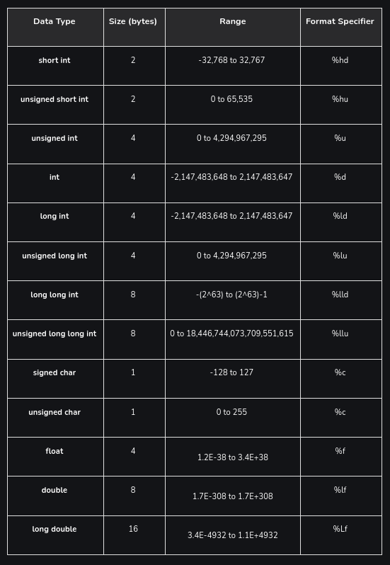

#C/C++ PROGRAMMING#

/////////////////

#POINTERS IN C#

##Introduction to pointers in C##

###What is reference?

Memory: an array of bytes within RAM
Memory block: a single unit (byte) within memory, used to hold some value
Memroy address: The address of where a memory block is located

### A list of memory size used by different data types




Example in C:
```
#include <stdio.h>

int main() {
    char a = 'X'; 
    short b = 'Y'; // can use characters as it will covert to ASCII
    int c = 'Z';    

    printf("Size of char: %zu bytes\n", sizeof(a));   // Use %zu for size_t
    printf("Size of short: %zu bytes\n", sizeof(b));  // Use %zu for size_t
    printf("Size of int: %zu bytes\n", sizeof(c));    // Use %zu for size_t

    printf("Address of a: %p\n", (void*)&a);  // Use %p for address
    printf("Address of b: %p\n", (void*)&b);  // Cast to void* to match %p
    printf("Address of c: %p\n", (void*)&c);  // Cast to void* to match %p

    return 0;
}
```

output:
```
1 byte
2 byte
4 byte
000000000061FE1F // memory address for a in hexadecimal form
000000000061FE1D // memory address for b in hexadecimal form
000000000061FE1 // memory address for c in hexadecimal form
```

Reference is when a data is stored in memory it has a memory address. A variable points to this memory address. This is called its reference.

#REFERENCES#

How to use pointers in C: https://www.freecodecamp.org/news/pointers-in-c-programming/

Data types in C: https://www.geeksforgeeks.org/data-types-in-c/

Primitive & non primitive in JS: https://blog.stackademic.com/understanding-the-difference-between-primitive-and-non-primitive-data-types-in-javascript-c5251c0293db


