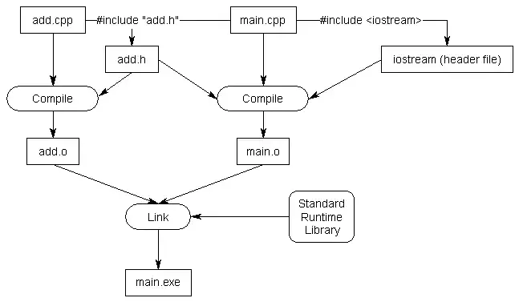

# C/C++ PROGRAMMING

# POINTERS IN C

## Introduction to pointers in C##

### What is reference?

**Memory**: an array of bytes within RAM

**Memory block**: a single unit (byte) within memory, used to hold some value

**Memroy address**: The address of where a memory block is located

### A list of memory size used by different data types


Example in C:

```cpp
#include <stdio.h>

int main() {
    char a = 'X';
    short b = 'Y'; // can use characters as it will covert to ASCII
    int c = 'Z';

    printf("Size of char: %zu bytes\n", sizeof(a));   // Use %zu for size_t
    printf("Size of short: %zu bytes\n", sizeof(b));  // Use %zu for size_t
    printf("Size of int: %zu bytes\n", sizeof(c));    // Use %zu for size_t

    printf("Address of a: %p\n", (void*)&a);  // Use %p for address
    printf("Address of b: %p\n", (void*)&b);  // Cast to void* to match %p
    printf("Address of c: %p\n", (void*)&c);  // Cast to void* to match %p

    return 0;
}
```

output:

```
1 byte
2 byte
4 byte
000000000061FE1F // memory address for a in hexadecimal form
000000000061FE1D // memory address for b in hexadecimal form
000000000061FE1 // memory address for c in hexadecimal form
```

Reference is when a data is stored in memory it has a memory address. A variable points to this memory address. This is called its reference.

# REFERENCES

How to use pointers in C: https://www.freecodecamp.org/news/pointers-in-c-programming/

Data types in C: https://www.geeksforgeeks.org/data-types-in-c/

Primitive & non primitive in JS: https://blog.stackademic.com/understanding-the-difference-between-primitive-and-non-primitive-data-types-in-javascript-c5251c0293db

# Random Access Memory

The main memory in a computer is called Random Access Memory (often called RAM for short). When we run a program, the operating system loads the program into RAM. Any data that is hardcoded into the program itself (e.g. text such as “Hello, world!”) is loaded at this point.

The operating system also reserves some additional RAM for the program to use while it is running. Common uses for this memory are to store values entered by the user, to store data read in from a file or network, or to store values calculated while the program is running (e.g. the sum of two values) so they can be used again later.

You can think of RAM as a series of numbered boxes that can be used to store data while the program is running.

In some older programming languages (like Applesoft BASIC), you could directly access these boxes (e.g. you could write a statement to “go get the value stored in membox number 7532”).

# Objects and variables

In C++, direct memory access is discouraged. Instead, we access memory indirectly through an object. An object represents a region of storage (typically RAM or a CPU register) that can hold a value. Objects also have associated properties (that we’ll cover in future lessons).

The key point here is that rather than say “go get the value stored in mailbox number 7532”, we can say, “go get the value stored by this object” and let the compiler figure out where and how to retrieve the value. This means we can focus on using objects to store and retrieve values, and not have to worry about where in memory those objects are actually being placed.

Although objects in C++ can be unnamed (anonymous), more often we name our objects using an identifier. An object with a name is called a variable.

**NOTE: In general programming, the term object typically refers to an unnamed object in memory, a variable, or a function. In C++, the term object has a narrower definition that excludes functions.**

## Variable definition

In order to use a variable in our program, we need to tell the compiler that we want one. The most common way to do this is by use of a special kind of declaration statement called a definition.
A definition statement can be used to tell the compiler that we want to use a variable in our program.

```cpp
int x; // define a variable named x (of type int)
```

At **compile-time** (when the program is being compiled), when encountering this statement, the compiler makes a note to itself that we want a variable with the name `x`, and that the variable has the data type `int`. From that point forward (with some limitations), whenever we use the identifier x in our code, the compiler will know that we are referring to this variable.

## Variable creation

At **runtime** (when the program is loaded into memory and run), each object is given an actual storage location (such as RAM, or a CPU register) that it can use to store values. The process of reserving storage for an object’s use is called **allocation**. Once allocation has occurred, the object has been created and can be used.

For the sake of example, let’s say that variable `x` is instantiated at memory location 140. Whenever the program uses variable `x`, it will access the value in memory location 140.

**NOTE: An object is “created” once actual storage has been reserved for the object’s use.**

## Data types

Objects are regions of storage that can store a data value. A **data type** (more commonly just called a **type**) determines what kind of value (e.g. a number, a letter, text, etc…) the object will store.

In C++, the type of an object must be known at compile-time, and that type can not be changed without recompiling the program. This means an integer variable can only hold integer values. If you want to store some other kind of value, you’ll need to use a different type.

**NOTE: The data type of an object must be known at compile-time (so the compiler knows how much memory that object requires).**
C++ also allows you to create your own custom types and it’s part of what makes C++ powerful.

## Summary

In C++, we use objects to access memory. A named object is called a variable. Each variable has an identifier, a type, and a value (and some other attributes that aren’t relevant here). A variable’s type is used to determine how the value in memory should be interpreted.

Variables are actually created at runtime, when memory is allocated for their use.

- What is a value?

A value is a letter (e.g. a), number (e.g. 5), text (e.g. Hello), or instance of some other useful concept that can be represented as data.

- What is an object?

An object is a region of storage (usually memory) that can store a value.

- What is a variable?

A variable is an object that has a name.

# Variable initialization

One downside of assignment is that assigning a value to a just-defined object requires two statements: one to define the variable, and another to assign the value.

These two steps can be combined. When an object is defined, you can optionally provide an initial value for the object. The process of specifying an initial value for an object is called initialization, and the syntax used to initialize an object is called an initializer. Informally, the initial value is often called an “initializer” as well.

For example, the following statement both defines a variable named width (of type int) and initializes it with the value 5:

```cpp
#include <iostream>

int main()
{
    int width { 5 };    // define variable width and initialize with initial value 5
    std::cout << width; // prints 5

    return 0;
}

In the above initialization of variable width, { 5 } is the initializer, and 5 is the initial value.
```

## Different forms of initialization

Unlike assignment (which is generally straightforward), initialization in C++ is surprisingly complex. So we’ll present a simplified view here to get started.

There are 5 common forms of initialization in C++:

```cpp
int a;         // default-initialization (no initializer)

// Traditional initialization forms:
int b = 5;     // copy-initialization (initial value after equals sign)
int c ( 6 );   // direct-initialization (initial value in parenthesis)

// Modern initialization forms (preferred):
int d { 7 };   // direct-list-initialization (initial value in braces)
int e {};      // value-initialization (empty braces)
```

Other forms of initialization include:

- Aggregate initialization
- Copy-list-initialization
- Reference initialization
- Static-initialization, constant-initialization, and dynamic-initialization
- Zero-initialization

### Default-initialization

When no initializer is provided (such as for variable a above), this is called default-initialization. In many cases, default-initialization performs no initialization, and leaves the variable with an indeterminate value (a value that is not predictable).

### Copy-initialization

When an initial value is provided after an equals sign, this is called copy-initialization. This form of initialization was inherited from the C language.

```c
int width = 5; // copy-initialization of value 5 into variable width
```

Much like copy-assignment, this copies the value on the right-hand side of the equals into the variable being created on the left-hand side. In the above snippet, variable width will be initialized with value 5.

Copy-initialization had fallen out of favor in modern C++ due to being less efficient than other forms of initialization for some complex types. However, C++17 remedied the bulk of these issues, and copy-initialization is now finding new advocates.

**NOTE: Copy-initialization is also used whenever values are implicitly copied, such as when passing arguments to a function by value, returning from a function by value, or catching exceptions by value.**

### Direct-initialization

When an initial value is provided inside parenthesis, this is called direct-initialization.

```c
int width ( 5 ); // direct initialization of value 5 into variable width
```

Direct-initialization was initially introduced to allow for more efficient initialization of complex objects (those with class types). Just like copy-initialization, direct-initialization had fallen out of favor in modern C++, largely due to being superseded by direct-list-initialization. However, direct-list-initialization has a few quirks of its own, and so direct-initialization is once again finding use in certain cases.

Direct-initialization is also used when values are explicitly cast to another type (e.g. via `static_cast`).

One of the reasons direct-initialization had fallen out of favor is because it makes it hard to differentiate variables from functions. For example:

```c
int x();  // forward declaration of function x
int x(0); // definition of variable x with initializer 0
T(5);     // function call if T is a function, direct-initialization of temporary object if T is a type
```

### Direct-list-initialization and copy-list-initialization

The modern way to initialize objects in C++ is to use a form of initialization that makes use of curly braces. This is called **list-initialization** (or **uniform initialization** or **brace initialization**).

List-initialization comes in two forms:

```cpp
int width { 5 };    // direct-list-initialization of initial value 5 into variable width (preferred)
int height = { 6 }; // copy-list-initialization of initial value 6 into variable height (rarely used)
```

When we see curly braces, we know we’re creating and initializing an object.

Additionally, list initialization provides a way to initialize objects with a list of values rather than a single value (which is why it is called “list initialization”).

### List initialization disallows narrowing conversions

The primary benefit of list-initialization is that “narrowing conversions” are disallowed. This means that if you try to list-initialize a variable using a value that the variable can not safely hold, the compiler is required to produce a diagnostic (compilation error or warning) to notify you. For example:

```cpp
int main()
{
    // An integer can only hold non-fractional values
    int w1 { 4.5 }; // compile error: list init does not allow narrowing conversion of 4.5 to 4

    int w2 = 4.5;   // compiles: copy-init initializes width with 4
    int w3 (4.5);    // compiles: direct-init initializes width with 4

    return 0;
}
```

**NOTE: List-initialization is generally preferred over the other initialization forms because it works in most cases (and is therefore most consistent), it disallows narrowing conversions (which we normally don’t want), and it supports initialization with a list of values (something we’ll cover in a future lesson).**

### Value-initialization and zero-initialization

When a variable is initialized using empty braces, value initialization takes place. In most cases, value initialization will initialize the variable to zero (or empty, if that’s more appropriate for a given type). In such cases where zeroing occurs, this is called zero-initialization.

```cpp
int width {}; // value-initialization / zero-initialization to value 0
```

### Q: When should I initialize with { 0 } vs {}?

Use direct-list-initialization when you’re actually using the initial value:

```cpp
int x { 0 };    // direct-list-initialization with initial value 0
std::cout << x; // we're using that 0 value here
```

Use value-initialization when the object’s value is temporary and will be replaced:

```cpp
int x {};      // value initialization
std::cin >> x; // we're immediately replacing that value so an explicit 0 would be meaningless
```

## Instantiation

The term instantiation is a fancy word that means a variable has been created (allocated) and initialized (this includes default initialization). An instantiated object is sometimes called an instance. Most often, this term is applied to class type objects, but it is occasionally applied to objects of other types as well.

multiple variables defined on the same line:

```cpp
int a = 5, b = 6;          // copy-initialization
int c ( 7 ), d ( 8 );      // direct-initialization
int e { 9 }, f { 10 };     // direct-list-initialization
int i {}, j {};            // value-initialization
```

## The `[[maybe_unused]]` attribute C++17

The `[[maybe_unused]]` attribute allows us to tell the compiler that we’re okay with a variable being unused. The compiler will not generate unused variable warnings for such variables.

The following program should generate no warnings/errors:

```cpp
#include <iostream>

int main()
{
    [[maybe_unused]] double pi { 3.14159 };  // Don't complain if pi is unused
    [[maybe_unused]] double gravity { 9.8 }; // Don't complain if gravity is unused
    [[maybe_unused]] double phi { 1.61803 }; // Don't complain if phi is unused

    std::cout << pi << '\n';
    std::cout << phi << '\n';

    // The compiler will no longer warn about gravity not being used

    return 0;
}
```

Additionally, the compiler will likely optimize these variables out of the program, so they have no performance impact.

The `[[maybe_unused]]` attribute should only be applied selectively to variables that have a specific and legitimate reason for being unused (e.g. because you need a list of named values, but which specific values are actually used in a given program may vary). Otherwise, unused variables should be removed from the program.

### Q. What are default-initialization and value-initialization? What is the behavior of each? Which should you prefer?

Default-initialization is when a variable initialization has no initializer (e.g. int x;). In most cases, the variable is left with an indeterminate value.
Value-initialization is when a variable initialization has an empty brace initializer (e.g. int x{};). In most cases this will perform zero-initialization.
You should prefer value-initialization, as it initializes the variable to a consistent value.

## `std::cout` is buffered

Consider a rollercoaster ride at your favorite amusement park. Passengers show up (at some variable rate) and get in line. Periodically, a train arrives and boards passengers (up to the maximum capacity of the train). When the train is full, or when enough time has passed, the train departs with a batch of passengers, and the ride commences. Any passengers unable to board the current train wait for the next one.

This analogy is similar to how output sent to std::cout is typically processed in C++. Statements in our program request that output be sent to the console. However, that output is typically not sent to the console immediately. Instead, the requested output “gets in line”, and is stored in a region of memory set aside to collect such requests (called a **buffer**). Periodically, the buffer is **flushed**, meaning all of the data collected in the buffer is transferred to its destination (in this case, the console).

This also means that if your program crashes, aborts, or is paused (e.g. for debugging purposes) before the buffer is flushed, any output still waiting in the buffer will not be displayed.

Using `std::endl` is often inefficient, as it actually does two jobs: it outputs a newline (moving the cursor to the next line of the console), and it flushes the buffer (which is slow). If we output multiple lines of text ending with std::endl, we will get multiple flushes, which is slow and probably unnecessary.

When outputting text to the console, we typically don’t need to explicitly flush the buffer ourselves. C++’s output system is designed to self-flush periodically, and it’s both simpler and more efficient to let it flush itself.

To output a newline without flushing the output buffer, we use `\n` (inside either single or double quotes), which is a special symbol that the compiler interprets as a newline character.

**NOTE**: In C++, we use single quotes to represent single characters (such as 'a' or '$'), and double-quotes to represent text (zero or more characters). Even though ‘\n’ is represented in source code as two symbols, it is treated by the compiler as a single **linefeed (LF)** character (with ASCII value 10), and thus is conventionally single quoted (unless embedded into existing double-quoted text).

## std::cin

`std::cin` is another predefined variable in the iostream library. Whereas `std::cout` prints data to the console (using the insertion operator `<<` to provide the data), `std::cin` (which stands for “character input”) reads input from keyboard. We typically use the extraction operator `>>` to put the input data in a variable (which can then be used in subsequent statements).

```cpp
#include <iostream>  // for std::cout and std::cin

int main()
{
    std::cout << "Enter a number: "; // ask user for a number

    int x{};       // define variable x to hold user input (and value-initialize it)
    std::cin >> x; // get number from keyboard and store it in variable x

    std::cout << "You entered " << x << '\n';
    return 0;
}
```

### std::cin is buffered

In a prior section, we noted that outputting data is actually a two stage process:

- The data from each output request is added (to the end) of an output buffer.
- Later, data from (the front of) the output buffer is flushed to the output device (the console).

Similarly, inputting data is also a two stage process:

- The individual characters you enter as input are added to the end of an input buffer (inside `std::cin`). The enter key (pressed to submit the data) is also stored as a `'\n'` character.
- The extraction operator ‘>>’ removes characters from the front of the input buffer and converts them into a value that is assigned (via copy-assignment) to the associated variable. This variable can then be used in subsequent statements.

Let's demonstrate this by an example:

```cpp
#include <iostream>  // for std::cout and std::cin

int main()
{
    std::cout << "Enter two numbers: ";

    int x{};
    std::cin >> x;

    int y{};
    std::cin >> y;

    std::cout << "You entered " << x << " and " << y << '\n';

    return 0;
}
```

This program inputs to two variables (this time as separate statements). We’ll run this program twice.

Run #1: When std::cin >> x; is encountered, the program will wait for input. Enter the value 4. The input 4\n goes into the input buffer, and the value 4 is extracted to variable x.

When std::cin >> y; is encountered, the program will again wait for input. Enter the value 5. The input 5\n goes into the input buffer, and the value 5 is extracted to variable y. Finally, the program will print You entered 4 and 5.

There should be nothing surprising about this run.

Run #2: When std::cin >> x is encountered, the program will wait for input. Enter 4 5. The input 4 5\n goes into the input buffer, but only the 4 is extracted to variable x (extraction stops at the space).

When std::cin >> y is encountered, the program will not wait for input. Instead, the 5 that is still in the input buffer is extracted to variable y. The program then prints You entered 4 and 5.

Note that in run 2, the program didn’t wait for the user to enter additional input when extracting to variable y because there was already prior input in the input buffer that could be used.

### The basic extraction process

Here’s a simplified view of how operator >> works for input:

    First, leading whitespace (spaces, tabs, and newlines at the front of the buffer) is discarded from the input buffer. This will discard any unextracted newline character remaining from a prior line of input.
    If the input buffer is now empty, operator >> will wait for the user to enter more data. Leading whitespace is again discarded.
    operator >> then extracts as many consecutive characters as it can, until it encounters either a newline character (representing the end of the line of input) or a character that is not valid for the variable being extracted to.

The result of the extraction is as follows:

    If any characters were extracted in step 3 above, extraction is a success. The extracted characters are converted into a value that is then copy-assigned to the variable.
    If no characters could be extracted in step 3 above, extraction has failed. The object being extracted to is copy-assigned the value 0 (as of C++11), and any future extractions will immediately fail (until std::cin is cleared).

Any non-extracted characters (including newlines) remain available for the next extraction attempt.
**Eg:**
If the user types 5a and enter, 5a\n will be added to the buffer. 5 will be extracted, converted to an integer, and assigned to variable x. a\n will be left in the input buffer for the next extraction.

If the user types ‘b’ and enter, b\n would be added to the buffer. Because b is not a valid integer, no characters can be extracted, so this is an extraction failure. Variable x would be set to 0, and future extractions will fail until the input stream is cleared.

# Uninitialized variables

Unlike some programming languages, C/C++ does not automatically initialize most variables to a given value (such as zero). When a variable that is not initialized is given a memory address to use to store data, the default value of that variable is whatever (garbage) value happens to already be in that memory address! A variable that has not been given a known value (through initialization or assignment) is called an uninitialized variable.

- Initialized = The object is given a known value at the point of definition.
- Assignment = The object is given a known value beyond the point of definition.
- Uninitialized = The object has not been given a known value yet.

# Undefined behavior

Using the value from an uninitialized variable is our first example of undefined behavior. **Undefined behavior** (often abbreviated UB) is the result of executing code whose behavior is not well-defined by the C++ language. In this case, the C++ language doesn’t have any rules determining what happens if you use the value of a variable that has not been given a known value. Consequently, if you actually do this, undefined behavior will result.

# Implementation-defined behavior and unspecified behavior

A specific compiler and the associated standard library it comes with are called an **implementation** (as these are what actually implements the C++ language). In some cases, the C++ language standard allows the implementation to determine how some aspect of the language will behave, so that the compiler can choose a behavior that is efficient for a given platform. Behavior that is defined by the implementation is called implementation-defined behavior. Implementation-defined behavior must be documented and consistent for a given implementation.

Example of implementation-defined behavior:

```cpp
#include <iostream>

int main()
{
	std::cout << sizeof(int) << '\n'; // print how many bytes of memory an int value takes

	return 0;
}
```

On most platforms, this will produce `4`, but on others it may produce `2`.

**Unspecified behavior** is almost identical to implementation-defined behavior in that the behavior is left up to the implementation to define, but the implementation is not required to document the behavior.

We generally want to avoid implementation-defined and unspecified behavior, as it means our program may not work as expected if compiled on a different compiler (or even on the same compiler if we change project settings that affect how the implementation behaves!)

# Keywords and naming identifiers

## Keywords

C++ reserves a set of 92 words (as of C++23) for its own use. These words are called keywords (or reserved words), and each of these keywords has a special meaning within the C++ language.

Here is a list of all the C++ keywords (through C++23):

- alignas
- alignof
- and
- and_eq
- asm
- auto
- bitand
- bitor
- bool
- break
- case
- catch
- char
- char8_t (since C++20)
- char16_t
- char32_t
- class
- compl
- concept (since C++20)
- const
- consteval (since C++20)
- constexpr
- constinit (since C++20)
- const_cast
- continue
- co_await (since C++20)
- co_return (since C++20)
- co_yield (since C++20)
- decltype
- default
- delete
- do
- double
- dynamic_cast
- else
- enum
- explicit
- export
- extern
- false
- float
- for
- friend
- goto
- if
- inline
- int
- long
- mutable
- namespace
- new
- noexcept
- not
- not_eq
- nullptr
- operator
- or
- or_eq
- private
- protected
- public
- register
- reinterpret_cast
- requires (since C++20)
- return
- short
- signed
- sizeof
- static
- static_assert
- static_cast
- struct
- switch
- template
- this
- thread_local
- throw
- true
- try
- typedef
- typeid
- typename
- union
- unsigned
- using
- virtual
- void
- volatile
- wchar_t
- while
- xor
- xor_eq

The name of a variable (or function, type, or other kind of item) is called an **identifier**.

C++ also defines special identifiers: _override, final, import, and module_. These have a specific meaning when used in certain contexts but are not reserved otherwise.

### Identifier naming best practices

First, it is a convention in C++ that variable names should begin with a lowercase letter. If the variable name is a single word or acronym, the whole thing should be written in lowercase letters.

Identifier names that start with a capital letter are typically used for user-defined types (such as structs, classes, and enumerations).

If the variable or function name is multi-word, there are two common conventions: words separated by underscores (sometimes called snake_case), or intercapped (sometimes called camelCase, since the capital letters stick up like the humps on a camel).

```cpp
int my_variable_name;   // conventional (separated by underscores/snake_case)
int my_function_name(); // conventional (separated by underscores/snake_case)

int myVariableName;     // conventional (intercapped/camelCase)
int myFunctionName();   // conventional (intercapped/camelCase)

int my variable name;   // invalid (whitespace not allowed)
int my function name(); // invalid (whitespace not allowed)

int MyVariableName;     // unconventional (should start with lower case letter)
int MyFunctionName();   // unconventional (should start with lower case letter)
```

# Literals

Consider the following two statements:

```cpp
std::cout << "Hello world!";
int x { 5 };
```

What are ‘”Hello world!”‘ and ‘5’? They are literals. A **literal** (also known as a **literal constant**) is a fixed value that has been inserted directly into the source code.

Literals and variables both have a value (and a type). Unlike a variable (whose value can be set and changed through initialization and assignment respectively), the value of a literal is fixed and cannot be changed. The literal 5 always has value 5. This is why literals are called constants.

A literal’s value is placed directly in the executable, and the executable itself can’t be changed after it is created. A variable’s value is placed in memory, and the value of memory can be changed while the executable is running.

# Operators

In mathematics, an **operation** is a process involving zero or more input values (called **operands**) that produces a new value (called an output value). The specific operation to be performed is denoted by a symbol called an **operator**.

In C++, the output value of an operation is often called a **return value**.

While most operators have symbols for names (e.g. `+`, or `==`), there are also a number of operators that are keywords (e.g. `new`, `delete`, and `throw`).

The number of operands that an operator takes as input is called the operator’s **arity**

## Types of Arity

Operators in C++ come in four different arities:

**Unary** operators act on one operand. An example of a unary operator is the `-` operator. For example, given `-5`, `operator-` takes literal operand `5` and flips its sign to produce new output value `-5`.

**Binary** operators act on two operands (often called left and right, as the left operand appears on the left side of the operator, and the right operand appears on the right side of the operator).
For example, given `3 + 4`, `operator+` takes the left operand `3` and the right operand `4` and applies mathematical addition to produce new output value `7`. The insertion (`<<`) and extraction (`>>`) operators are binary operators, taking `std::cout` or `std::cin` on the left side, and the value to output or variable to input to on the right side.

**Ternary** operators act on three operands. There is only one of these in C++ (the conditional operator)

**Nullary** operators act on zero operands. There is also only one of these in C++ (the throw operator)

Operators can be chained together such that the output of one operator can be used as the input for another operator.

## Return values and side effects

Most operators in C++ just use their operands to calculate a return value. There are a few operators that do not produce return values (such as **delete** and **throw**)

Some operators have additional behaviors. An operator (or function) that has some observable effect beyond producing a return value is said to have a **side effect**. For example, `x = 5` has the side effect of assigning value `5` to variable `x`. The changed value of `x` is observable (e.g. by printing the value of `x`) even after the operator has finished executing. `std::cout << 5` has the side effect of printing `5` to the console. We can observe the fact that `5` has been printed to the console even after `std::cout << 5` has finished executing.

**NOTE:** For the operators we call primarily for their side effects (e.g. **operator=** or **operator<<**), it’s not always obvious what return values they produce (if any) unlike for **operator+** or **operator \***.

So here, Both **operator=** and **operator<<** (when used to output values to the console) return their left operand. Thus, **x = 5** returns **x**, and **std::cout << 5** returns **std::cout**. This is done so that these operators can be chained.

# Introduction to expressions

## Expressions

In general programming, an **expression** is a non-empty sequence of literals, variables, operators, and function calls that calculates a value. The process of executing an expression is called **evaluation**, and the resulting value produced is called the **result** of the expression (also sometimes called the **return value**).

Expressions do not end in a semicolon, and cannot be compiled by themselves. For example, if you were to try compiling the expression `x = 5`, your compiler would complain (probably about a missing semicolon). Rather, expressions are always evaluated as part of statements.

For example, take this statement:

```cpp
int x{ 2 + 3 }; // 2 + 3 is an expression that has no semicolon -- the semicolon is at the end of the statement containing the expression
```

If you were to break this statement down into its syntax, it would look like this:

`type identifier { expression };`

Expressions cannot be executed by themselves -- they must exist as part of a statement. Fortunately, it’s trivial to convert any expression into an equivalent statement. An **expression statement** is a statement that consists of an expression followed by a semicolon. When the expression statement is executed, the expression will be evaluated.

## Subexpressions, full expressions, and compound expressions

Consider the following expressions:

```cpp
2               // 2 is a literal that evaluates to value 2
2 + 3           // 2 + 3 uses operator + to evaluate to value 5
x = 4 + 5       // 4 + 5 evaluates to value 9, which is then assigned to variable x
```

A **subexpression** is an expression used as an operand. For example, the subexpressions of `x = 4 + 5` are `x` and `4 + 5`. The subexpressions of `4 + 5` are `4` and `5`.

A **full expression** is an expression that is not a subexpression. All three expressions above (`2`, `2 + 3`, and `x = 4 + 5`) are full expressions.

In casual language, a **compound expression** is an expression that contains two or more uses of operators. `x = 4 + 5` is a compound expression because it contains two uses of operators (`operator=` and `operator+`). `2` and `2 + 3` are not compound expressions.

# Functions

A function is a collection of statements that execute sequentially.

But more importatnly a function is a reusable sequence of statements designed to do a particular job.

Functions provide a way for us to split our programs into small, modular chunks that are easier to organize, test, and use.

The C++ standard library comes with plenty of already-written functions for you to use -- however, it’s just as common to write your own. Functions that you write yourself are called **user-defined functions**.

## How function call works

A program will be executing statements sequentially inside one function when it encounters a function call. A function call tells the CPU to interrupt the current function and execute another function. The CPU essentially “puts a bookmark” at the current point of execution, executes the function named in the function call, and then returns to the point it bookmarked and resumes execution.

The function initiating the function call is the **caller**, and the function being **called** (executed) is the **callee**. A function call is also sometimes called an **invocation**, with the caller **invoking** the callee.

### Function syntax

```cpp
returnType functionName() // This is the function header (tells the compiler about the existence of the function)
{
    // This is the function body (tells the compiler what the function does)
}
```

An example of user defined function

```cpp
#include <iostream> // for std::cout

// Definition of user-defined function doPrint()
// doPrint() is the called function in this example
void doPrint()
{
    std::cout << "In doPrint()\n";
}

// Definition of user-defined function main()
int main()
{
    std::cout << "Starting main()\n";
    doPrint();                        // Interrupt main() by making a function call to doPrint().  main() is the caller.
    std::cout << "Ending main()\n";   // This statement is executed after doPrint() ends

    return 0;
}
```

**NOTE: Nested functions are not supported. A function whose definition is placed inside another function is a nested function. Unlike some other programming languages, in C++, functions cannot be nested.**

## Return values

To return a value back to the caller, two things are needed.

First, your function has to indicate what type of value will be returned. This is done by setting the function’s **return type**, which is the type that is defined before the function’s name.

Second, inside the function that will return a value, we use a **return statement** to indicate the specific value being returned to the caller. The specific value returned from a function is called the **return value**. When the return statement is executed, the function exits immediately, and the return value is copied from the function back to the caller. This process is called **return by value**.

Eg:

```cpp
#include <iostream>

int getValueFromUser() // this function now returns an integer value
{
 	std::cout << "Enter an integer: ";
	int input{};
	std::cin >> input;

	return input; // return the value the user entered back to the caller
}

int main()
{
	int num { getValueFromUser() }; // initialize num with the return value of getValueFromUser()

	std::cout << num << " doubled is: " << num * 2 << '\n';

	return 0;
}
```

## So How main works

When the program is executed, the operating system makes a function call to `main()`. Execution then jumps to the top of `main()`. The statements in `main()` are executed sequentially. Finally, `main()` returns an integer value (usually 0), and your program terminates.

In C++, there are two special requirements for `main()`:

- `main()` is required to return an `int`.
- Explicit function calls to `main()` are disallowed.

**NOTE: It is a common misconception that main is always the first function that executes. Global variables are initialized prior to the execution of main. If the initializer for such a variable invokes a function, then that function will execute prior to main.**

## Status codes

The return value from `main()` is sometimes called a **status code** (or less commonly, an **exit code**, or rarely a **return code**). The status code is used to signal whether your program was successful or not.

By convention, a status code of `0` means the program ran normally (meaning the program executed and behaved as expected).

The C++ standard only defines the meaning of 3 status codes: `0`, `EXIT_SUCCESS`, and `EXIT_FAILURE`. `0` and `EXIT_SUCCESS` both mean the program executed successfully. `EXIT_FAILURE` means the program did not execute successfully.

`EXIT_SUCCESS` and `EXIT_FAILURE` are preprocessor macros defined in the <cstdlib> header:

```cpp
#include <cstdlib> // for EXIT_SUCCESS and EXIT_FAILURE

int main()
{
    return EXIT_SUCCESS;
}
```

If you want to maximize portability, you should only use `0` or `EXIT_SUCCESS` to indicate a successful termination, or `EXIT_FAILURE` to indicate an unsuccessful termination.

## A value-returning function that does not return a value will produce undefined behavior

A function that returns a value is called a **value-returning function**. A function is value-returning if the return type is anything other than `void`.

A value-returning function must return a value of that type (using a return statement), otherwise undefined behavior will result.

- Function main will implicitly return 0 if no return statement is provided.
- A value-returning function can only return a single value back to the caller each time it is called. Although there are various ways to work around the limitation of functions only being able to return a single value.

A great function example

```cpp
#include <iostream>

int getValueFromUser()
{
    std::cout << "Enter an integer: ";
    int input{};
    std::cin >> input;
    return input;
}

int main()
{
    int x{ getValueFromUser() };
    int y{ getValueFromUser() };

    std::cout << x << " + " << x + y << '\n';

    return 0;
}
```

**NOTE: Bro your code shouldn't be WET man, it should be DRY.**

## Void functions

- Void functions don’t need a return statement. A void function will automatically return to the caller at the end of the function. No return statement is required.

- Void functions can’t be used in expression that require a value

```cpp
#include <iostream>

// void means the function does not return a value to the caller
void printHi()
{
    std::cout << "Hi" << '\n';
}

int main()
{
    printHi(); // okay: function printHi() is called, no value is returned

    std::cout << printHi(); // compile error

    return 0;
}
```

The first call to `printHi()` is called in a context that does not require a value. Since the function doesn’t return a value, this is fine.

The second function call to function `printHi()` won’t even compile. Function `printHi` has a `void` return type, meaning it doesn’t return a value. However, this statement is trying to send the return value of printHi to `std::cout` to be printed. `std::cout` doesn’t know how to handle this (what value would it output?). Consequently, the compiler will flag this as an error.

## Function parameters and arguments

A **function parameter** is a variable used in the header of a function. Function parameters work almost identically to variables defined inside the function, but with one difference: they are initialized with a value provided by the caller of the function.

Function parameters are defined in the function header by placing them in between the parenthesis after the function name, with multiple parameters being separated by commas.

Here are some examples of functions with different numbers of parameters:

```cpp
// This function takes no parameters
// It does not rely on the caller for anything
void doPrint()
{
    std::cout << "In doPrint()\n";
}

// This function takes one integer parameter named x
// The caller will supply the value of x
void printValue(int x)
{
    std::cout << x  << '\n';
}

// This function has two integer parameters, one named x, and one named y
// The caller will supply the value of both x and y
int add(int x, int y)
{
    return x + y;
}
```

An **argument** is a value that is passed from the caller to the function when a function call is made:

```cpp
doPrint(); // this call has no arguments
printValue(6); // 6 is the argument passed to function printValue()
add(2, 3); // 2 and 3 are the arguments passed to function add()
```

Note that multiple arguments are also separated by commas.

### How parameters and arguments work together

When a function is called, all of the parameters of the function are created as variables, and the value of each of the arguments is copied into the matching parameter (using copy initialization). This process is called pass by value. Function parameters that utilize **pass by value** are called **value parameters**.

For example:

```cpp
#include <iostream>

// This function has two integer parameters, one named x, and one named y
// The values of x and y are passed in by the caller
void printValues(int x, int y)
{
    std::cout << x << '\n';
    std::cout << y << '\n';
}

int main()
{
    printValues(6, 7); // This function call has two arguments, 6 and 7

    return 0;
}
```

Another example:

```cpp
#include <iostream>

int getValueFromUser()
{
  int input{};
  std::cout << "Enter an integer: ";
  std::cin >> input;
  return input;
}

void printDouble(int val)
{
  std::cout << "Double of " << val << " is: " << val * 2 << '\n';
}

int main()
{
  int num{ getValueFromUser() };
  printDouble(num);

  std::cout << num; // The num was never changed even though
                    // passed it as a val to printDouble,
                    // demonstration of pass by value.

  return 0;
}
```

By using both parameters and a return value, we can create functions that take data as input, do some calculation with it, and return the value to the caller.

```cpp
#include <iostream>

int add(int x, int y)
{
    return x + y;
}

int multiply(int z, int w)
{
    return z * w;
}

int main()
{
    std::cout << add(4, 5) << '\n'; // within add() x=4, y=5, so x+y=9
    std::cout << add(1 + 2, 3 * 4) << '\n'; // within add() x=3, y=12, so x+y=15

    int a{ 5 };
    std::cout << add(a, a) << '\n'; // evaluates (5 + 5)

    std::cout << add(1, multiply(2, 3)) << '\n'; // evaluates 1 + (2 * 3)
    std::cout << add(1, add(2, 3)) << '\n'; // evaluates 1 + (2 + 3)

    return 0;
}
```

### Unreferenced parameters

In certain cases, you will encounter functions that have parameters that are not used in the body of the function. These are called **unreferenced parameters**.

```cpp
void doSomething(int count) // warning: unreferenced parameter count
{
    // This function used to do something with count but it is not used any longer
}

int main()
{
    doSomething(4);

    return 0;
}
```

Just like with unused local variables, your compiler will probably warn that variable `count` has been defined but not used.

In a function definition, the name of a function parameter is optional. Therefore, in cases where a function parameter needs to exist but is not used in the body of the function, you can simply omit the name. A parameter without a name is called an **unnamed parameter**:

```cpp
void doSomething(int) // ok: unnamed parameter will not generate warning
{
}
```

The Google C++ style guide recommends using a comment to document what the unnamed parameter was:

```cpp
void doSomething(int /*count*/)
{
}
```

why we’d write a function that has a parameter whose value isn’t used?

1. Let’s say we have a function with a single parameter. Later, the function is updated in some way, and the value of the parameter is no longer needed. If the now-unused function parameter were simply removed, then every existing call to the function would break (because the function call would be supplying more arguments than the function could accept). This would require us to find every call to the function and remove the unneeded argument. This might be a lot of work (and require a lot of retesting). It also might not even be possible (in cases where we did not control all of the code calling the function). So instead, we might leave the parameter as it is, and just have it do nothing.

2. Operators `++` and `--` have prefix and postfix variants (e.g. `++foo` vs `foo++`). An unreferenced function parameter is used to differentiate whether an overload of such an operator is for the prefix or postfix case.

3. When we need to determine something from the type (rather than the value) of a type template parameter.

# Introduction to local scope

Variables defined inside the body of a function are called **local variables**.

```cpp
int add(int x, int y)
{
    int z{ x + y }; // z is a local variable

    return z;
}
```

Function parameters are also generally considered to be local variables, and we will include them as such:

```cpp
int add(int x, int y) // function parameters x and y are local variables
{
    int z{ x + y };

    return z;
}
```

## Lifetime

When is an instantiated variable destroyed?

Local variables are destroyed in the opposite order of creation at the end of the set of curly braces in which it is defined (or for a function parameter, at the end of the function).

An object’s **lifetime** is defined to be the time between its creation and destruction. Variable creation and destruction happen when the program is running (called runtime), not at compile time. Therefore, lifetime is a runtime property.

### What happens when an object is destroyed?

In most cases, nothing. The destroyed object simply becomes invalid. If the object is a class type object, prior to destruction, a special function called a destructor is invoked. In many cases, the destructor does nothing, in which case no cost is incurred.

Any use of an object after it has been destroyed will result in undefined behavior.

At some point after destruction, the memory used by the object will be **deallocated** (freed up for reuse).

## Local Scope (block scope)

An identifier’s **scope** determines where the identifier can be seen and used within the source code. When an identifier can be seen and used, we say it is **in scope**. When an identifier can not be seen, we can not use it, and we say it is **out of scope**. Scope is a compile-time property, and trying to use an identifier when it is not in scope will result in a compile error.

The identifier of a local variable has **local scope**. An identifier with local scope (technically called **block scope**) is usable from the point of definition to the end of the innermost pair of curly braces containing the identifier (or for function parameters, at the end of the function). This ensures local variables cannot be used before the point of definition (even if the compiler opts to create them before then) or after they are destroyed. Local variables defined in one function are also not in scope in other functions that are called.

Here’s a program demonstrating the scope of a variable named x:

```cpp
#include <iostream>

// x is not in scope anywhere in this function
void doSomething()
{
    std::cout << "Hello!\n";
}

int main()
{
    // x can not be used here because it's not in scope yet

    int x{ 0 }; // x enters scope here and can now be used within this function

    doSomething();

    return 0;
} // x goes out of scope here and can no longer be used
```

**NOTE**: Variable `x` is not in scope anywhere inside of function `doSomething`. The fact that function `main` calls function `doSomething` is irrelevant in this context.

### “Out of scope” vs “going out of scope”

The terms “out of scope” and “going out of scope” can be confusing.

An identifier is out of scope anywhere it cannot be accessed within the code. In the example above, the identifier x is in scope from its point of definition to the end of the `main` function. The identifier `x` is out of scope outside of that code region.

The term “going out of scope” is typically applied to objects rather than identifiers. We say an object goes out of scope at the end of the scope (the end curly brace) in which the object was instantiated. In the example above, the object named `x` goes out of scope at the end of the function `main`.

A local variable’s lifetime ends at the point where it goes out of scope, so local variables are destroyed at this point.

Note that not all types of variables are destroyed when they go out of scope.

**NOTE:** Remember, lifetime is a runtime property, and scope is a compile-time property.

Another example:

```cpp
#include <iostream>

int add(int x, int y) // x and y are created and enter scope here
{
    // x and y are usable only within add()
    return x + y;
} // y and x go out of scope and are destroyed here

int main()
{
    int a{ 5 }; // a is created, initialized, and enters scope here
    int b{ 6 }; // b is created, initialized, and enters scope here

    // a and b are usable only within main()

    std::cout << add(a, b) << '\n'; // calls add(5, 6), where x=5 and y=6

    return 0;
} // b and a go out of scope and are destroyed here
```

### Where to define local variables

In modern C++, the best practice is that local variables inside the function body should be defined as close to their first use as reasonable:

```cpp
#include <iostream>

int main()
{
	std::cout << "Enter an integer: ";
	int x{};       // x defined here
	std::cin >> x; // and used here

	std::cout << "Enter another integer: ";
	int y{};       // y defined here
	std::cin >> y; // and used here

	int sum{ x + y }; // sum can be initialized with intended value
	std::cout << "The sum is: " << sum << '\n';

	return 0;
}
```

### When to use function parameters vs Local variables

Using a function parameter when you should use a local variable leads to code looking like this:

```cpp
#include <iostream>

int getValueFromUser(int val) // val is a function parameter
{
    std::cout << "Enter a value: ";
    std::cin >> val;
    return val;
}

int main()
{
    int x {};
    int num { getValueFromUser(x) }; // main must pass x as an argument

    std::cout << "You entered " << num << '\n';

    return 0;
}
```

In the above example, `getValueFromUser()` has defined `val` as a function parameter. Because of this, `main()` must define `x` so that it has something to pass as an argument. However, the actual value of `x` is never used, and the value that `val` is initialized with is never used. Making the caller define and pass a variable that is never used adds needless complexity.

The correct way to write this would be as follows:

```cpp
#include <iostream>

int getValueFromUser()
{
    int val {}; // val is a local variable
    std::cout << "Enter a value: ";
    std::cin >> val;
    return val;
}

int main()
{
    int num { getValueFromUser() }; // main does not need to pass anything

    std::cout << "You entered " << num << '\n';

    return 0;
}
```

In this example, `val` is now a local variable. `main()` is now simpler because it does not need to define or pass a variable to call `getValueFromUser()`.

## Temporary object

A **temporary object** (also sometimes called an **anonymous object**) is an unnamed object that is used to hold a value that is only needed for a short period of time. Temporary objects are generated by the compiler when they are needed.

There are many different ways that temporary values can be created, but here’s a common one:

```cpp
#include <iostream>

int getValueFromUser()
{
 	std::cout << "Enter an integer: ";
	int input{};
	std::cin >> input;

	return input; // return the value of input back to the caller
}

int main()
{
	std::cout << getValueFromUser() << '\n'; // where does the returned value get stored?

	return 0;
}
```

In the above program, the function `getValueFromUser()` returns the value stored in local variable `input` back to the caller. Because `input` will be destroyed at the end of the function, the caller receives a copy of the value so that it has a value it can use even after `input` is destroyed.

But where is the value that is copied back to the caller stored? We haven’t defined any variables in `main()`. The answer is that the return value is stored in a temporary object. This temporary object is then passed to `std::cout` to be printed.

**Key insight:** Return by value returns a temporary object (that holds a copy of the return value) to the caller.

Temporary objects have no scope at all (this makes sense, since scope is a property of an identifier, and temporary objects have no identifier).

Temporary objects are destroyed at the end of the full expression in which they are created. This means temporary objects are always destroyed before the next statement executes.

In our example above, the temporary object created to hold the return value of `getValueFromUser()` is destroyed after `std::cout << getValueFromUser() << '\n'` executes.

In the case where a temporary object is used to initialize a variable, the initialization happens before the destruction of the temporary.

In modern C++ (especially since C++17), the compiler has many tricks to avoid generating temporaries where previously it would have needed to. For example, when we use a return value to initialize a variable, this would normally result in the creation of a temporary holding the return value, and then using the temporary to initialize the variable. However, in modern C++, the compiler will often skip creating the temporary and just initialize the variable directly with the return value.

Similarly, in the above example, since the return value of `getValueFromUser()` is immediately output, the compiler can skip creation and destruction of the temporary in `main()`, and use the return value of `getValueFromUser()` to directly initialize the parameter of `operator<<`.

**On a side note:** When a function becomes too long, too complicated, or hard to understand, it can be split into multiple sub-functions. This is called refactoring.

# Forward declarations and definitions

Take a look at this seemingly innocent sample program:

```cpp
#include <iostream>

int main()
{
    std::cout << "The sum of 3 and 4 is: " << add(3, 4) << '\n';
    return 0;
}

int add(int x, int y)
{
    return x + y;
}
```

it doesn’t compile at all! It produces compile error.

The reason this program doesn’t compile is because the compiler compiles the contents of code files sequentially. When the compiler reaches the function call add() on line 5 of main, it doesn’t know what add is, because we haven’t defined add until line 9! That produces the error, identifier not found.

To fix this problem, we need to address the fact that the compiler doesn’t know what add is. There are two common ways to address the issue.

### Option 1: Reorder the function definitions

One way to address the issue is to reorder the function definitions so add is defined before main:

```cpp
#include <iostream>

int add(int x, int y)
{
    return x + y;
}

int main()
{
    std::cout << "The sum of 3 and 4 is: " << add(3, 4) << '\n';
    return 0;
}
```

That way, by the time main calls add, the compiler will already know what add is. Because this is such a simple program, this change is relatively easy to do. However, in a larger program, it can be tedious trying to figure out which functions call which other functions (and in what order) so they can be declared sequentially.

Furthermore, this option is not always possible. Let’s say we’re writing a program that has two functions A and B. If function A calls function B, and function B calls function A, then there’s no way to order the functions in a way that will make the compiler happy. If you define A first, the compiler will complain it doesn’t know what B is. If you define B first, the compiler will complain that it doesn’t know what A is.

### Option 2: Use a forward declaration

We can also fix this by using a forward declaration.

A **forward declaration** allows us to tell the compiler about the existence of an identifier before actually defining the identifier.

In the case of functions, this allows us to tell the compiler about the existence of a function before we define the function’s body. This way, when the compiler encounters a call to the function, it’ll understand that we’re making a function call, and can check to ensure we’re calling the function correctly, even if it doesn’t yet know how or where the function is defined.

To write a forward declaration for a function, we use a **function declaration** statement (also called a **function prototype**). The function declaration consists of the function’s return type, name, and parameter types, terminated with a semicolon. The names of the parameters can be optionally included. The function body is not included in the declaration.

Here’s a function declaration for the add function:

```cpp
int add(int x, int y); // function declaration includes return type, name, parameters, and semicolon.  No function body!
```

here’s our original program that didn’t compile, using a function declaration as a forward declaration for function add:

```cpp
#include <iostream>

int add(int x, int y); // forward declaration of add() (using a function declaration)

int main()
{
    std::cout << "The sum of 3 and 4 is: " << add(3, 4) << '\n'; // this works because we forward declared add() above
    return 0;
}

int add(int x, int y) // even though the body of add() isn't defined until here
{
    return x + y;
}
```

It is worth noting that function declarations do not need to specify the names of the parameters (as they are not considered to be part of the function declaration). In the above code, you can also forward declare your function like this:

```cpp
int add(int, int); // valid function declaration
```

## Why forward declarations?

You may be wondering why we would use a forward declaration if we could just reorder the functions to make our programs work.

Most often, forward declarations are used to tell the compiler about the existence of some function that has been defined in a different code file. Reordering isn’t possible in this scenario because the caller and the callee are in completely different files!

Forward declarations can also be used to define our functions in an order-agnostic manner. This allows us to define functions in whatever order maximizes organization (e.g. by clustering related functions together) or reader understanding.

Less often, there are times when we have two functions that call each other. Reordering isn’t possible in this case either, as there is no way to reorder the functions such that each is before the other. Forward declarations give us a way to resolve such circular dependencies.

### Forgetting the function body

What happens if they forward declare a function but do not define it.

The answer is: it depends. If a forward declaration is made, but the function is never called, the program will compile and run fine. However, if a forward declaration is made and the function is called, but the program never defines the function, the program will compile okay, but the linker will complain that it can’t resolve the function call.

Forward declarations are most often used with functions. However, forward declarations can also be used with other identifiers in C++, such as variables and types.

## Declarations vs. definitions

A **declaration** tells the compiler about the existence of an identifier and its associated type information.

Example:

```cpp
int add(int x, int y); // tells the compiler about a function named "add" that takes two int parameters and returns an int.  No body!. A pure declaration.
int x;                 // tells the compiler about an integer variable named x
```

A **definition** is a declaration that actually implements (for functions and types) or instantiates (for variables) the identifier.

Example:

```cpp
// because this function has a body, it is an implementation of function add()
int add(int x, int y)
{
    int z{ x + y };   // instantiates variable z

    return z;
}

int x;                // instantiates variable x
```

**NOTE:** In C++, all definitions are declarations. Therefore int x; is both a definition and a declaration. Conversely, not all declarations are definitions. Declarations that aren’t definitions are called pure declarations. Types of pure declarations include forward declarations for function, variables, and types.

When the compiler encounters an identifier, it will check to ensure use of that identifier is valid (e.g. that the identifier is in scope, that it is used in a syntactically valid manner, etc…).

In most cases, a declaration is sufficient to allow the compiler to ensure an identifier is being used properly. For example, when the compiler encounters function call add(5, 6), if it has already seen the declaration for `add(int, int)`, then it can validate that `add` is actually a function that takes two `int` parameters. It does not need to have actually seen the definition for function `add` (which may exist in some other file).

However, there are a few cases where the compiler must be able to see a full definition in order to use an identifier (such as for template definitions and type definitions)

## The one definition rule (ODR)

The one definition rule (or ODR for short) is a well-known rule in C++. The ODR has three parts:

1. Within a file, each function, variable, type, or template in a given scope can only have one definition. Definitions occurring in different scopes (e.g. local variables defined inside different functions, or functions defined inside different namespaces) do not violate this rule.

2. Within a program, each function or variable in a given scope can only have one definition. This rule exists because programs can have more than one file. Functions and variables not visible to the linker are excluded from this rule.

3. Types, templates, inline functions, and inline variables are allowed to have duplicate definitions in different files, so long as each definition is identical.

Violating part 1 of the ODR will cause the compiler to issue a redefinition error. Violating ODR part 2 will cause the linker to issue a redefinition error. Violating ODR part 3 will cause undefined behavior.

Here’s an example of a violation of part 1:

```cpp
int add(int x, int y)
{
     return x + y;
}

int add(int x, int y) // violation of ODR, we've already defined function add(int, int)
{
     return x + y;
}

int main()
{
    int x{};
    int x{ 5 }; // violation of ODR, we've already defined x
}
```

In this example, function `add(int, int)` is defined twice (in the global scope), and local variable `int x` is defined twice (in the scope of `main()`). The following error is shown:

```
project3.cpp(9): error C2084: function 'int add(int,int)' already has a body
project3.cpp(3): note: see previous definition of 'add'
project3.cpp(16): error C2086: 'int x': redefinition
project3.cpp(15): note: see declaration of 'x'
```

However, it is not a violation of ODR part 1 for `main()` to have a local variable defined as `int x` and `add()` to also have a function parameter defined as `int x`. These definitions occur in different scopes (in the scope of each respective function), so they are considered to be separate definitions for two distinct objects, not a definition and redefinition of the same object.

Functions that share an identifier but have different sets of parameters are also considered to be distinct functions, so such definitions do not violate the ODR.

### An extra note for program with separate files

Remember, the compiler compiles each file individually. It does not know about the contents of other code files, or remember anything it has seen from previously compiled code files.

This limited visibility and short memory is intentional, for a few reasons:

1. It allows the source files of a project to be compiled in any order.
2. When we change a source file, only that source file needs to be recompiled.
3. It reduces the possibility of naming conflicts between identifiers in different files.

# Naming collisions and an introduction to namespaces

C++ requires that all identifiers be non-ambiguous. If two identical identifiers are introduced into the same program in a way that the compiler or linker can’t tell them apart, the compiler or linker will produce an error. This error is generally referred to as a **naming collision** (or **naming conflict**).

If the colliding identifiers are introduced into the same file, the result will be a compiler error. If the colliding identifiers are introduced into separate files belonging to the same program, the result will be a linker error.

Most naming collisions occur in two cases:

1. Two (or more) identically named functions (or global variables) are introduced into separate files belonging to the same program. This will result in a linker error, as shown above.

2. Two (or more) identically named functions (or global variables) are introduced into the same file. This will result in a compiler error.

As programs get larger and use more identifiers, the odds of a naming collision being introduced increases significantly. The good news is that C++ provides plenty of mechanisms for avoiding naming collisions. Local scope, which keeps local variables defined inside functions from conflicting with each other, is one such mechanism. But local scope doesn’t work for function names. So how do we keep function names from conflicting with each other?

## Scope regions

A scope region is an area of source code where all declared identifiers are considered distinct from names declared in other scopes (much like the cities in our analogy). Two identifiers with the same name can be declared in separate scope regions without causing a naming conflict. However, within a given scope region, all identifiers must be unique, otherwise a naming collision will result.
The body of a function is one example of a scope region.

### Namespaces

A **namespace** provides another type of scope region (called **namespace scope**) that allows you to declare names inside of it for the purpose of disambiguation. Any names declared inside the namespace won’t be mistaken for identical names in other scopes.

Unlike functions (which are designed to contain executable statements), only declarations and definitions can appear in the scope of a namespace. For example, two identically named functions can be defined inside separate namespaces, and no naming collision will occur.

Namespaces are often used to group related identifiers in a large project to help ensure they don’t inadvertently collide with other identifiers. For example, if you put all your math functions in a namespace named `math`, then your math functions won’t collide with identically named functions outside the `math` namespace.

### The global namespace

In C++, any name that is not defined inside a class, function, or a namespace is considered to be part of an implicitly-defined namespace called the **global namespace** (sometimes also called the **global scope**).

Two things you should know:

- Identifiers declared inside the global scope are in scope from the point of declaration to the end of the file.

- Although variables can be defined in the global namespace, this should generally be avoided

For example:

```cpp
#include <iostream> // imports the declaration of std::cout into the global scope

// All of the following statements are part of the global namespace

void foo();    // okay: function forward declaration
int x;         // compiles but strongly discouraged: non-const global variable definition (without initializer)
int y { 5 };   // compiles but strongly discouraged: non-const global variable definition (with initializer)
x = 5;         // compile error: executable statements are not allowed in namespaces

int main()     // okay: function definition
{
    return 0;
}

void goo();    // okay: A function forward declaration
```

### The std namespace

When C++ was originally designed, all of the identifiers in the C++ standard library (including `std::cin` and `std::cout`) were available to be used without the `std::` prefix (they were part of the global namespace). However, this meant that any identifier in the standard library could potentially conflict with any name you picked for your own identifiers (also defined in the global namespace). Code that was once working might suddenly have a naming conflict when you include a different part of the standard library. Or worse, code that compiled under one version of C++ might not compile under the next version of C++, as new identifiers introduced into the standard library could have a naming conflict with already written code. So C++ moved all of the functionality in the standard library into a namespace named `std` (short for “standard”).

It turns out that `std::cout`‘s name isn’t really `std::cout`. It’s actually just `cout`, and `std` is the name of the namespace that identifier `cout` is part of. Because `cout` is defined in the `std` namespace, the name `cout` won’t conflict with any objects or functions named `cout` that we create outside of the `std` namespace (such as in the global namespace).

When you use an identifier that is defined inside a non-global namespace (e.g. the `std` namespace), you need to tell the compiler that the identifier lives inside the namespace.”

- The most straightforward way to tell the compiler that we want to use cout from the std namespace is by explicitly using the `std::` prefix

For example:

```cpp
#include <iostream>

int main()
{
    std::cout << "Hello world!"; // when we say cout, we mean the cout defined in the std namespace
    return 0;
}
```

The :: symbol is an operator called the **scope resolution operator**. The identifier to the left of the :: symbol identifies the namespace that the name to the right of the :: symbol is contained within. If no identifier to the left of the :: symbol is provided, the global namespace is assumed.

So when we say `std::cout` we’re saying "the `cout` that is declared in namespace `std`".

This is the safest way to use `cout`, because there’s no ambiguity about which `cout` we’re referencing (the one in the `std` namespace).

When an identifier includes a namespace prefix, the identifier is called a `qualified name`.

- Using namespace std (and why to avoid it)
  Another way to access identifiers inside a namespace is to use a using-directive statement. Here’s our original “Hello world” program with a using-directive:

```cpp
#include <iostream>

using namespace std; // this is a using-directive that allows us to access names in the std namespace with no namespace prefix

int main()
{
    cout << "Hello world!";
    return 0;
}
```

A **using directive** allows us to access the names in a namespace without using a namespace prefix. So in the above example, when the compiler goes to determine what identifier `cout` is, it will match with `std::cout`, which, because of the using-directive, is accessible as just `cout`.

Many texts, tutorials, and even some IDEs recommend or use a using-directive at the top of the program. However, used in this way, this is a bad practice, and highly discouraged.

Consider the following program:

```cpp
#include <iostream> // imports the declaration of std::cout into the global scope

using namespace std; // makes std::cout accessible as "cout"

int cout() // defines our own "cout" function in the global namespace
{
    return 5;
}

int main()
{
    cout << "Hello, world!"; // Compile error!  Which cout do we want here?  The one in the std namespace or the one we defined above?

    return 0;
}
```

The above program doesn’t compile, because the compiler now can’t tell whether we want the `cout` function that we defined, or `std::cout`.

When using a using-directive in this manner, any identifier we define may conflict with any identically named identifier in the `std` namespace. Even worse, while an identifier name may not conflict today, it may conflict with new identifiers added to the std namespace in future language revisions. This was the whole point of moving all of the identifiers in the standard library into the `std` namespace in the first place!

# Introduction to the preprocessor

Prior to compilation, each code (.cpp) file goes through a **preprocessing** phase. In this phase, a program called the **preprocessor** makes various changes to the text of the code file. The preprocessor does not actually modify the original code files in any way -- rather, all changes made by the preprocessor happen either temporarily in-memory or using temporary files.

Most of what the preprocessor does is fairly uninteresting. For example, it strips out comments, and ensures each code file ends in a newline. However, the preprocessor does have one very important role: it is what processes `#include` directives.

When the preprocessor has finished processing a code file, the result is called a **translation unit**. This translation unit is what is then compiled by the compiler.

**NOTE:** The entire process of preprocessing, compiling, and linking is called **translation**.

## Preprocessor directives

When the preprocessor runs, it scans through the code file (from top to bottom), looking for preprocessor directives. **Preprocessor directives** (often just called directives) are instructions that start with a # symbol and end with a newline (NOT a semicolon). These directives tell the preprocessor to perform certain text manipulation tasks. Note that the preprocessor does not understand C++ syntax -- instead, the directives have their own syntax (which in some cases resembles C++ syntax, and in other cases, not so much).

The final output of the preprocessor contains no directives -- only the output of the processed directive is passed to the compiler.

`Using directives` are not preprocessor directives (and thus are not processed by the preprocessor). So while the term `directive` usually means a `preprocessor directive`, this is not always the case.

### #include

When you #include a file, the preprocessor replaces the #include directive with the contents of the included file. The included contents are then preprocessed (which may result in additional #includes being preprocessed recursively), then the rest of the file is preprocessed.

Consider the following program:

```cpp
#include <iostream>

int main()
{
    std::cout << "Hello, world!\n";
    return 0;
}
```

When the preprocessor runs on this program, the preprocessor will replace `#include <iostream>` with the contents of the file named “iostream” and then preprocess the included content and the rest of the file.

`#include` is almost exclusively used to include header files.

### Macro defines

The **#define directive** can be used to create a macro. In C++, a **macro** is a rule that defines how input text is converted into replacement output text.

There are two basic types of macros: object-like macros, and function-like macros.

Function-like macros act like functions, and serve a similar purpose. Their use is generally considered unsafe, and almost anything they can do can be done by a normal function.

Object-like macros can be defined in one of two ways:

```
#define IDENTIFIER
#define IDENTIFIER substitution_text
```

The top definition has no substitution text, whereas the bottom one does. Because these are preprocessor directives (not statements), note that neither form ends with a semicolon.

The identifier for a macro uses the same naming rules as normal identifiers: they can use letters, numbers, and underscores, cannot start with a number, and should not start with an underscore. By convention, macro names are typically all upper-case, separated by underscores.

#### Object-like macros with substitution text

When the preprocessor encounters this directive, an association is made between the macro identifier and substitution_text. All further occurrences of the macro identifier (outside of use in other preprocessor commands) are replaced by the substitution_text.

Consider the following program:

```cpp
#include <iostream>

#define MY_NAME "Alex"

int main()
{
    std::cout << "My name is: " << MY_NAME << '\n';

    return 0;
}
```

The preprocessor converts the above into the following:

```cpp
// The contents of iostream are inserted here

int main()
{
    std::cout << "My name is: " << "Alex" << '\n';

    return 0;
}
```

Which, when run, prints the output `My name is: Alex`.

Object-like macros with substitution text were used (in C) as a way to assign names to literals. This is no longer necessary, as better methods are available in C++. Object-like macros with substitution text are now mostly
seen in legacy code, and we recommend avoiding them whenever possible.

#### Object-like macros without substitution text

Object-like macros can also be defined without substitution text.

For example:

```
#define USE_YEN
```

Macros of this form work like you might expect: most further occurrences of the identifier is removed and replaced by nothing!.

This might seem pretty useless, and it is useless for doing text substitution. However, that’s not what this form of the directive is generally used for.

#### Conditional compilation

The **conditional compilation preprocessor directives** allow you to specify under what conditions something will or won’t compile. There are quite a few different conditional compilation directives, but a few that are used the most often are: _#ifdef, #ifndef, and #endif_.

The _#ifdef_ preprocessor directive allows the preprocessor to check whether an identifier has been previously defined via #define. If so, the code between the #ifdef and matching #endif is compiled. If not, the code is ignored.

```cpp
#include <iostream>

#define PRINT_JOE

int main()
{
#ifdef PRINT_JOE
    std::cout << "Joe\n"; // will be compiled since PRINT_JOE is defined
#endif

#ifdef PRINT_BOB
    std::cout << "Bob\n"; // will be excluded since PRINT_BOB is not defined
#endif

    return 0;
}
```

Because PRINT_JOE has been #defined, the line `std::cout << "Joe\n"` will be compiled. Because PRINT_BOB has not been #defined, the line `std::cout << "Bob\n"` will be ignored.

_#ifndef_ is the opposite of #ifdef, in that it allows you to check whether an identifier has NOT been _#defined_ yet.

```cpp
#include <iostream>

int main()
{
#ifndef PRINT_BOB
    std::cout << "Bob\n";
#endif

    return 0;
}
```

This program prints “Bob”, because PRINT*BOB was never *#defined\_.

In place of **#ifdef PRINT_BOB** and #ifndef PRINT_BOB, you’ll also see **#if defined(PRINT_BOB)** and **#if !defined(PRINT_BOB)**. These do the same, but use a slightly more C++-style syntax.

#### if 0

One more common use of conditional compilation involves using #if 0 to exclude a block of code from being compiled (as if it were inside a comment block):

```cpp
#include <iostream>

int main()
{
    std::cout << "Joe\n";

#if 0 // Don't compile anything starting here
    std::cout << "Bob\n";
    std::cout << "Steve\n";
#endif // until this point

    return 0;
}
```

The above code only prints “Joe”, because “Bob” and “Steve” are excluded from compilation by the #if 0 preprocessor directive.

This provides a convenient way to “comment out” code that contains multi-line comments (which can’t be commented out using another multi-line comment due to multi-line comments being non-nestable):

```cpp
#include <iostream>

int main()
{
    std::cout << "Joe\n";

#if 0 // Don't compile anything starting here
    std::cout << "Bob\n";
    /* Some
     * multi-line
     * comment here
     */
    std::cout << "Steve\n";
#endif // until this point

    return 0;
}
```

To temporarily re-enable code that has been wrapped in an `#if 0`, you can change the `#if 0` to `#if 1`

#### Macro substitution within other preprocessor commands

Given the following code:

```cpp
#define PRINT_JOE

int main()
{
#ifdef PRINT_JOE
    std::cout << "Joe\n"; // will be compiled since PRINT_JOE is defined
#endif

    return 0;
}
```

Since we defined _PRINT_JOE_ to be nothing, how come the preprocessor didn’t replace _PRINT_JOE_ in #ifdef _PRINT_JOE_ with nothing and exclude the output statement from compilation?

In most cases, macro substitution does not occur when a macro identifier is used within another preprocessor command.

There is at least one exception to this rule: most forms of #if and #elif do macro substitution within the preprocessor command.

As another example:

```cpp
#define FOO 9 // Here's a macro substitution

#ifdef FOO // This FOO does not get replaced with 9 because it’s part of another preprocessor directive
    std::cout << FOO << '\n'; // This FOO gets replaced with 9 because it's part of the normal code
#endif
```

#### The scope of #defines

Directives are resolved before compilation, from top to bottom on a file-by-file basis.

Consider the following program:

```cpp
#include <iostream>

void foo()
{
#define MY_NAME "Alex"
}

int main()
{
	std::cout << "My name is: " << MY_NAME << '\n';

	return 0;
}
```

Even though it looks like #define MY_NAME “Alex” is defined inside function foo, the preprocessor doesn’t understand C++ concepts like functions. Therefore, this program behaves identically to one where #define MY_NAME “Alex” was defined either before or immediately after function foo. To avoid confusion, you’ll generally want to #define identifiers outside of functions.

Because an #include directive replaces the #include directive with the content of the included file, an #include can copy directives from the included file into the current file. These directives will then be processed in order.

For example, the following also behaves identically to the prior examples:

Alex.h:

```cpp
#define MY_NAME "Alex"
```

main.cpp:

```cpp
#include "Alex.h" // copies #define MY_NAME from Alex.h here
#include <iostream>

int main()
{
	std::cout << "My name is: " << MY_NAME << '\n'; // preprocessor replaces MY_NAME with "Alex"

	return 0;
}
```

Once the preprocessor has finished, all defined identifiers from that file are discarded. This means that directives are only valid from the point of definition to the end of the file in which they are defined. Directives defined in one file do not have any impact on other files (unless they are #included into another file). For example:

function.cpp:

```cpp
#include <iostream>

void doSomething()
{
#ifdef PRINT
    std::cout << "Printing!\n";
#endif
#ifndef PRINT
    std::cout << "Not printing!\n";
#endif
}
```

main.cpp:

```cpp
void doSomething(); // forward declaration for function doSomething()

#define PRINT

int main()
{
    doSomething();

    return 0;
}
```

The above program will print:

```
Not printing!
```

Even though PRINT was defined in main.cpp, that doesn’t have any impact on any of the code in function.cpp (PRINT is only #defined from the point of definition to the end of main.cpp).

# Header files

C++ code files (with a .cpp extension) are not the only files commonly seen in C++ programs. The other type of file is called a header file. Header files usually have a .h extension, but you will occasionally see them with a .hpp extension or no extension at all.

std::cout has been forward declared in the “iostream” header file. When we `#include <iostream>`, we’re requesting that the preprocessor copy all of the content (including forward declarations for std::cout) from the file named “iostream” into the file doing the #include.

## Writing a header file

Header files only consist of two parts:

1. A header guard
2. The actual content of the header file, which should be the forward declarations for all of the identifiers we want other files to be able to see.

If a header file is paired with a code file (e.g. add.h with add.cpp), they should both have the same base name (add).

Example:

add.h:

```cpp
// 1) We really should have a header guard here, but will omit it for simplicity

// 2) This is the content of the .h file, which is where the declarations go
int add(int x, int y); // function prototype for add.h -- don't forget the semicolon!
```

In order to use this header file in main.cpp, we have to #include it (using quotes, not angle brackets).

main.cpp:

```cpp
#include "add.h" // Insert contents of add.h at this point.  Note use of double quotes here.
#include <iostream>

int main()
{
    std::cout << "The sum of 3 and 4 is " << add(3, 4) << '\n';
    return 0;
}
```

add.cpp:

```cpp
#include "add.h" // Insert contents of add.h at this point.  Note use of double quotes here.

int add(int x, int y)
{
    return x + y;
}
```

An illustration below:



**NOTE:** Do not put function and variable definitions in your header files (for now).

Defining either of these in a header file will likely result in a violation of the one-definition rule (ODR) if that header is then #included into more than one source (.cpp) file.

Though there are additional kinds of definitions that can be safely defined in header files(becasue they are exempt form ODR). This includes definition from inline funtions, inline variables, types, and templates.

## Source files should #include their paired header file (if one exists).

In C++, it is a best practice for code files to #include their paired header file (if one exists). This allows the compiler to catch certain kinds of errors at compile time instead of link time.

## Do not #include .cpp files

Although the preprocessor will happily do so, you should generally not #include .cpp files. These should be added to your project and compiled.

There are number of reasons for this:

- Doing so can cause naming collisions between source files.
- In a large project it can be hard to avoid one definition rules (ODR) issues.
- Any change to such a .cpp file will cause both the .cpp file and any other .cpp file that includes it to recompile, which can take a long time. Headers tend to change less often than source files.
- It is non-conventional to do so.

## Angled brackets vs double quotes

When we use angled brackets, we’re telling the preprocessor that this is a header file we didn’t write ourselves. The preprocessor will search for the header only in the directories specified by the `include directories`. The `include directories` are configured as part of your project/IDE settings/compiler settings, and typically default to the directories containing the header files that come with your compiler and/or OS. The preprocessor will not search for the header file in your project’s source code directory.

When we use double-quotes, we’re telling the preprocessor that this is a header file that we wrote. The preprocessor will first search for the header file in the current directory. If it can’t find a matching header there, it will then search the `include directories`.

## Headers may include other headers

When your code file #includes the first header file, you’ll also get any other header files that the first header file includes (and any header files those include, and so on). These additional header files are sometimes called **transitive includes**, as they’re included implicitly rather than explicitly.

The content of these transitive includes are available for use in your code file. However, you generally should not rely on the content of headers that are included transitively (unless reference documentation indicates that those transitive includes are required). The implementation of header files may change over time, or be different across different systems. If that happens, your code may only compile on certain systems, or may compile now but not in the future. This is easily avoided by explicitly including all of the header files the content of your code file requires.

## The order of inclusion for header files

To maximize the chance that missing includes will be flagged by compiler, order your #includes as follows (skipping any that are not relevant):

- The paired header file for this code file (e.g. add.cpp should `#include "add.h"`)
- Other headers from the same project (e.g. `#include "mymath.h"`)
- 3rd party library headers (e.g. `#include <boost/tuple/tuple.hpp>`)
- Standard library headers (e.g. `#include <iostream>`)

# Header guards (include guard)

Header guards are conditional compilation directives that take the following form:

```cpp
#ifndef SOME_UNIQUE_NAME_HERE
#define SOME_UNIQUE_NAME_HERE

// your declarations (and certain types of definitions) here

#endif
```

When this header is #included, the preprocessor will check whether SOME_UNIQUE_NAME_HERE has been previously defined in this translation unit. If this is the first time we’re including the header, SOME_UNIQUE_NAME_HERE will not have been defined. Consequently, it #defines SOME_UNIQUE_NAME_HERE and includes the contents of the file. If the header is included again into the same file, SOME_UNIQUE_NAME_HERE will already have been defined from the first time the contents of the header were included, and the contents of the header will be ignored (thanks to the #ifndef).

All of your header files should have header guards on them. SOME_UNIQUE_NAME_HERE can be any name you want, but by convention is set to the full filename of the header file, typed in all caps, using underscores for spaces or punctuation. For example, square.h would have the header guard:

square.h:

```cpp
#ifndef SQUARE_H
#define SQUARE_H

int getSquareSides()
{
    return 4;
}

#endif
```

## Header guards do not prevent a header from being included once into different code files

Note that the goal of header guards is to prevent a code file from receiving more than one copy of a guarded header. By design, header guards do not prevent a given header file from being included (once) into separate code files. This can also cause unexpected problems. . Consider:

square.h:

```cpp
#ifndef SQUARE_H
#define SQUARE_H

int getSquareSides()
{
    return 4;
}

int getSquarePerimeter(int sideLength); // forward declaration for getSquarePerimeter

#endif
```

square.cpp:

```cpp
#include "square.h"  // square.h is included once here

int getSquarePerimeter(int sideLength)
{
    return sideLength * getSquareSides();
}
```

main.cpp:

```cpp
#include "square.h" // square.h is also included once here
#include <iostream>

int main()
{
    std::cout << "a square has " << getSquareSides() << " sides\n";
    std::cout << "a square of length 5 has perimeter length " << getSquarePerimeter(5) << '\n';

    return 0;
}
```

When `square.h` is included in both `main.cpp` and `square.cpp`, its contents are processed separately for each file. Header guards (e.g., `#ifndef SQUARE_H`) prevent multiple inclusions within the same file, but they do not persist across files. As a result, both `main.cpp` and `square.cpp` receive a copy of the `getSquareSides` definition, causing the linker to report multiple definitions.

To fix this, place the function definition in one `.cpp` file and keep only the forward declaration in the header file. This ensures the function is defined once and avoids linker errors.

square.h:

```cpp
#ifndef SQUARE_H
#define SQUARE_H

int getSquareSides(); // forward declaration for getSquareSides
int getSquarePerimeter(int sideLength); // forward declaration for getSquarePerimeter

#endif
```

square.cpp:

```cpp
#include "square.h"

int getSquareSides() // actual definition for getSquareSides
{
    return 4;
}

int getSquarePerimeter(int sideLength)
{
    return sideLength * getSquareSides();
}
```

main.cpp:

```cpp
#include "square.h" // square.h is also included once here
#include <iostream>

int main()
{
    std::cout << "a square has " << getSquareSides() << " sides\n";
    std::cout << "a square of length 5 has perimeter length " << getSquarePerimeter(5) << '\n';

    return 0;
}
```

When compiled, the function `getSquareSides` has a single definition in `square.cpp`, satisfying the linker. `main.cpp` can call this function because it includes `square.h`, which provides a forward declaration. The linker connects the call in `main.cpp` to the definition in `square.cpp`.

## Can’t We Just Avoid Definitions in Header Files?

It is advised against including function definitions in headers, so we wonder why header guards are necessary.

While you should avoid function definitions in headers, there are cases where non-function definitions, such as custom type definitions, must go in header files to be accessible to other files. Without header guards, a code file could end up with multiple identical copies of a type definition, leading to compiler errors.

Even though header guards might seem unnecessary now, using them establishes good habits and prevents issues as your programs become more complex.

## #pragma once

Modern compilers support a simpler, alternate form of header guards using the `#pragma` preprocessor directive:

```cpp
#pragma once

// your code here
```

`#pragma once` serves the same purpose as header guards: to avoid a header file from being included multiple times. With traditional header guards, the developer is responsible for guarding the header (by using preprocessor directives `#ifndef`, `#define`, and `#endif`). With `#pragma once`, we’re requesting that the compiler guard the header. How exactly it does this is an implementation-specific detail.

# Syntax and semantic errors

Programming can be challenging, and C++ is somewhat of a quirky language. Put those two together, and there are a lot of ways to make mistakes. Errors generally fall into one of two categories: syntax errors, and semantic errors (logic errors).

## Syntax errors

A **syntax error** occurs when you write a statement that is not valid according to the grammar of the C++ language. This includes errors such as missing semicolons, mismatched parentheses or braces, etc…

## Semantic errors

A semantic error is an error in meaning. These occur when a statement is syntactically valid, but either violates other rules of the language, or does not do what the programmer intended.

Some kind of semantic errors can be caught by the compiler. Common examples include using an undeclared variable, type mismatches (when we use an object with the wrong type somewhere), etc…

For example, the following program contains several compile-time semantic errors:

```cpp
int main()
{
    5 = x; // x not declared, cannot assign a value to 5
    return "hello"; // "hello" cannot be converted to an int
}
```

Other semantic errors only manifest at runtime. Sometimes these will cause your program to crash, such as in the case of division by zero:

```cpp
#include <iostream>

int main()
{
    int a { 10 };
    int b { 0 };
    std::cout << a << " / " << b << " = " << a / b << '\n'; // division by 0 is undefined in mathematics
    return 0;
}
```

## Basic debugging tactics

### Debugging tactic #1: Commenting out your code

An alternate approach to repeatedly adding/removing or uncommenting/commenting debug statements is to use a 3rd party library that will let you leave debug statements in your code but compile them out in release mode via a preprocessor macro. dbg is one such header-only library that exists to help facilitate this (via the `DBG_MACRO_DISABLE` preprocessor macro).

### Debugging tactic #2: Validating your code flow

Another problem common in more complex programs is that the program is calling a function too many or too few times (including not at all).

In such cases, it can be helpful to place statements at the top of your functions to print the function’s name. That way, when the program runs, you can see which functions are getting called.

**TIP**:

- When printing information for debugging purposes, use `std::cerr` instead of `std::cout`.

- When adding temporary debug statements, it can be helpful to not indent them. This makes them easier to find for removal later.

### Debugging tactic #3: Printing values

With some types of bugs, the program may be calculating or passing the wrong value.

We can also output the value of variables (including parameters) or expressions to ensure that they are correct.

## More debugging tactics

### Conditionalizing your debugging code

When you’re done with the debugging statement, you’ll either need to remove them, or comment them out. Then if you want them again later, you’ll have to add them back, or uncomment them.

One way to make it easier to disable and enable debugging throughout your program is to make your debugging statements conditional using preprocessor directives:

```cpp
#include <iostream>

#define ENABLE_DEBUG // comment out to disable debugging

int getUserInput()
{
#ifdef ENABLE_DEBUG
std::cerr << "getUserInput() called\n";
#endif
	std::cout << "Enter a number: ";
	int x{};
	std::cin >> x;
	return x;
}

int main()
{
#ifdef ENABLE_DEBUG
std::cerr << "main() called\n";
#endif
    int x{ getUserInput() };
    std::cout << "You entered: " << x << '\n';

    return 0;
}
```

Now we can enable debugging simply by commenting / uncommenting #define ENABLE_DEBUG. This allows us to reuse previously added debug statements and then just disable them when we’re done with them, rather than having to actually remove them from the code. If this were a multi-file program, the #define ENABLE_DEBUG would go in a header file that’s included into all code files so we can comment / uncomment the #define in a single location and have it propagate to all code files.

### Using a logger

An alternative approach to conditionalized debugging via the preprocessor is to send your debugging information to a log. A **log** is a sequential record of events that have happened, usually time-stamped. The process of generating a log is called **logging**. Typically, logs are written to a file on disk (called a **log file**) so they can be reviewed later. Most applications and operating systems write log files that can be used to help diagnose issues that occur.

C++ contains an output stream named `std::clog` that is intended to be used for writing logging information. However, by default, `std::clog` writes to the standard error stream (the same as `std::cerr`). And while you can redirect it to file instead, this is one area where you’re generally better off using one of the many existing third-party logging tools available. Which one you use is up to you.

outputting to a logger looks like using the **plog** logger. Plog is implemented as a set of header files, so it’s easy to include anywhere you need it, and it’s lightweight and easy to use.

```cpp
#include <plog/Log.h> // Step 1: include the logger headers
#include <plog/Initializers/RollingFileInitializer.h>
#include <iostream>

int getUserInput()
{
	PLOGD << "getUserInput() called"; // PLOGD is defined by the plog library

	std::cout << "Enter a number: ";
	int x{};
	std::cin >> x;
	return x;
}

int main()
{
	plog::init(plog::debug, "Logfile.txt"); // Step 2: initialize the logger

	PLOGD << "main() called"; // Step 3: Output to the log as if you were writing to the console

	int x{ getUserInput() };
	std::cout << "You entered: " << x << '\n';

	return 0;
}
```

Here’s output from the above logger (in the Logfile.txt file):

```
2018-12-26 20:03:33.295 DEBUG [4752] [main@19] main() called
2018-12-26 20:03:33.296 DEBUG [4752] [getUserInput@7] getUserInput() called
```

with plog, logging can be temporarily disabled by changing the init statement to the following:

```cpp
plog::init(plog::none , "Logfile.txt"); // plog::none eliminates writing of most messages, essentially turning logging off
```

**TIP:** In larger or performance-sensitive projects, faster and more feature-rich loggers may be preferred, such as **spdlog**.

# Using an integrated debugger: Stepping

When you run your program, execution begins at the top of the main function, and then proceeds sequentially statement by statement, until the program ends. At any point in time while your program is running, the program is keeping track of a lot of things: the value of the variables you’re using, which functions have been called (so that when those functions return, the program will know where to go back to), and the current point of execution within the program (so it knows which statement to execute next). All of this tracked information is called your **program state** (or just state, for short).

## The debugger

A **debugger** is a computer program that allows the programmer to control how another program executes and examine the program state while that program is running. For example, the programmer can use a debugger to execute a program line by line, examining the value of variables along the way. By comparing the actual value of variables to what is expected, or watching the path of execution through the code, the debugger can help immensely in tracking down semantic (logic) errors.

The power behind the debugger is twofold: the ability to precisely control execution of the program, and the ability to view (and modify, if desired) the program’s state.

**Extra Read**

Initially, debuggers (such as gdb) were separate programs that had command-line interfaces, where the programmer had to type arcane commands to make them work. Later debuggers (such as early versions of Borland’s turbo debugger) were still separate programs, but supplied a “graphical” front end to make working with them easier. These days, many modern IDEs have an integrated debugger -- that is, a debugger that uses the same interface as the code editor, so you can debug using the same environment that you use to write your code (rather than having to switch programs).

While integrated debuggers are highly convenient and recommended for beginners, command line debuggers are well supported and still commonly used in environments that do not support graphical interfaces (e.g. embedded systems).

### Stepping

Stepping is the name for a set of related debugger features that let us execute (step through) our code statement by statement.

#### 1. Step into

The **step** into command executes the next statement in the normal execution path of the program, and then pauses execution of the program so we can examine the program’s state using the debugger. If the statement being executed contains a function call, step into causes the program to jump to the top of the function being called, where it will pause.

#### 2. Step over

Like step into, The **step over** command executes the next statement in the normal execution path of the program. However, whereas step into will enter function calls and execute them line by line, step over will execute an entire function without stopping and return control to you after the function has been executed.

#### 3. Step out

Unlike the other two stepping commands, **Step out** does not just execute the next line of code. Instead, it executes all remaining code in the function currently being executed, and then returns control to you when the function has returned.

#### 4. Step back (provided by IDE's like visual studio enterprise edition and rr)

Some debuggers (such as Visual Studio Enterprise Edition and rr) have introduced a stepping capability generally referred to as step back or reverse debugging. The goal of a step back is to rewind the last step, so you can return the program to a prior state. This can be useful if you overstep, or if you want to re-examine a statement that just executed.

mplementing step back requires a great deal of sophistication on the part of the debugger (because it has to keep track of a separate program state for each step). Because of the complexity, this capability isn’t standardized yet, and varies by debugger.

### Using an integrated debugger: Running and breakpoints

While stepping is useful for examining each individual line of your code in isolation, in a large program, it can take a long time to step through your code to even get to the point where you want to examine in more detail.

Fortunately, modern debuggers provide more tools to help us efficiently debug our programs.

#### Running

##### Run to cursor

The first useful command is commonly called Run to cursor. This Run to cursor command executes the program until execution reaches the statement selected by your cursor. Then it returns control to you so you can debug starting at that point. This makes for an efficient way to start debugging at a particular point in your code, or if already debugging, to move straight to some place you want to examine further.

##### Continue

Once you’re in the middle of a debugging session, you may want to just run the program from that point forward. The easiest way to do this is to use the continue command. The **continue** debug command simply continues running the program as per normal, either until the program terminates, or until something triggers control to return back to you again (such as breakpoint)

##### Start

The continue command has a twin brother named start. The start command performs the same action as continue, just starting from the beginning of the program. It can only be invoked when not already in a debug session.

##### breakpoints

A **breakpoint** is a special marker that tells the debugger to stop execution of the program at the breakpoint when running in debug mode.

#### breakpoints

A **breakpoint** is a special marker that tells the debugger to stop execution of the program at the breakpoint when running in debug mode.

Breakpoints have a couple of advantages over run to cursor. First, a breakpoint will cause the debugger to return control to you every time they are encountered (unlike run to cursor, which only runs to the cursor once each time it is invoked). Second, you can set a breakpoint and it will persist until you remove it, whereas with run to cursor you have to locate the spot you want to run to each time you invoke the command.

#### Set next statement

The **set next statement** command allows us to change the point of execution to some other statement (sometimes informally called jumping). This can be used to jump the point of execution forwards and skip some code that would otherwise execute, or backwards and have something that already executed run again.

The set next statement command will change the point of execution, but will not otherwise change the program state. Your variables will retain whatever values they had before the jump. As a result, jumping may cause your program to produce different values, results, or behaviors than it would otherwise. Use this capability judiciously (especially jumping backwards).

You should not use set next statement to change the point of execution to a different function. This may result in undefined behavior, and likely a crash.

### “Step back” vs jumping backwards via “Set next statement”

“Step back” rewinds the state of everything, as if you’d never gone past that point in the first place. Any changes to variable values or other program state is undone. This is essentially an “undo” command for stepping.

“Set next statement” when used to jump backwards only changes the point of execution. Any changes to variable values or other program state are not undone.
