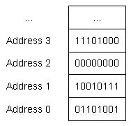

# C/C++ PROGRAMMING

# POINTERS IN C

## Introduction to pointers in C##

### What is reference?

**Memory**: an array of bytes within RAM

**Memory block**: a single unit (byte) within memory, used to hold some value

**Memroy address**: The address of where a memory block is located

### A list of memory size used by different data types


Example in C:

```cpp
#include <stdio.h>

int main() {
    char a = 'X';
    short b = 'Y'; // can use characters as it will covert to ASCII
    int c = 'Z';

    printf("Size of char: %zu bytes\n", sizeof(a));   // Use %zu for size_t
    printf("Size of short: %zu bytes\n", sizeof(b));  // Use %zu for size_t
    printf("Size of int: %zu bytes\n", sizeof(c));    // Use %zu for size_t

    printf("Address of a: %p\n", (void*)&a);  // Use %p for address
    printf("Address of b: %p\n", (void*)&b);  // Cast to void* to match %p
    printf("Address of c: %p\n", (void*)&c);  // Cast to void* to match %p

    return 0;
}
```

output:

```
1 byte
2 byte
4 byte
000000000061FE1F // memory address for a in hexadecimal form
000000000061FE1D // memory address for b in hexadecimal form
000000000061FE1 // memory address for c in hexadecimal form
```

Reference is when a data is stored in memory it has a memory address. A variable points to this memory address. This is called its reference.

# REFERENCES

How to use pointers in C: https://www.freecodecamp.org/news/pointers-in-c-programming/

Data types in C: https://www.geeksforgeeks.org/data-types-in-c/

Primitive & non primitive in JS: https://blog.stackademic.com/understanding-the-difference-between-primitive-and-non-primitive-data-types-in-javascript-c5251c0293db

# Random Access Memory

The main memory in a computer is called Random Access Memory (often called RAM for short). When we run a program, the operating system loads the program into RAM. Any data that is hardcoded into the program itself (e.g. text such as “Hello, world!”) is loaded at this point.

The operating system also reserves some additional RAM for the program to use while it is running. Common uses for this memory are to store values entered by the user, to store data read in from a file or network, or to store values calculated while the program is running (e.g. the sum of two values) so they can be used again later.

You can think of RAM as a series of numbered boxes that can be used to store data while the program is running.

In some older programming languages (like Applesoft BASIC), you could directly access these boxes (e.g. you could write a statement to “go get the value stored in membox number 7532”).

# Objects and variables

In C++, direct memory access is discouraged. Instead, we access memory indirectly through an object. An object represents a region of storage (typically RAM or a CPU register) that can hold a value. Objects also have associated properties (that we’ll cover in future lessons).

The key point here is that rather than say “go get the value stored in mailbox number 7532”, we can say, “go get the value stored by this object” and let the compiler figure out where and how to retrieve the value. This means we can focus on using objects to store and retrieve values, and not have to worry about where in memory those objects are actually being placed.

Although objects in C++ can be unnamed (anonymous), more often we name our objects using an identifier. An object with a name is called a variable.

**NOTE: In general programming, the term object typically refers to an unnamed object in memory, a variable, or a function. In C++, the term object has a narrower definition that excludes functions.**

## Variable definition

In order to use a variable in our program, we need to tell the compiler that we want one. The most common way to do this is by use of a special kind of declaration statement called a definition.
A definition statement can be used to tell the compiler that we want to use a variable in our program.

```cpp
int x; // define a variable named x (of type int)
```

At **compile-time** (when the program is being compiled), when encountering this statement, the compiler makes a note to itself that we want a variable with the name `x`, and that the variable has the data type `int`. From that point forward (with some limitations), whenever we use the identifier x in our code, the compiler will know that we are referring to this variable.

## Variable creation

At **runtime** (when the program is loaded into memory and run), each object is given an actual storage location (such as RAM, or a CPU register) that it can use to store values. The process of reserving storage for an object’s use is called **allocation**. Once allocation has occurred, the object has been created and can be used.

For the sake of example, let’s say that variable `x` is instantiated at memory location 140. Whenever the program uses variable `x`, it will access the value in memory location 140.

**NOTE: An object is “created” once actual storage has been reserved for the object’s use.**

## Data types

Objects are regions of storage that can store a data value. A **data type** (more commonly just called a **type**) determines what kind of value (e.g. a number, a letter, text, etc…) the object will store.

In C++, the type of an object must be known at compile-time, and that type can not be changed without recompiling the program. This means an integer variable can only hold integer values. If you want to store some other kind of value, you’ll need to use a different type.

**NOTE: The data type of an object must be known at compile-time (so the compiler knows how much memory that object requires).**
C++ also allows you to create your own custom types and it’s part of what makes C++ powerful.

## Summary

In C++, we use objects to access memory. A named object is called a variable. Each variable has an identifier, a type, and a value (and some other attributes that aren’t relevant here). A variable’s type is used to determine how the value in memory should be interpreted.

Variables are actually created at runtime, when memory is allocated for their use.

- What is a value?

A value is a letter (e.g. a), number (e.g. 5), text (e.g. Hello), or instance of some other useful concept that can be represented as data.

- What is an object?

An object is a region of storage (usually memory) that can store a value.

- What is a variable?

A variable is an object that has a name.

# Variable initialization

One downside of assignment is that assigning a value to a just-defined object requires two statements: one to define the variable, and another to assign the value.

These two steps can be combined. When an object is defined, you can optionally provide an initial value for the object. The process of specifying an initial value for an object is called initialization, and the syntax used to initialize an object is called an initializer. Informally, the initial value is often called an “initializer” as well.

For example, the following statement both defines a variable named width (of type int) and initializes it with the value 5:

```cpp
#include <iostream>

int main()
{
    int width { 5 };    // define variable width and initialize with initial value 5
    std::cout << width; // prints 5

    return 0;
}

In the above initialization of variable width, { 5 } is the initializer, and 5 is the initial value.
```

## Different forms of initialization

Unlike assignment (which is generally straightforward), initialization in C++ is surprisingly complex. So we’ll present a simplified view here to get started.

There are 5 common forms of initialization in C++:

```cpp
int a;         // default-initialization (no initializer)

// Traditional initialization forms:
int b = 5;     // copy-initialization (initial value after equals sign)
int c ( 6 );   // direct-initialization (initial value in parenthesis)

// Modern initialization forms (preferred):
int d { 7 };   // direct-list-initialization (initial value in braces)
int e {};      // value-initialization (empty braces)
```

Other forms of initialization include:

- Aggregate initialization
- Copy-list-initialization
- Reference initialization
- Static-initialization, constant-initialization, and dynamic-initialization
- Zero-initialization

### Default-initialization

When no initializer is provided (such as for variable a above), this is called default-initialization. In many cases, default-initialization performs no initialization, and leaves the variable with an indeterminate value (a value that is not predictable).

### Copy-initialization

When an initial value is provided after an equals sign, this is called copy-initialization. This form of initialization was inherited from the C language.

```c
int width = 5; // copy-initialization of value 5 into variable width
```

Much like copy-assignment, this copies the value on the right-hand side of the equals into the variable being created on the left-hand side. In the above snippet, variable width will be initialized with value 5.

Copy-initialization had fallen out of favor in modern C++ due to being less efficient than other forms of initialization for some complex types. However, C++17 remedied the bulk of these issues, and copy-initialization is now finding new advocates.

**NOTE: Copy-initialization is also used whenever values are implicitly copied, such as when passing arguments to a function by value, returning from a function by value, or catching exceptions by value.**

### Direct-initialization

When an initial value is provided inside parenthesis, this is called direct-initialization.

```c
int width ( 5 ); // direct initialization of value 5 into variable width
```

Direct-initialization was initially introduced to allow for more efficient initialization of complex objects (those with class types). Just like copy-initialization, direct-initialization had fallen out of favor in modern C++, largely due to being superseded by direct-list-initialization. However, direct-list-initialization has a few quirks of its own, and so direct-initialization is once again finding use in certain cases.

Direct-initialization is also used when values are explicitly cast to another type (e.g. via `static_cast`).

One of the reasons direct-initialization had fallen out of favor is because it makes it hard to differentiate variables from functions. For example:

```c
int x();  // forward declaration of function x
int x(0); // definition of variable x with initializer 0
T(5);     // function call if T is a function, direct-initialization of temporary object if T is a type
```

### Direct-list-initialization and copy-list-initialization

The modern way to initialize objects in C++ is to use a form of initialization that makes use of curly braces. This is called **list-initialization** (or **uniform initialization** or **brace initialization**).

List-initialization comes in two forms:

```cpp
int width { 5 };    // direct-list-initialization of initial value 5 into variable width (preferred)
int height = { 6 }; // copy-list-initialization of initial value 6 into variable height (rarely used)
```

When we see curly braces, we know we’re creating and initializing an object.

Additionally, list initialization provides a way to initialize objects with a list of values rather than a single value (which is why it is called “list initialization”).

### List initialization disallows narrowing conversions

The primary benefit of list-initialization is that “narrowing conversions” are disallowed. This means that if you try to list-initialize a variable using a value that the variable can not safely hold, the compiler is required to produce a diagnostic (compilation error or warning) to notify you. For example:

```cpp
int main()
{
    // An integer can only hold non-fractional values
    int w1 { 4.5 }; // compile error: list init does not allow narrowing conversion of 4.5 to 4

    int w2 = 4.5;   // compiles: copy-init initializes width with 4
    int w3 (4.5);    // compiles: direct-init initializes width with 4

    return 0;
}
```

**NOTE: List-initialization is generally preferred over the other initialization forms because it works in most cases (and is therefore most consistent), it disallows narrowing conversions (which we normally don’t want), and it supports initialization with a list of values (something we’ll cover in a future lesson).**

### Value-initialization and zero-initialization

When a variable is initialized using empty braces, value initialization takes place. In most cases, value initialization will initialize the variable to zero (or empty, if that’s more appropriate for a given type). In such cases where zeroing occurs, this is called zero-initialization.

```cpp
int width {}; // value-initialization / zero-initialization to value 0
```

### Q: When should I initialize with { 0 } vs {}?

Use direct-list-initialization when you’re actually using the initial value:

```cpp
int x { 0 };    // direct-list-initialization with initial value 0
std::cout << x; // we're using that 0 value here
```

Use value-initialization when the object’s value is temporary and will be replaced:

```cpp
int x {};      // value initialization
std::cin >> x; // we're immediately replacing that value so an explicit 0 would be meaningless
```

## Instantiation

The term instantiation is a fancy word that means a variable has been created (allocated) and initialized (this includes default initialization). An instantiated object is sometimes called an instance. Most often, this term is applied to class type objects, but it is occasionally applied to objects of other types as well.

multiple variables defined on the same line:

```cpp
int a = 5, b = 6;          // copy-initialization
int c ( 7 ), d ( 8 );      // direct-initialization
int e { 9 }, f { 10 };     // direct-list-initialization
int i {}, j {};            // value-initialization
```

## The `[[maybe_unused]]` attribute C++17

The `[[maybe_unused]]` attribute allows us to tell the compiler that we’re okay with a variable being unused. The compiler will not generate unused variable warnings for such variables.

The following program should generate no warnings/errors:

```cpp
#include <iostream>

int main()
{
    [[maybe_unused]] double pi { 3.14159 };  // Don't complain if pi is unused
    [[maybe_unused]] double gravity { 9.8 }; // Don't complain if gravity is unused
    [[maybe_unused]] double phi { 1.61803 }; // Don't complain if phi is unused

    std::cout << pi << '\n';
    std::cout << phi << '\n';

    // The compiler will no longer warn about gravity not being used

    return 0;
}
```

Additionally, the compiler will likely optimize these variables out of the program, so they have no performance impact.

The `[[maybe_unused]]` attribute should only be applied selectively to variables that have a specific and legitimate reason for being unused (e.g. because you need a list of named values, but which specific values are actually used in a given program may vary). Otherwise, unused variables should be removed from the program.

### Q. What are default-initialization and value-initialization? What is the behavior of each? Which should you prefer?

Default-initialization is when a variable initialization has no initializer (e.g. int x;). In most cases, the variable is left with an indeterminate value.
Value-initialization is when a variable initialization has an empty brace initializer (e.g. int x{};). In most cases this will perform zero-initialization.
You should prefer value-initialization, as it initializes the variable to a consistent value.

## `std::cout` is buffered

Consider a rollercoaster ride at your favorite amusement park. Passengers show up (at some variable rate) and get in line. Periodically, a train arrives and boards passengers (up to the maximum capacity of the train). When the train is full, or when enough time has passed, the train departs with a batch of passengers, and the ride commences. Any passengers unable to board the current train wait for the next one.

This analogy is similar to how output sent to std::cout is typically processed in C++. Statements in our program request that output be sent to the console. However, that output is typically not sent to the console immediately. Instead, the requested output “gets in line”, and is stored in a region of memory set aside to collect such requests (called a **buffer**). Periodically, the buffer is **flushed**, meaning all of the data collected in the buffer is transferred to its destination (in this case, the console).

This also means that if your program crashes, aborts, or is paused (e.g. for debugging purposes) before the buffer is flushed, any output still waiting in the buffer will not be displayed.

Using `std::endl` is often inefficient, as it actually does two jobs: it outputs a newline (moving the cursor to the next line of the console), and it flushes the buffer (which is slow). If we output multiple lines of text ending with std::endl, we will get multiple flushes, which is slow and probably unnecessary.

When outputting text to the console, we typically don’t need to explicitly flush the buffer ourselves. C++’s output system is designed to self-flush periodically, and it’s both simpler and more efficient to let it flush itself.

To output a newline without flushing the output buffer, we use `\n` (inside either single or double quotes), which is a special symbol that the compiler interprets as a newline character.

**NOTE**: In C++, we use single quotes to represent single characters (such as 'a' or '$'), and double-quotes to represent text (zero or more characters). Even though ‘\n’ is represented in source code as two symbols, it is treated by the compiler as a single **linefeed (LF)** character (with ASCII value 10), and thus is conventionally single quoted (unless embedded into existing double-quoted text).

## std::cin

`std::cin` is another predefined variable in the iostream library. Whereas `std::cout` prints data to the console (using the insertion operator `<<` to provide the data), `std::cin` (which stands for “character input”) reads input from keyboard. We typically use the extraction operator `>>` to put the input data in a variable (which can then be used in subsequent statements).

```cpp
#include <iostream>  // for std::cout and std::cin

int main()
{
    std::cout << "Enter a number: "; // ask user for a number

    int x{};       // define variable x to hold user input (and value-initialize it)
    std::cin >> x; // get number from keyboard and store it in variable x

    std::cout << "You entered " << x << '\n';
    return 0;
}
```

### std::cin is buffered

In a prior section, we noted that outputting data is actually a two stage process:

- The data from each output request is added (to the end) of an output buffer.
- Later, data from (the front of) the output buffer is flushed to the output device (the console).

Similarly, inputting data is also a two stage process:

- The individual characters you enter as input are added to the end of an input buffer (inside `std::cin`). The enter key (pressed to submit the data) is also stored as a `'\n'` character.
- The extraction operator ‘>>’ removes characters from the front of the input buffer and converts them into a value that is assigned (via copy-assignment) to the associated variable. This variable can then be used in subsequent statements.

Let's demonstrate this by an example:

```cpp
#include <iostream>  // for std::cout and std::cin

int main()
{
    std::cout << "Enter two numbers: ";

    int x{};
    std::cin >> x;

    int y{};
    std::cin >> y;

    std::cout << "You entered " << x << " and " << y << '\n';

    return 0;
}
```

This program inputs to two variables (this time as separate statements). We’ll run this program twice.

Run #1: When std::cin >> x; is encountered, the program will wait for input. Enter the value 4. The input 4\n goes into the input buffer, and the value 4 is extracted to variable x.

When std::cin >> y; is encountered, the program will again wait for input. Enter the value 5. The input 5\n goes into the input buffer, and the value 5 is extracted to variable y. Finally, the program will print You entered 4 and 5.

There should be nothing surprising about this run.

Run #2: When std::cin >> x is encountered, the program will wait for input. Enter 4 5. The input 4 5\n goes into the input buffer, but only the 4 is extracted to variable x (extraction stops at the space).

When std::cin >> y is encountered, the program will not wait for input. Instead, the 5 that is still in the input buffer is extracted to variable y. The program then prints You entered 4 and 5.

Note that in run 2, the program didn’t wait for the user to enter additional input when extracting to variable y because there was already prior input in the input buffer that could be used.

### The basic extraction process

Here’s a simplified view of how operator >> works for input:

    First, leading whitespace (spaces, tabs, and newlines at the front of the buffer) is discarded from the input buffer. This will discard any unextracted newline character remaining from a prior line of input.
    If the input buffer is now empty, operator >> will wait for the user to enter more data. Leading whitespace is again discarded.
    operator >> then extracts as many consecutive characters as it can, until it encounters either a newline character (representing the end of the line of input) or a character that is not valid for the variable being extracted to.

The result of the extraction is as follows:

    If any characters were extracted in step 3 above, extraction is a success. The extracted characters are converted into a value that is then copy-assigned to the variable.
    If no characters could be extracted in step 3 above, extraction has failed. The object being extracted to is copy-assigned the value 0 (as of C++11), and any future extractions will immediately fail (until std::cin is cleared).

Any non-extracted characters (including newlines) remain available for the next extraction attempt.
**Eg:**
If the user types 5a and enter, 5a\n will be added to the buffer. 5 will be extracted, converted to an integer, and assigned to variable x. a\n will be left in the input buffer for the next extraction.

If the user types ‘b’ and enter, b\n would be added to the buffer. Because b is not a valid integer, no characters can be extracted, so this is an extraction failure. Variable x would be set to 0, and future extractions will fail until the input stream is cleared.

# Uninitialized variables

Unlike some programming languages, C/C++ does not automatically initialize most variables to a given value (such as zero). When a variable that is not initialized is given a memory address to use to store data, the default value of that variable is whatever (garbage) value happens to already be in that memory address! A variable that has not been given a known value (through initialization or assignment) is called an uninitialized variable.

- Initialized = The object is given a known value at the point of definition.
- Assignment = The object is given a known value beyond the point of definition.
- Uninitialized = The object has not been given a known value yet.

# Undefined behavior

Using the value from an uninitialized variable is our first example of undefined behavior. **Undefined behavior** (often abbreviated UB) is the result of executing code whose behavior is not well-defined by the C++ language. In this case, the C++ language doesn’t have any rules determining what happens if you use the value of a variable that has not been given a known value. Consequently, if you actually do this, undefined behavior will result.

# Implementation-defined behavior and unspecified behavior

A specific compiler and the associated standard library it comes with are called an **implementation** (as these are what actually implements the C++ language). In some cases, the C++ language standard allows the implementation to determine how some aspect of the language will behave, so that the compiler can choose a behavior that is efficient for a given platform. Behavior that is defined by the implementation is called implementation-defined behavior. Implementation-defined behavior must be documented and consistent for a given implementation.

Example of implementation-defined behavior:

```cpp
#include <iostream>

int main()
{
	std::cout << sizeof(int) << '\n'; // print how many bytes of memory an int value takes

	return 0;
}
```

On most platforms, this will produce `4`, but on others it may produce `2`.

**Unspecified behavior** is almost identical to implementation-defined behavior in that the behavior is left up to the implementation to define, but the implementation is not required to document the behavior.

We generally want to avoid implementation-defined and unspecified behavior, as it means our program may not work as expected if compiled on a different compiler (or even on the same compiler if we change project settings that affect how the implementation behaves!)

# Keywords and naming identifiers

## Keywords

C++ reserves a set of 92 words (as of C++23) for its own use. These words are called keywords (or reserved words), and each of these keywords has a special meaning within the C++ language.

Here is a list of all the C++ keywords (through C++23):

- alignas
- alignof
- and
- and_eq
- asm
- auto
- bitand
- bitor
- bool
- break
- case
- catch
- char
- char8_t (since C++20)
- char16_t
- char32_t
- class
- compl
- concept (since C++20)
- const
- consteval (since C++20)
- constexpr
- constinit (since C++20)
- const_cast
- continue
- co_await (since C++20)
- co_return (since C++20)
- co_yield (since C++20)
- decltype
- default
- delete
- do
- double
- dynamic_cast
- else
- enum
- explicit
- export
- extern
- false
- float
- for
- friend
- goto
- if
- inline
- int
- long
- mutable
- namespace
- new
- noexcept
- not
- not_eq
- nullptr
- operator
- or
- or_eq
- private
- protected
- public
- register
- reinterpret_cast
- requires (since C++20)
- return
- short
- signed
- sizeof
- static
- static_assert
- static_cast
- struct
- switch
- template
- this
- thread_local
- throw
- true
- try
- typedef
- typeid
- typename
- union
- unsigned
- using
- virtual
- void
- volatile
- wchar_t
- while
- xor
- xor_eq

The name of a variable (or function, type, or other kind of item) is called an **identifier**.

C++ also defines special identifiers: _override, final, import, and module_. These have a specific meaning when used in certain contexts but are not reserved otherwise.

### Identifier naming best practices

First, it is a convention in C++ that variable names should begin with a lowercase letter. If the variable name is a single word or acronym, the whole thing should be written in lowercase letters.

Identifier names that start with a capital letter are typically used for user-defined types (such as structs, classes, and enumerations).

If the variable or function name is multi-word, there are two common conventions: words separated by underscores (sometimes called snake_case), or intercapped (sometimes called camelCase, since the capital letters stick up like the humps on a camel).

```cpp
int my_variable_name;   // conventional (separated by underscores/snake_case)
int my_function_name(); // conventional (separated by underscores/snake_case)

int myVariableName;     // conventional (intercapped/camelCase)
int myFunctionName();   // conventional (intercapped/camelCase)

int my variable name;   // invalid (whitespace not allowed)
int my function name(); // invalid (whitespace not allowed)

int MyVariableName;     // unconventional (should start with lower case letter)
int MyFunctionName();   // unconventional (should start with lower case letter)
```

# Literals

Consider the following two statements:

```cpp
std::cout << "Hello world!";
int x { 5 };
```

What are ‘”Hello world!”‘ and ‘5’? They are literals. A **literal** (also known as a **literal constant**) is a fixed value that has been inserted directly into the source code.

Literals and variables both have a value (and a type). Unlike a variable (whose value can be set and changed through initialization and assignment respectively), the value of a literal is fixed and cannot be changed. The literal 5 always has value 5. This is why literals are called constants.

A literal’s value is placed directly in the executable, and the executable itself can’t be changed after it is created. A variable’s value is placed in memory, and the value of memory can be changed while the executable is running.

# Operators

In mathematics, an **operation** is a process involving zero or more input values (called **operands**) that produces a new value (called an output value). The specific operation to be performed is denoted by a symbol called an **operator**.

In C++, the output value of an operation is often called a **return value**.

While most operators have symbols for names (e.g. `+`, or `==`), there are also a number of operators that are keywords (e.g. `new`, `delete`, and `throw`).

The number of operands that an operator takes as input is called the operator’s **arity**

## Types of Arity

Operators in C++ come in four different arities:

**Unary** operators act on one operand. An example of a unary operator is the `-` operator. For example, given `-5`, `operator-` takes literal operand `5` and flips its sign to produce new output value `-5`.

**Binary** operators act on two operands (often called left and right, as the left operand appears on the left side of the operator, and the right operand appears on the right side of the operator).
For example, given `3 + 4`, `operator+` takes the left operand `3` and the right operand `4` and applies mathematical addition to produce new output value `7`. The insertion (`<<`) and extraction (`>>`) operators are binary operators, taking `std::cout` or `std::cin` on the left side, and the value to output or variable to input to on the right side.

**Ternary** operators act on three operands. There is only one of these in C++ (the conditional operator)

**Nullary** operators act on zero operands. There is also only one of these in C++ (the throw operator)

Operators can be chained together such that the output of one operator can be used as the input for another operator.

## Return values and side effects

Most operators in C++ just use their operands to calculate a return value. There are a few operators that do not produce return values (such as **delete** and **throw**)

Some operators have additional behaviors. An operator (or function) that has some observable effect beyond producing a return value is said to have a **side effect**. For example, `x = 5` has the side effect of assigning value `5` to variable `x`. The changed value of `x` is observable (e.g. by printing the value of `x`) even after the operator has finished executing. `std::cout << 5` has the side effect of printing `5` to the console. We can observe the fact that `5` has been printed to the console even after `std::cout << 5` has finished executing.

**NOTE:** For the operators we call primarily for their side effects (e.g. **operator=** or **operator<<**), it’s not always obvious what return values they produce (if any) unlike for **operator+** or **operator \***.

So here, Both **operator=** and **operator<<** (when used to output values to the console) return their left operand. Thus, **x = 5** returns **x**, and **std::cout << 5** returns **std::cout**. This is done so that these operators can be chained.

# Introduction to expressions

## Expressions

In general programming, an **expression** is a non-empty sequence of literals, variables, operators, and function calls that calculates a value. The process of executing an expression is called **evaluation**, and the resulting value produced is called the **result** of the expression (also sometimes called the **return value**).

Expressions do not end in a semicolon, and cannot be compiled by themselves. For example, if you were to try compiling the expression `x = 5`, your compiler would complain (probably about a missing semicolon). Rather, expressions are always evaluated as part of statements.

For example, take this statement:

```cpp
int x{ 2 + 3 }; // 2 + 3 is an expression that has no semicolon -- the semicolon is at the end of the statement containing the expression
```

If you were to break this statement down into its syntax, it would look like this:

`type identifier { expression };`

Expressions cannot be executed by themselves -- they must exist as part of a statement. Fortunately, it’s trivial to convert any expression into an equivalent statement. An **expression statement** is a statement that consists of an expression followed by a semicolon. When the expression statement is executed, the expression will be evaluated.

## Subexpressions, full expressions, and compound expressions

Consider the following expressions:

```cpp
2               // 2 is a literal that evaluates to value 2
2 + 3           // 2 + 3 uses operator + to evaluate to value 5
x = 4 + 5       // 4 + 5 evaluates to value 9, which is then assigned to variable x
```

A **subexpression** is an expression used as an operand. For example, the subexpressions of `x = 4 + 5` are `x` and `4 + 5`. The subexpressions of `4 + 5` are `4` and `5`.

A **full expression** is an expression that is not a subexpression. All three expressions above (`2`, `2 + 3`, and `x = 4 + 5`) are full expressions.

In casual language, a **compound expression** is an expression that contains two or more uses of operators. `x = 4 + 5` is a compound expression because it contains two uses of operators (`operator=` and `operator+`). `2` and `2 + 3` are not compound expressions.

# Functions

A function is a collection of statements that execute sequentially.

But more importatnly a function is a reusable sequence of statements designed to do a particular job.

Functions provide a way for us to split our programs into small, modular chunks that are easier to organize, test, and use.

The C++ standard library comes with plenty of already-written functions for you to use -- however, it’s just as common to write your own. Functions that you write yourself are called **user-defined functions**.

## How function call works

A program will be executing statements sequentially inside one function when it encounters a function call. A function call tells the CPU to interrupt the current function and execute another function. The CPU essentially “puts a bookmark” at the current point of execution, executes the function named in the function call, and then returns to the point it bookmarked and resumes execution.

The function initiating the function call is the **caller**, and the function being **called** (executed) is the **callee**. A function call is also sometimes called an **invocation**, with the caller **invoking** the callee.

### Function syntax

```cpp
returnType functionName() // This is the function header (tells the compiler about the existence of the function)
{
    // This is the function body (tells the compiler what the function does)
}
```

An example of user defined function

```cpp
#include <iostream> // for std::cout

// Definition of user-defined function doPrint()
// doPrint() is the called function in this example
void doPrint()
{
    std::cout << "In doPrint()\n";
}

// Definition of user-defined function main()
int main()
{
    std::cout << "Starting main()\n";
    doPrint();                        // Interrupt main() by making a function call to doPrint().  main() is the caller.
    std::cout << "Ending main()\n";   // This statement is executed after doPrint() ends

    return 0;
}
```

**NOTE: Nested functions are not supported. A function whose definition is placed inside another function is a nested function. Unlike some other programming languages, in C++, functions cannot be nested.**

## Return values

To return a value back to the caller, two things are needed.

First, your function has to indicate what type of value will be returned. This is done by setting the function’s **return type**, which is the type that is defined before the function’s name.

Second, inside the function that will return a value, we use a **return statement** to indicate the specific value being returned to the caller. The specific value returned from a function is called the **return value**. When the return statement is executed, the function exits immediately, and the return value is copied from the function back to the caller. This process is called **return by value**.

Eg:

```cpp
#include <iostream>

int getValueFromUser() // this function now returns an integer value
{
 	std::cout << "Enter an integer: ";
	int input{};
	std::cin >> input;

	return input; // return the value the user entered back to the caller
}

int main()
{
	int num { getValueFromUser() }; // initialize num with the return value of getValueFromUser()

	std::cout << num << " doubled is: " << num * 2 << '\n';

	return 0;
}
```

## So How main works

When the program is executed, the operating system makes a function call to `main()`. Execution then jumps to the top of `main()`. The statements in `main()` are executed sequentially. Finally, `main()` returns an integer value (usually 0), and your program terminates.

In C++, there are two special requirements for `main()`:

- `main()` is required to return an `int`.
- Explicit function calls to `main()` are disallowed.

**NOTE: It is a common misconception that main is always the first function that executes. Global variables are initialized prior to the execution of main. If the initializer for such a variable invokes a function, then that function will execute prior to main.**

## Status codes

The return value from `main()` is sometimes called a **status code** (or less commonly, an **exit code**, or rarely a **return code**). The status code is used to signal whether your program was successful or not.

By convention, a status code of `0` means the program ran normally (meaning the program executed and behaved as expected).

The C++ standard only defines the meaning of 3 status codes: `0`, `EXIT_SUCCESS`, and `EXIT_FAILURE`. `0` and `EXIT_SUCCESS` both mean the program executed successfully. `EXIT_FAILURE` means the program did not execute successfully.

`EXIT_SUCCESS` and `EXIT_FAILURE` are preprocessor macros defined in the <cstdlib> header:

```cpp
#include <cstdlib> // for EXIT_SUCCESS and EXIT_FAILURE

int main()
{
    return EXIT_SUCCESS;
}
```

If you want to maximize portability, you should only use `0` or `EXIT_SUCCESS` to indicate a successful termination, or `EXIT_FAILURE` to indicate an unsuccessful termination.

## A value-returning function that does not return a value will produce undefined behavior

A function that returns a value is called a **value-returning function**. A function is value-returning if the return type is anything other than `void`.

A value-returning function must return a value of that type (using a return statement), otherwise undefined behavior will result.

- Function main will implicitly return 0 if no return statement is provided.
- A value-returning function can only return a single value back to the caller each time it is called. Although there are various ways to work around the limitation of functions only being able to return a single value.

A great function example

```cpp
#include <iostream>

int getValueFromUser()
{
    std::cout << "Enter an integer: ";
    int input{};
    std::cin >> input;
    return input;
}

int main()
{
    int x{ getValueFromUser() };
    int y{ getValueFromUser() };

    std::cout << x << " + " << x + y << '\n';

    return 0;
}
```

**NOTE: Bro your code shouldn't be WET man, it should be DRY.**

## Void functions

- Void functions don’t need a return statement. A void function will automatically return to the caller at the end of the function. No return statement is required.

- Void functions can’t be used in expression that require a value

```cpp
#include <iostream>

// void means the function does not return a value to the caller
void printHi()
{
    std::cout << "Hi" << '\n';
}

int main()
{
    printHi(); // okay: function printHi() is called, no value is returned

    std::cout << printHi(); // compile error

    return 0;
}
```

The first call to `printHi()` is called in a context that does not require a value. Since the function doesn’t return a value, this is fine.

The second function call to function `printHi()` won’t even compile. Function `printHi` has a `void` return type, meaning it doesn’t return a value. However, this statement is trying to send the return value of printHi to `std::cout` to be printed. `std::cout` doesn’t know how to handle this (what value would it output?). Consequently, the compiler will flag this as an error.

## Function parameters and arguments

A **function parameter** is a variable used in the header of a function. Function parameters work almost identically to variables defined inside the function, but with one difference: they are initialized with a value provided by the caller of the function.

Function parameters are defined in the function header by placing them in between the parenthesis after the function name, with multiple parameters being separated by commas.

Here are some examples of functions with different numbers of parameters:

```cpp
// This function takes no parameters
// It does not rely on the caller for anything
void doPrint()
{
    std::cout << "In doPrint()\n";
}

// This function takes one integer parameter named x
// The caller will supply the value of x
void printValue(int x)
{
    std::cout << x  << '\n';
}

// This function has two integer parameters, one named x, and one named y
// The caller will supply the value of both x and y
int add(int x, int y)
{
    return x + y;
}
```

An **argument** is a value that is passed from the caller to the function when a function call is made:

```cpp
doPrint(); // this call has no arguments
printValue(6); // 6 is the argument passed to function printValue()
add(2, 3); // 2 and 3 are the arguments passed to function add()
```

Note that multiple arguments are also separated by commas.

### How parameters and arguments work together

When a function is called, all of the parameters of the function are created as variables, and the value of each of the arguments is copied into the matching parameter (using copy initialization). This process is called pass by value. Function parameters that utilize **pass by value** are called **value parameters**.

For example:

```cpp
#include <iostream>

// This function has two integer parameters, one named x, and one named y
// The values of x and y are passed in by the caller
void printValues(int x, int y)
{
    std::cout << x << '\n';
    std::cout << y << '\n';
}

int main()
{
    printValues(6, 7); // This function call has two arguments, 6 and 7

    return 0;
}
```

Another example:

```cpp
#include <iostream>

int getValueFromUser()
{
  int input{};
  std::cout << "Enter an integer: ";
  std::cin >> input;
  return input;
}

void printDouble(int val)
{
  std::cout << "Double of " << val << " is: " << val * 2 << '\n';
}

int main()
{
  int num{ getValueFromUser() };
  printDouble(num);

  std::cout << num; // The num was never changed even though
                    // passed it as a val to printDouble,
                    // demonstration of pass by value.

  return 0;
}
```

By using both parameters and a return value, we can create functions that take data as input, do some calculation with it, and return the value to the caller.

```cpp
#include <iostream>

int add(int x, int y)
{
    return x + y;
}

int multiply(int z, int w)
{
    return z * w;
}

int main()
{
    std::cout << add(4, 5) << '\n'; // within add() x=4, y=5, so x+y=9
    std::cout << add(1 + 2, 3 * 4) << '\n'; // within add() x=3, y=12, so x+y=15

    int a{ 5 };
    std::cout << add(a, a) << '\n'; // evaluates (5 + 5)

    std::cout << add(1, multiply(2, 3)) << '\n'; // evaluates 1 + (2 * 3)
    std::cout << add(1, add(2, 3)) << '\n'; // evaluates 1 + (2 + 3)

    return 0;
}
```

### Unreferenced parameters

In certain cases, you will encounter functions that have parameters that are not used in the body of the function. These are called **unreferenced parameters**.

```cpp
void doSomething(int count) // warning: unreferenced parameter count
{
    // This function used to do something with count but it is not used any longer
}

int main()
{
    doSomething(4);

    return 0;
}
```

Just like with unused local variables, your compiler will probably warn that variable `count` has been defined but not used.

In a function definition, the name of a function parameter is optional. Therefore, in cases where a function parameter needs to exist but is not used in the body of the function, you can simply omit the name. A parameter without a name is called an **unnamed parameter**:

```cpp
void doSomething(int) // ok: unnamed parameter will not generate warning
{
}
```

The Google C++ style guide recommends using a comment to document what the unnamed parameter was:

```cpp
void doSomething(int /*count*/)
{
}
```

why we’d write a function that has a parameter whose value isn’t used?

1. Let’s say we have a function with a single parameter. Later, the function is updated in some way, and the value of the parameter is no longer needed. If the now-unused function parameter were simply removed, then every existing call to the function would break (because the function call would be supplying more arguments than the function could accept). This would require us to find every call to the function and remove the unneeded argument. This might be a lot of work (and require a lot of retesting). It also might not even be possible (in cases where we did not control all of the code calling the function). So instead, we might leave the parameter as it is, and just have it do nothing.

2. Operators `++` and `--` have prefix and postfix variants (e.g. `++foo` vs `foo++`). An unreferenced function parameter is used to differentiate whether an overload of such an operator is for the prefix or postfix case.

3. When we need to determine something from the type (rather than the value) of a type template parameter.

# Introduction to local scope

Variables defined inside the body of a function are called **local variables**.

```cpp
int add(int x, int y)
{
    int z{ x + y }; // z is a local variable

    return z;
}
```

Function parameters are also generally considered to be local variables, and we will include them as such:

```cpp
int add(int x, int y) // function parameters x and y are local variables
{
    int z{ x + y };

    return z;
}
```

## Lifetime

When is an instantiated variable destroyed?

Local variables are destroyed in the opposite order of creation at the end of the set of curly braces in which it is defined (or for a function parameter, at the end of the function).

An object’s **lifetime** is defined to be the time between its creation and destruction. Variable creation and destruction happen when the program is running (called runtime), not at compile time. Therefore, lifetime is a runtime property.

### What happens when an object is destroyed?

In most cases, nothing. The destroyed object simply becomes invalid. If the object is a class type object, prior to destruction, a special function called a destructor is invoked. In many cases, the destructor does nothing, in which case no cost is incurred.

Any use of an object after it has been destroyed will result in undefined behavior.

At some point after destruction, the memory used by the object will be **deallocated** (freed up for reuse).

## Local Scope (block scope)

An identifier’s **scope** determines where the identifier can be seen and used within the source code. When an identifier can be seen and used, we say it is **in scope**. When an identifier can not be seen, we can not use it, and we say it is **out of scope**. Scope is a compile-time property, and trying to use an identifier when it is not in scope will result in a compile error.

The identifier of a local variable has **local scope**. An identifier with local scope (technically called **block scope**) is usable from the point of definition to the end of the innermost pair of curly braces containing the identifier (or for function parameters, at the end of the function). This ensures local variables cannot be used before the point of definition (even if the compiler opts to create them before then) or after they are destroyed. Local variables defined in one function are also not in scope in other functions that are called.

Here’s a program demonstrating the scope of a variable named x:

```cpp
#include <iostream>

// x is not in scope anywhere in this function
void doSomething()
{
    std::cout << "Hello!\n";
}

int main()
{
    // x can not be used here because it's not in scope yet

    int x{ 0 }; // x enters scope here and can now be used within this function

    doSomething();

    return 0;
} // x goes out of scope here and can no longer be used
```

**NOTE**: Variable `x` is not in scope anywhere inside of function `doSomething`. The fact that function `main` calls function `doSomething` is irrelevant in this context.

### “Out of scope” vs “going out of scope”

The terms “out of scope” and “going out of scope” can be confusing.

An identifier is out of scope anywhere it cannot be accessed within the code. In the example above, the identifier x is in scope from its point of definition to the end of the `main` function. The identifier `x` is out of scope outside of that code region.

The term “going out of scope” is typically applied to objects rather than identifiers. We say an object goes out of scope at the end of the scope (the end curly brace) in which the object was instantiated. In the example above, the object named `x` goes out of scope at the end of the function `main`.

A local variable’s lifetime ends at the point where it goes out of scope, so local variables are destroyed at this point.

Note that not all types of variables are destroyed when they go out of scope.

**NOTE:** Remember, lifetime is a runtime property, and scope is a compile-time property.

Another example:

```cpp
#include <iostream>

int add(int x, int y) // x and y are created and enter scope here
{
    // x and y are usable only within add()
    return x + y;
} // y and x go out of scope and are destroyed here

int main()
{
    int a{ 5 }; // a is created, initialized, and enters scope here
    int b{ 6 }; // b is created, initialized, and enters scope here

    // a and b are usable only within main()

    std::cout << add(a, b) << '\n'; // calls add(5, 6), where x=5 and y=6

    return 0;
} // b and a go out of scope and are destroyed here
```

### Where to define local variables

In modern C++, the best practice is that local variables inside the function body should be defined as close to their first use as reasonable:

```cpp
#include <iostream>

int main()
{
	std::cout << "Enter an integer: ";
	int x{};       // x defined here
	std::cin >> x; // and used here

	std::cout << "Enter another integer: ";
	int y{};       // y defined here
	std::cin >> y; // and used here

	int sum{ x + y }; // sum can be initialized with intended value
	std::cout << "The sum is: " << sum << '\n';

	return 0;
}
```

### When to use function parameters vs Local variables

Using a function parameter when you should use a local variable leads to code looking like this:

```cpp
#include <iostream>

int getValueFromUser(int val) // val is a function parameter
{
    std::cout << "Enter a value: ";
    std::cin >> val;
    return val;
}

int main()
{
    int x {};
    int num { getValueFromUser(x) }; // main must pass x as an argument

    std::cout << "You entered " << num << '\n';

    return 0;
}
```

In the above example, `getValueFromUser()` has defined `val` as a function parameter. Because of this, `main()` must define `x` so that it has something to pass as an argument. However, the actual value of `x` is never used, and the value that `val` is initialized with is never used. Making the caller define and pass a variable that is never used adds needless complexity.

The correct way to write this would be as follows:

```cpp
#include <iostream>

int getValueFromUser()
{
    int val {}; // val is a local variable
    std::cout << "Enter a value: ";
    std::cin >> val;
    return val;
}

int main()
{
    int num { getValueFromUser() }; // main does not need to pass anything

    std::cout << "You entered " << num << '\n';

    return 0;
}
```

In this example, `val` is now a local variable. `main()` is now simpler because it does not need to define or pass a variable to call `getValueFromUser()`.

## Temporary object

A **temporary object** (also sometimes called an **anonymous object**) is an unnamed object that is used to hold a value that is only needed for a short period of time. Temporary objects are generated by the compiler when they are needed.

There are many different ways that temporary values can be created, but here’s a common one:

```cpp
#include <iostream>

int getValueFromUser()
{
 	std::cout << "Enter an integer: ";
	int input{};
	std::cin >> input;

	return input; // return the value of input back to the caller
}

int main()
{
	std::cout << getValueFromUser() << '\n'; // where does the returned value get stored?

	return 0;
}
```

In the above program, the function `getValueFromUser()` returns the value stored in local variable `input` back to the caller. Because `input` will be destroyed at the end of the function, the caller receives a copy of the value so that it has a value it can use even after `input` is destroyed.

But where is the value that is copied back to the caller stored? We haven’t defined any variables in `main()`. The answer is that the return value is stored in a temporary object. This temporary object is then passed to `std::cout` to be printed.

**Key insight:** Return by value returns a temporary object (that holds a copy of the return value) to the caller.

Temporary objects have no scope at all (this makes sense, since scope is a property of an identifier, and temporary objects have no identifier).

Temporary objects are destroyed at the end of the full expression in which they are created. This means temporary objects are always destroyed before the next statement executes.

In our example above, the temporary object created to hold the return value of `getValueFromUser()` is destroyed after `std::cout << getValueFromUser() << '\n'` executes.

In the case where a temporary object is used to initialize a variable, the initialization happens before the destruction of the temporary.

In modern C++ (especially since C++17), the compiler has many tricks to avoid generating temporaries where previously it would have needed to. For example, when we use a return value to initialize a variable, this would normally result in the creation of a temporary holding the return value, and then using the temporary to initialize the variable. However, in modern C++, the compiler will often skip creating the temporary and just initialize the variable directly with the return value.

Similarly, in the above example, since the return value of `getValueFromUser()` is immediately output, the compiler can skip creation and destruction of the temporary in `main()`, and use the return value of `getValueFromUser()` to directly initialize the parameter of `operator<<`.

**On a side note:** When a function becomes too long, too complicated, or hard to understand, it can be split into multiple sub-functions. This is called refactoring.

# Forward declarations and definitions

Take a look at this seemingly innocent sample program:

```cpp
#include <iostream>

int main()
{
    std::cout << "The sum of 3 and 4 is: " << add(3, 4) << '\n';
    return 0;
}

int add(int x, int y)
{
    return x + y;
}
```

it doesn’t compile at all! It produces compile error.

The reason this program doesn’t compile is because the compiler compiles the contents of code files sequentially. When the compiler reaches the function call add() on line 5 of main, it doesn’t know what add is, because we haven’t defined add until line 9! That produces the error, identifier not found.

To fix this problem, we need to address the fact that the compiler doesn’t know what add is. There are two common ways to address the issue.

### Option 1: Reorder the function definitions

One way to address the issue is to reorder the function definitions so add is defined before main:

```cpp
#include <iostream>

int add(int x, int y)
{
    return x + y;
}

int main()
{
    std::cout << "The sum of 3 and 4 is: " << add(3, 4) << '\n';
    return 0;
}
```

That way, by the time main calls add, the compiler will already know what add is. Because this is such a simple program, this change is relatively easy to do. However, in a larger program, it can be tedious trying to figure out which functions call which other functions (and in what order) so they can be declared sequentially.

Furthermore, this option is not always possible. Let’s say we’re writing a program that has two functions A and B. If function A calls function B, and function B calls function A, then there’s no way to order the functions in a way that will make the compiler happy. If you define A first, the compiler will complain it doesn’t know what B is. If you define B first, the compiler will complain that it doesn’t know what A is.

### Option 2: Use a forward declaration

We can also fix this by using a forward declaration.

A **forward declaration** allows us to tell the compiler about the existence of an identifier before actually defining the identifier.

In the case of functions, this allows us to tell the compiler about the existence of a function before we define the function’s body. This way, when the compiler encounters a call to the function, it’ll understand that we’re making a function call, and can check to ensure we’re calling the function correctly, even if it doesn’t yet know how or where the function is defined.

To write a forward declaration for a function, we use a **function declaration** statement (also called a **function prototype**). The function declaration consists of the function’s return type, name, and parameter types, terminated with a semicolon. The names of the parameters can be optionally included. The function body is not included in the declaration.

Here’s a function declaration for the add function:

```cpp
int add(int x, int y); // function declaration includes return type, name, parameters, and semicolon.  No function body!
```

here’s our original program that didn’t compile, using a function declaration as a forward declaration for function add:

```cpp
#include <iostream>

int add(int x, int y); // forward declaration of add() (using a function declaration)

int main()
{
    std::cout << "The sum of 3 and 4 is: " << add(3, 4) << '\n'; // this works because we forward declared add() above
    return 0;
}

int add(int x, int y) // even though the body of add() isn't defined until here
{
    return x + y;
}
```

It is worth noting that function declarations do not need to specify the names of the parameters (as they are not considered to be part of the function declaration). In the above code, you can also forward declare your function like this:

```cpp
int add(int, int); // valid function declaration
```

## Why forward declarations?

You may be wondering why we would use a forward declaration if we could just reorder the functions to make our programs work.

Most often, forward declarations are used to tell the compiler about the existence of some function that has been defined in a different code file. Reordering isn’t possible in this scenario because the caller and the callee are in completely different files!

Forward declarations can also be used to define our functions in an order-agnostic manner. This allows us to define functions in whatever order maximizes organization (e.g. by clustering related functions together) or reader understanding.

Less often, there are times when we have two functions that call each other. Reordering isn’t possible in this case either, as there is no way to reorder the functions such that each is before the other. Forward declarations give us a way to resolve such circular dependencies.

### Forgetting the function body

What happens if they forward declare a function but do not define it.

The answer is: it depends. If a forward declaration is made, but the function is never called, the program will compile and run fine. However, if a forward declaration is made and the function is called, but the program never defines the function, the program will compile okay, but the linker will complain that it can’t resolve the function call.

Forward declarations are most often used with functions. However, forward declarations can also be used with other identifiers in C++, such as variables and types.

## Declarations vs. definitions

A **declaration** tells the compiler about the existence of an identifier and its associated type information.

Example:

```cpp
int add(int x, int y); // tells the compiler about a function named "add" that takes two int parameters and returns an int.  No body!. A pure declaration.
int x;                 // tells the compiler about an integer variable named x
```

A **definition** is a declaration that actually implements (for functions and types) or instantiates (for variables) the identifier.

Example:

```cpp
// because this function has a body, it is an implementation of function add()
int add(int x, int y)
{
    int z{ x + y };   // instantiates variable z

    return z;
}

int x;                // instantiates variable x
```

**NOTE:** In C++, all definitions are declarations. Therefore int x; is both a definition and a declaration. Conversely, not all declarations are definitions. Declarations that aren’t definitions are called pure declarations. Types of pure declarations include forward declarations for function, variables, and types.

When the compiler encounters an identifier, it will check to ensure use of that identifier is valid (e.g. that the identifier is in scope, that it is used in a syntactically valid manner, etc…).

In most cases, a declaration is sufficient to allow the compiler to ensure an identifier is being used properly. For example, when the compiler encounters function call add(5, 6), if it has already seen the declaration for `add(int, int)`, then it can validate that `add` is actually a function that takes two `int` parameters. It does not need to have actually seen the definition for function `add` (which may exist in some other file).

However, there are a few cases where the compiler must be able to see a full definition in order to use an identifier (such as for template definitions and type definitions)

## The one definition rule (ODR)

The one definition rule (or ODR for short) is a well-known rule in C++. The ODR has three parts:

1. Within a file, each function, variable, type, or template in a given scope can only have one definition. Definitions occurring in different scopes (e.g. local variables defined inside different functions, or functions defined inside different namespaces) do not violate this rule.

2. Within a program, each function or variable in a given scope can only have one definition. This rule exists because programs can have more than one file. Functions and variables not visible to the linker are excluded from this rule.

3. Types, templates, inline functions, and inline variables are allowed to have duplicate definitions in different files, so long as each definition is identical.

Violating part 1 of the ODR will cause the compiler to issue a redefinition error. Violating ODR part 2 will cause the linker to issue a redefinition error. Violating ODR part 3 will cause undefined behavior.

Here’s an example of a violation of part 1:

```cpp
int add(int x, int y)
{
     return x + y;
}

int add(int x, int y) // violation of ODR, we've already defined function add(int, int)
{
     return x + y;
}

int main()
{
    int x{};
    int x{ 5 }; // violation of ODR, we've already defined x
}
```

In this example, function `add(int, int)` is defined twice (in the global scope), and local variable `int x` is defined twice (in the scope of `main()`). The following error is shown:

```
project3.cpp(9): error C2084: function 'int add(int,int)' already has a body
project3.cpp(3): note: see previous definition of 'add'
project3.cpp(16): error C2086: 'int x': redefinition
project3.cpp(15): note: see declaration of 'x'
```

However, it is not a violation of ODR part 1 for `main()` to have a local variable defined as `int x` and `add()` to also have a function parameter defined as `int x`. These definitions occur in different scopes (in the scope of each respective function), so they are considered to be separate definitions for two distinct objects, not a definition and redefinition of the same object.

Functions that share an identifier but have different sets of parameters are also considered to be distinct functions, so such definitions do not violate the ODR.

### An extra note for program with separate files

Remember, the compiler compiles each file individually. It does not know about the contents of other code files, or remember anything it has seen from previously compiled code files.

This limited visibility and short memory is intentional, for a few reasons:

1. It allows the source files of a project to be compiled in any order.
2. When we change a source file, only that source file needs to be recompiled.
3. It reduces the possibility of naming conflicts between identifiers in different files.

# Naming collisions and an introduction to namespaces

C++ requires that all identifiers be non-ambiguous. If two identical identifiers are introduced into the same program in a way that the compiler or linker can’t tell them apart, the compiler or linker will produce an error. This error is generally referred to as a **naming collision** (or **naming conflict**).

If the colliding identifiers are introduced into the same file, the result will be a compiler error. If the colliding identifiers are introduced into separate files belonging to the same program, the result will be a linker error.

Most naming collisions occur in two cases:

1. Two (or more) identically named functions (or global variables) are introduced into separate files belonging to the same program. This will result in a linker error, as shown above.

2. Two (or more) identically named functions (or global variables) are introduced into the same file. This will result in a compiler error.

As programs get larger and use more identifiers, the odds of a naming collision being introduced increases significantly. The good news is that C++ provides plenty of mechanisms for avoiding naming collisions. Local scope, which keeps local variables defined inside functions from conflicting with each other, is one such mechanism. But local scope doesn’t work for function names. So how do we keep function names from conflicting with each other?

## Scope regions

A scope region is an area of source code where all declared identifiers are considered distinct from names declared in other scopes (much like the cities in our analogy). Two identifiers with the same name can be declared in separate scope regions without causing a naming conflict. However, within a given scope region, all identifiers must be unique, otherwise a naming collision will result.
The body of a function is one example of a scope region.

### Namespaces

A **namespace** provides another type of scope region (called **namespace scope**) that allows you to declare names inside of it for the purpose of disambiguation. Any names declared inside the namespace won’t be mistaken for identical names in other scopes.

Unlike functions (which are designed to contain executable statements), only declarations and definitions can appear in the scope of a namespace. For example, two identically named functions can be defined inside separate namespaces, and no naming collision will occur.

Namespaces are often used to group related identifiers in a large project to help ensure they don’t inadvertently collide with other identifiers. For example, if you put all your math functions in a namespace named `math`, then your math functions won’t collide with identically named functions outside the `math` namespace.

### The global namespace

In C++, any name that is not defined inside a class, function, or a namespace is considered to be part of an implicitly-defined namespace called the **global namespace** (sometimes also called the **global scope**).

Two things you should know:

- Identifiers declared inside the global scope are in scope from the point of declaration to the end of the file.

- Although variables can be defined in the global namespace, this should generally be avoided

For example:

```cpp
#include <iostream> // imports the declaration of std::cout into the global scope

// All of the following statements are part of the global namespace

void foo();    // okay: function forward declaration
int x;         // compiles but strongly discouraged: non-const global variable definition (without initializer)
int y { 5 };   // compiles but strongly discouraged: non-const global variable definition (with initializer)
x = 5;         // compile error: executable statements are not allowed in namespaces

int main()     // okay: function definition
{
    return 0;
}

void goo();    // okay: A function forward declaration
```

### The std namespace

When C++ was originally designed, all of the identifiers in the C++ standard library (including `std::cin` and `std::cout`) were available to be used without the `std::` prefix (they were part of the global namespace). However, this meant that any identifier in the standard library could potentially conflict with any name you picked for your own identifiers (also defined in the global namespace). Code that was once working might suddenly have a naming conflict when you include a different part of the standard library. Or worse, code that compiled under one version of C++ might not compile under the next version of C++, as new identifiers introduced into the standard library could have a naming conflict with already written code. So C++ moved all of the functionality in the standard library into a namespace named `std` (short for “standard”).

It turns out that `std::cout`‘s name isn’t really `std::cout`. It’s actually just `cout`, and `std` is the name of the namespace that identifier `cout` is part of. Because `cout` is defined in the `std` namespace, the name `cout` won’t conflict with any objects or functions named `cout` that we create outside of the `std` namespace (such as in the global namespace).

When you use an identifier that is defined inside a non-global namespace (e.g. the `std` namespace), you need to tell the compiler that the identifier lives inside the namespace.”

- The most straightforward way to tell the compiler that we want to use cout from the std namespace is by explicitly using the `std::` prefix

For example:

```cpp
#include <iostream>

int main()
{
    std::cout << "Hello world!"; // when we say cout, we mean the cout defined in the std namespace
    return 0;
}
```

The :: symbol is an operator called the **scope resolution operator**. The identifier to the left of the :: symbol identifies the namespace that the name to the right of the :: symbol is contained within. If no identifier to the left of the :: symbol is provided, the global namespace is assumed.

So when we say `std::cout` we’re saying "the `cout` that is declared in namespace `std`".

This is the safest way to use `cout`, because there’s no ambiguity about which `cout` we’re referencing (the one in the `std` namespace).

When an identifier includes a namespace prefix, the identifier is called a `qualified name`.

- Using namespace std (and why to avoid it)
  Another way to access identifiers inside a namespace is to use a using-directive statement. Here’s our original “Hello world” program with a using-directive:

```cpp
#include <iostream>

using namespace std; // this is a using-directive that allows us to access names in the std namespace with no namespace prefix

int main()
{
    cout << "Hello world!";
    return 0;
}
```

A **using directive** allows us to access the names in a namespace without using a namespace prefix. So in the above example, when the compiler goes to determine what identifier `cout` is, it will match with `std::cout`, which, because of the using-directive, is accessible as just `cout`.

Many texts, tutorials, and even some IDEs recommend or use a using-directive at the top of the program. However, used in this way, this is a bad practice, and highly discouraged.

Consider the following program:

```cpp
#include <iostream> // imports the declaration of std::cout into the global scope

using namespace std; // makes std::cout accessible as "cout"

int cout() // defines our own "cout" function in the global namespace
{
    return 5;
}

int main()
{
    cout << "Hello, world!"; // Compile error!  Which cout do we want here?  The one in the std namespace or the one we defined above?

    return 0;
}
```

The above program doesn’t compile, because the compiler now can’t tell whether we want the `cout` function that we defined, or `std::cout`.

When using a using-directive in this manner, any identifier we define may conflict with any identically named identifier in the `std` namespace. Even worse, while an identifier name may not conflict today, it may conflict with new identifiers added to the std namespace in future language revisions. This was the whole point of moving all of the identifiers in the standard library into the `std` namespace in the first place!

# Introduction to the preprocessor

Prior to compilation, each code (.cpp) file goes through a **preprocessing** phase. In this phase, a program called the **preprocessor** makes various changes to the text of the code file. The preprocessor does not actually modify the original code files in any way -- rather, all changes made by the preprocessor happen either temporarily in-memory or using temporary files.

Most of what the preprocessor does is fairly uninteresting. For example, it strips out comments, and ensures each code file ends in a newline. However, the preprocessor does have one very important role: it is what processes `#include` directives.

When the preprocessor has finished processing a code file, the result is called a **translation unit**. This translation unit is what is then compiled by the compiler.

**NOTE:** The entire process of preprocessing, compiling, and linking is called **translation**.

## Preprocessor directives

When the preprocessor runs, it scans through the code file (from top to bottom), looking for preprocessor directives. **Preprocessor directives** (often just called directives) are instructions that start with a # symbol and end with a newline (NOT a semicolon). These directives tell the preprocessor to perform certain text manipulation tasks. Note that the preprocessor does not understand C++ syntax -- instead, the directives have their own syntax (which in some cases resembles C++ syntax, and in other cases, not so much).

The final output of the preprocessor contains no directives -- only the output of the processed directive is passed to the compiler.

`Using directives` are not preprocessor directives (and thus are not processed by the preprocessor). So while the term `directive` usually means a `preprocessor directive`, this is not always the case.

### #include

When you #include a file, the preprocessor replaces the #include directive with the contents of the included file. The included contents are then preprocessed (which may result in additional #includes being preprocessed recursively), then the rest of the file is preprocessed.

Consider the following program:

```cpp
#include <iostream>

int main()
{
    std::cout << "Hello, world!\n";
    return 0;
}
```

When the preprocessor runs on this program, the preprocessor will replace `#include <iostream>` with the contents of the file named “iostream” and then preprocess the included content and the rest of the file.

`#include` is almost exclusively used to include header files.

### Macro defines

The **#define directive** can be used to create a macro. In C++, a **macro** is a rule that defines how input text is converted into replacement output text.

There are two basic types of macros: object-like macros, and function-like macros.

Function-like macros act like functions, and serve a similar purpose. Their use is generally considered unsafe, and almost anything they can do can be done by a normal function.

Object-like macros can be defined in one of two ways:

```
#define IDENTIFIER
#define IDENTIFIER substitution_text
```

The top definition has no substitution text, whereas the bottom one does. Because these are preprocessor directives (not statements), note that neither form ends with a semicolon.

The identifier for a macro uses the same naming rules as normal identifiers: they can use letters, numbers, and underscores, cannot start with a number, and should not start with an underscore. By convention, macro names are typically all upper-case, separated by underscores.

#### Object-like macros with substitution text

When the preprocessor encounters this directive, an association is made between the macro identifier and substitution_text. All further occurrences of the macro identifier (outside of use in other preprocessor commands) are replaced by the substitution_text.

Consider the following program:

```cpp
#include <iostream>

#define MY_NAME "Alex"

int main()
{
    std::cout << "My name is: " << MY_NAME << '\n';

    return 0;
}
```

The preprocessor converts the above into the following:

```cpp
// The contents of iostream are inserted here

int main()
{
    std::cout << "My name is: " << "Alex" << '\n';

    return 0;
}
```

Which, when run, prints the output `My name is: Alex`.

Object-like macros with substitution text were used (in C) as a way to assign names to literals. This is no longer necessary, as better methods are available in C++. Object-like macros with substitution text are now mostly
seen in legacy code, and we recommend avoiding them whenever possible.

#### Object-like macros without substitution text

Object-like macros can also be defined without substitution text.

For example:

```
#define USE_YEN
```

Macros of this form work like you might expect: most further occurrences of the identifier is removed and replaced by nothing!.

This might seem pretty useless, and it is useless for doing text substitution. However, that’s not what this form of the directive is generally used for.

#### Conditional compilation

The **conditional compilation preprocessor directives** allow you to specify under what conditions something will or won’t compile. There are quite a few different conditional compilation directives, but a few that are used the most often are: _#ifdef, #ifndef, and #endif_.

The _#ifdef_ preprocessor directive allows the preprocessor to check whether an identifier has been previously defined via #define. If so, the code between the #ifdef and matching #endif is compiled. If not, the code is ignored.

```cpp
#include <iostream>

#define PRINT_JOE

int main()
{
#ifdef PRINT_JOE
    std::cout << "Joe\n"; // will be compiled since PRINT_JOE is defined
#endif

#ifdef PRINT_BOB
    std::cout << "Bob\n"; // will be excluded since PRINT_BOB is not defined
#endif

    return 0;
}
```

Because PRINT_JOE has been #defined, the line `std::cout << "Joe\n"` will be compiled. Because PRINT_BOB has not been #defined, the line `std::cout << "Bob\n"` will be ignored.

_#ifndef_ is the opposite of #ifdef, in that it allows you to check whether an identifier has NOT been _#defined_ yet.

```cpp
#include <iostream>

int main()
{
#ifndef PRINT_BOB
    std::cout << "Bob\n";
#endif

    return 0;
}
```

This program prints “Bob”, because PRINT*BOB was never *#defined\_.

In place of **#ifdef PRINT_BOB** and #ifndef PRINT_BOB, you’ll also see **#if defined(PRINT_BOB)** and **#if !defined(PRINT_BOB)**. These do the same, but use a slightly more C++-style syntax.

#### if 0

One more common use of conditional compilation involves using #if 0 to exclude a block of code from being compiled (as if it were inside a comment block):

```cpp
#include <iostream>

int main()
{
    std::cout << "Joe\n";

#if 0 // Don't compile anything starting here
    std::cout << "Bob\n";
    std::cout << "Steve\n";
#endif // until this point

    return 0;
}
```

The above code only prints “Joe”, because “Bob” and “Steve” are excluded from compilation by the #if 0 preprocessor directive.

This provides a convenient way to “comment out” code that contains multi-line comments (which can’t be commented out using another multi-line comment due to multi-line comments being non-nestable):

```cpp
#include <iostream>

int main()
{
    std::cout << "Joe\n";

#if 0 // Don't compile anything starting here
    std::cout << "Bob\n";
    /* Some
     * multi-line
     * comment here
     */
    std::cout << "Steve\n";
#endif // until this point

    return 0;
}
```

To temporarily re-enable code that has been wrapped in an `#if 0`, you can change the `#if 0` to `#if 1`

#### Macro substitution within other preprocessor commands

Given the following code:

```cpp
#define PRINT_JOE

int main()
{
#ifdef PRINT_JOE
    std::cout << "Joe\n"; // will be compiled since PRINT_JOE is defined
#endif

    return 0;
}
```

Since we defined _PRINT_JOE_ to be nothing, how come the preprocessor didn’t replace _PRINT_JOE_ in #ifdef _PRINT_JOE_ with nothing and exclude the output statement from compilation?

In most cases, macro substitution does not occur when a macro identifier is used within another preprocessor command.

There is at least one exception to this rule: most forms of #if and #elif do macro substitution within the preprocessor command.

As another example:

```cpp
#define FOO 9 // Here's a macro substitution

#ifdef FOO // This FOO does not get replaced with 9 because it’s part of another preprocessor directive
    std::cout << FOO << '\n'; // This FOO gets replaced with 9 because it's part of the normal code
#endif
```

#### The scope of #defines

Directives are resolved before compilation, from top to bottom on a file-by-file basis.

Consider the following program:

```cpp
#include <iostream>

void foo()
{
#define MY_NAME "Alex"
}

int main()
{
	std::cout << "My name is: " << MY_NAME << '\n';

	return 0;
}
```

Even though it looks like #define MY_NAME “Alex” is defined inside function foo, the preprocessor doesn’t understand C++ concepts like functions. Therefore, this program behaves identically to one where #define MY_NAME “Alex” was defined either before or immediately after function foo. To avoid confusion, you’ll generally want to #define identifiers outside of functions.

Because an #include directive replaces the #include directive with the content of the included file, an #include can copy directives from the included file into the current file. These directives will then be processed in order.

For example, the following also behaves identically to the prior examples:

Alex.h:

```cpp
#define MY_NAME "Alex"
```

main.cpp:

```cpp
#include "Alex.h" // copies #define MY_NAME from Alex.h here
#include <iostream>

int main()
{
	std::cout << "My name is: " << MY_NAME << '\n'; // preprocessor replaces MY_NAME with "Alex"

	return 0;
}
```

Once the preprocessor has finished, all defined identifiers from that file are discarded. This means that directives are only valid from the point of definition to the end of the file in which they are defined. Directives defined in one file do not have any impact on other files (unless they are #included into another file). For example:

function.cpp:

```cpp
#include <iostream>

void doSomething()
{
#ifdef PRINT
    std::cout << "Printing!\n";
#endif
#ifndef PRINT
    std::cout << "Not printing!\n";
#endif
}
```

main.cpp:

```cpp
void doSomething(); // forward declaration for function doSomething()

#define PRINT

int main()
{
    doSomething();

    return 0;
}
```

The above program will print:

```
Not printing!
```

Even though PRINT was defined in main.cpp, that doesn’t have any impact on any of the code in function.cpp (PRINT is only #defined from the point of definition to the end of main.cpp).

# Header files

C++ code files (with a .cpp extension) are not the only files commonly seen in C++ programs. The other type of file is called a header file. Header files usually have a .h extension, but you will occasionally see them with a .hpp extension or no extension at all.

std::cout has been forward declared in the “iostream” header file. When we `#include <iostream>`, we’re requesting that the preprocessor copy all of the content (including forward declarations for std::cout) from the file named “iostream” into the file doing the #include.

## Writing a header file

Header files only consist of two parts:

1. A header guard
2. The actual content of the header file, which should be the forward declarations for all of the identifiers we want other files to be able to see.

If a header file is paired with a code file (e.g. add.h with add.cpp), they should both have the same base name (add).

Example:

add.h:

```cpp
// 1) We really should have a header guard here, but will omit it for simplicity

// 2) This is the content of the .h file, which is where the declarations go
int add(int x, int y); // function prototype for add.h -- don't forget the semicolon!
```

In order to use this header file in main.cpp, we have to #include it (using quotes, not angle brackets).

main.cpp:

```cpp
#include "add.h" // Insert contents of add.h at this point.  Note use of double quotes here.
#include <iostream>

int main()
{
    std::cout << "The sum of 3 and 4 is " << add(3, 4) << '\n';
    return 0;
}
```

add.cpp:

```cpp
#include "add.h" // Insert contents of add.h at this point.  Note use of double quotes here.

int add(int x, int y)
{
    return x + y;
}
```

An illustration below:


**NOTE:** Do not put function and variable definitions in your header files (for now).

Defining either of these in a header file will likely result in a violation of the one-definition rule (ODR) if that header is then #included into more than one source (.cpp) file.

Though there are additional kinds of definitions that can be safely defined in header files(becasue they are exempt form ODR). This includes definition from inline funtions, inline variables, types, and templates.

## Source files should #include their paired header file (if one exists).

In C++, it is a best practice for code files to #include their paired header file (if one exists). This allows the compiler to catch certain kinds of errors at compile time instead of link time.

## Do not #include .cpp files

Although the preprocessor will happily do so, you should generally not #include .cpp files. These should be added to your project and compiled.

There are number of reasons for this:

- Doing so can cause naming collisions between source files.
- In a large project it can be hard to avoid one definition rules (ODR) issues.
- Any change to such a .cpp file will cause both the .cpp file and any other .cpp file that includes it to recompile, which can take a long time. Headers tend to change less often than source files.
- It is non-conventional to do so.

## Angled brackets vs double quotes

When we use angled brackets, we’re telling the preprocessor that this is a header file we didn’t write ourselves. The preprocessor will search for the header only in the directories specified by the `include directories`. The `include directories` are configured as part of your project/IDE settings/compiler settings, and typically default to the directories containing the header files that come with your compiler and/or OS. The preprocessor will not search for the header file in your project’s source code directory.

When we use double-quotes, we’re telling the preprocessor that this is a header file that we wrote. The preprocessor will first search for the header file in the current directory. If it can’t find a matching header there, it will then search the `include directories`.

## Headers may include other headers

When your code file #includes the first header file, you’ll also get any other header files that the first header file includes (and any header files those include, and so on). These additional header files are sometimes called **transitive includes**, as they’re included implicitly rather than explicitly.

The content of these transitive includes are available for use in your code file. However, you generally should not rely on the content of headers that are included transitively (unless reference documentation indicates that those transitive includes are required). The implementation of header files may change over time, or be different across different systems. If that happens, your code may only compile on certain systems, or may compile now but not in the future. This is easily avoided by explicitly including all of the header files the content of your code file requires.

## The order of inclusion for header files

To maximize the chance that missing includes will be flagged by compiler, order your #includes as follows (skipping any that are not relevant):

- The paired header file for this code file (e.g. add.cpp should `#include "add.h"`)
- Other headers from the same project (e.g. `#include "mymath.h"`)
- 3rd party library headers (e.g. `#include <boost/tuple/tuple.hpp>`)
- Standard library headers (e.g. `#include <iostream>`)

# Header guards (include guard)

Header guards are conditional compilation directives that take the following form:

```cpp
#ifndef SOME_UNIQUE_NAME_HERE
#define SOME_UNIQUE_NAME_HERE

// your declarations (and certain types of definitions) here

#endif
```

When this header is #included, the preprocessor will check whether SOME_UNIQUE_NAME_HERE has been previously defined in this translation unit. If this is the first time we’re including the header, SOME_UNIQUE_NAME_HERE will not have been defined. Consequently, it #defines SOME_UNIQUE_NAME_HERE and includes the contents of the file. If the header is included again into the same file, SOME_UNIQUE_NAME_HERE will already have been defined from the first time the contents of the header were included, and the contents of the header will be ignored (thanks to the #ifndef).

All of your header files should have header guards on them. SOME_UNIQUE_NAME_HERE can be any name you want, but by convention is set to the full filename of the header file, typed in all caps, using underscores for spaces or punctuation. For example, square.h would have the header guard:

square.h:

```cpp
#ifndef SQUARE_H
#define SQUARE_H

int getSquareSides()
{
    return 4;
}

#endif
```

## Header guards do not prevent a header from being included once into different code files

Note that the goal of header guards is to prevent a code file from receiving more than one copy of a guarded header. By design, header guards do not prevent a given header file from being included (once) into separate code files. This can also cause unexpected problems. . Consider:

square.h:

```cpp
#ifndef SQUARE_H
#define SQUARE_H

int getSquareSides()
{
    return 4;
}

int getSquarePerimeter(int sideLength); // forward declaration for getSquarePerimeter

#endif
```

square.cpp:

```cpp
#include "square.h"  // square.h is included once here

int getSquarePerimeter(int sideLength)
{
    return sideLength * getSquareSides();
}
```

main.cpp:

```cpp
#include "square.h" // square.h is also included once here
#include <iostream>

int main()
{
    std::cout << "a square has " << getSquareSides() << " sides\n";
    std::cout << "a square of length 5 has perimeter length " << getSquarePerimeter(5) << '\n';

    return 0;
}
```

When `square.h` is included in both `main.cpp` and `square.cpp`, its contents are processed separately for each file. Header guards (e.g., `#ifndef SQUARE_H`) prevent multiple inclusions within the same file, but they do not persist across files. As a result, both `main.cpp` and `square.cpp` receive a copy of the `getSquareSides` definition, causing the linker to report multiple definitions.

To fix this, place the function definition in one `.cpp` file and keep only the forward declaration in the header file. This ensures the function is defined once and avoids linker errors.

square.h:

```cpp
#ifndef SQUARE_H
#define SQUARE_H

int getSquareSides(); // forward declaration for getSquareSides
int getSquarePerimeter(int sideLength); // forward declaration for getSquarePerimeter

#endif
```

square.cpp:

```cpp
#include "square.h"

int getSquareSides() // actual definition for getSquareSides
{
    return 4;
}

int getSquarePerimeter(int sideLength)
{
    return sideLength * getSquareSides();
}
```

main.cpp:

```cpp
#include "square.h" // square.h is also included once here
#include <iostream>

int main()
{
    std::cout << "a square has " << getSquareSides() << " sides\n";
    std::cout << "a square of length 5 has perimeter length " << getSquarePerimeter(5) << '\n';

    return 0;
}
```

When compiled, the function `getSquareSides` has a single definition in `square.cpp`, satisfying the linker. `main.cpp` can call this function because it includes `square.h`, which provides a forward declaration. The linker connects the call in `main.cpp` to the definition in `square.cpp`.

## Can’t We Just Avoid Definitions in Header Files?

It is advised against including function definitions in headers, so we wonder why header guards are necessary.

While you should avoid function definitions in headers, there are cases where non-function definitions, such as custom type definitions, must go in header files to be accessible to other files. Without header guards, a code file could end up with multiple identical copies of a type definition, leading to compiler errors.

Even though header guards might seem unnecessary now, using them establishes good habits and prevents issues as your programs become more complex.

## #pragma once

Modern compilers support a simpler, alternate form of header guards using the `#pragma` preprocessor directive:

```cpp
#pragma once

// your code here
```

`#pragma once` serves the same purpose as header guards: to avoid a header file from being included multiple times. With traditional header guards, the developer is responsible for guarding the header (by using preprocessor directives `#ifndef`, `#define`, and `#endif`). With `#pragma once`, we’re requesting that the compiler guard the header. How exactly it does this is an implementation-specific detail.

# Syntax and semantic errors

Programming can be challenging, and C++ is somewhat of a quirky language. Put those two together, and there are a lot of ways to make mistakes. Errors generally fall into one of two categories: syntax errors, and semantic errors (logic errors).

## Syntax errors

A **syntax error** occurs when you write a statement that is not valid according to the grammar of the C++ language. This includes errors such as missing semicolons, mismatched parentheses or braces, etc…

## Semantic errors

A semantic error is an error in meaning. These occur when a statement is syntactically valid, but either violates other rules of the language, or does not do what the programmer intended.

Some kind of semantic errors can be caught by the compiler. Common examples include using an undeclared variable, type mismatches (when we use an object with the wrong type somewhere), etc…

For example, the following program contains several compile-time semantic errors:

```cpp
int main()
{
    5 = x; // x not declared, cannot assign a value to 5
    return "hello"; // "hello" cannot be converted to an int
}
```

Other semantic errors only manifest at runtime. Sometimes these will cause your program to crash, such as in the case of division by zero:

```cpp
#include <iostream>

int main()
{
    int a { 10 };
    int b { 0 };
    std::cout << a << " / " << b << " = " << a / b << '\n'; // division by 0 is undefined in mathematics
    return 0;
}
```

## Basic debugging tactics

### Debugging tactic #1: Commenting out your code

An alternate approach to repeatedly adding/removing or uncommenting/commenting debug statements is to use a 3rd party library that will let you leave debug statements in your code but compile them out in release mode via a preprocessor macro. dbg is one such header-only library that exists to help facilitate this (via the `DBG_MACRO_DISABLE` preprocessor macro).

### Debugging tactic #2: Validating your code flow

Another problem common in more complex programs is that the program is calling a function too many or too few times (including not at all).

In such cases, it can be helpful to place statements at the top of your functions to print the function’s name. That way, when the program runs, you can see which functions are getting called.

**TIP**:

- When printing information for debugging purposes, use `std::cerr` instead of `std::cout`.

- When adding temporary debug statements, it can be helpful to not indent them. This makes them easier to find for removal later.

### Debugging tactic #3: Printing values

With some types of bugs, the program may be calculating or passing the wrong value.

We can also output the value of variables (including parameters) or expressions to ensure that they are correct.

## More debugging tactics

### Conditionalizing your debugging code

When you’re done with the debugging statement, you’ll either need to remove them, or comment them out. Then if you want them again later, you’ll have to add them back, or uncomment them.

One way to make it easier to disable and enable debugging throughout your program is to make your debugging statements conditional using preprocessor directives:

```cpp
#include <iostream>

#define ENABLE_DEBUG // comment out to disable debugging

int getUserInput()
{
#ifdef ENABLE_DEBUG
std::cerr << "getUserInput() called\n";
#endif
	std::cout << "Enter a number: ";
	int x{};
	std::cin >> x;
	return x;
}

int main()
{
#ifdef ENABLE_DEBUG
std::cerr << "main() called\n";
#endif
    int x{ getUserInput() };
    std::cout << "You entered: " << x << '\n';

    return 0;
}
```

Now we can enable debugging simply by commenting / uncommenting #define ENABLE_DEBUG. This allows us to reuse previously added debug statements and then just disable them when we’re done with them, rather than having to actually remove them from the code. If this were a multi-file program, the #define ENABLE_DEBUG would go in a header file that’s included into all code files so we can comment / uncomment the #define in a single location and have it propagate to all code files.

### Using a logger

An alternative approach to conditionalized debugging via the preprocessor is to send your debugging information to a log. A **log** is a sequential record of events that have happened, usually time-stamped. The process of generating a log is called **logging**. Typically, logs are written to a file on disk (called a **log file**) so they can be reviewed later. Most applications and operating systems write log files that can be used to help diagnose issues that occur.

C++ contains an output stream named `std::clog` that is intended to be used for writing logging information. However, by default, `std::clog` writes to the standard error stream (the same as `std::cerr`). And while you can redirect it to file instead, this is one area where you’re generally better off using one of the many existing third-party logging tools available. Which one you use is up to you.

outputting to a logger looks like using the **plog** logger. Plog is implemented as a set of header files, so it’s easy to include anywhere you need it, and it’s lightweight and easy to use.

```cpp
#include <plog/Log.h> // Step 1: include the logger headers
#include <plog/Initializers/RollingFileInitializer.h>
#include <iostream>

int getUserInput()
{
	PLOGD << "getUserInput() called"; // PLOGD is defined by the plog library

	std::cout << "Enter a number: ";
	int x{};
	std::cin >> x;
	return x;
}

int main()
{
	plog::init(plog::debug, "Logfile.txt"); // Step 2: initialize the logger

	PLOGD << "main() called"; // Step 3: Output to the log as if you were writing to the console

	int x{ getUserInput() };
	std::cout << "You entered: " << x << '\n';

	return 0;
}
```

Here’s output from the above logger (in the Logfile.txt file):

```
2018-12-26 20:03:33.295 DEBUG [4752] [main@19] main() called
2018-12-26 20:03:33.296 DEBUG [4752] [getUserInput@7] getUserInput() called
```

with plog, logging can be temporarily disabled by changing the init statement to the following:

```cpp
plog::init(plog::none , "Logfile.txt"); // plog::none eliminates writing of most messages, essentially turning logging off
```

**TIP:** In larger or performance-sensitive projects, faster and more feature-rich loggers may be preferred, such as **spdlog**.

# Using an integrated debugger: Stepping

When you run your program, execution begins at the top of the main function, and then proceeds sequentially statement by statement, until the program ends. At any point in time while your program is running, the program is keeping track of a lot of things: the value of the variables you’re using, which functions have been called (so that when those functions return, the program will know where to go back to), and the current point of execution within the program (so it knows which statement to execute next). All of this tracked information is called your **program state** (or just state, for short).

## The debugger

A **debugger** is a computer program that allows the programmer to control how another program executes and examine the program state while that program is running. For example, the programmer can use a debugger to execute a program line by line, examining the value of variables along the way. By comparing the actual value of variables to what is expected, or watching the path of execution through the code, the debugger can help immensely in tracking down semantic (logic) errors.

The power behind the debugger is twofold: the ability to precisely control execution of the program, and the ability to view (and modify, if desired) the program’s state.

**Extra Read**

Initially, debuggers (such as gdb) were separate programs that had command-line interfaces, where the programmer had to type arcane commands to make them work. Later debuggers (such as early versions of Borland’s turbo debugger) were still separate programs, but supplied a “graphical” front end to make working with them easier. These days, many modern IDEs have an integrated debugger -- that is, a debugger that uses the same interface as the code editor, so you can debug using the same environment that you use to write your code (rather than having to switch programs).

While integrated debuggers are highly convenient and recommended for beginners, command line debuggers are well supported and still commonly used in environments that do not support graphical interfaces (e.g. embedded systems).

### Stepping

Stepping is the name for a set of related debugger features that let us execute (step through) our code statement by statement.

#### 1. Step into

The **step** into command executes the next statement in the normal execution path of the program, and then pauses execution of the program so we can examine the program’s state using the debugger. If the statement being executed contains a function call, step into causes the program to jump to the top of the function being called, where it will pause.

#### 2. Step over

Like step into, The **step over** command executes the next statement in the normal execution path of the program. However, whereas step into will enter function calls and execute them line by line, step over will execute an entire function without stopping and return control to you after the function has been executed.

#### 3. Step out

Unlike the other two stepping commands, **Step out** does not just execute the next line of code. Instead, it executes all remaining code in the function currently being executed, and then returns control to you when the function has returned.

#### 4. Step back (provided by IDE's like visual studio enterprise edition and rr)

Some debuggers (such as Visual Studio Enterprise Edition and rr) have introduced a stepping capability generally referred to as step back or reverse debugging. The goal of a step back is to rewind the last step, so you can return the program to a prior state. This can be useful if you overstep, or if you want to re-examine a statement that just executed.

mplementing step back requires a great deal of sophistication on the part of the debugger (because it has to keep track of a separate program state for each step). Because of the complexity, this capability isn’t standardized yet, and varies by debugger.

### Using an integrated debugger: Running and breakpoints

While stepping is useful for examining each individual line of your code in isolation, in a large program, it can take a long time to step through your code to even get to the point where you want to examine in more detail.

Fortunately, modern debuggers provide more tools to help us efficiently debug our programs.

#### Running

##### Run to cursor

The first useful command is commonly called Run to cursor. This Run to cursor command executes the program until execution reaches the statement selected by your cursor. Then it returns control to you so you can debug starting at that point. This makes for an efficient way to start debugging at a particular point in your code, or if already debugging, to move straight to some place you want to examine further.

##### Continue

Once you’re in the middle of a debugging session, you may want to just run the program from that point forward. The easiest way to do this is to use the continue command. The **continue** debug command simply continues running the program as per normal, either until the program terminates, or until something triggers control to return back to you again (such as breakpoint)

##### Start

The continue command has a twin brother named start. The start command performs the same action as continue, just starting from the beginning of the program. It can only be invoked when not already in a debug session.

#### Breakpoints

A **breakpoint** is a special marker that tells the debugger to stop execution of the program at the breakpoint when running in debug mode.

Breakpoints have a couple of advantages over run to cursor. First, a breakpoint will cause the debugger to return control to you every time they are encountered (unlike run to cursor, which only runs to the cursor once each time it is invoked). Second, you can set a breakpoint and it will persist until you remove it, whereas with run to cursor you have to locate the spot you want to run to each time you invoke the command.

#### Set next statement

The **set next statement** command allows us to change the point of execution to some other statement (sometimes informally called jumping). This can be used to jump the point of execution forwards and skip some code that would otherwise execute, or backwards and have something that already executed run again.

The set next statement command will change the point of execution, but will not otherwise change the program state. Your variables will retain whatever values they had before the jump. As a result, jumping may cause your program to produce different values, results, or behaviors than it would otherwise. Use this capability judiciously (especially jumping backwards).

You should not use set next statement to change the point of execution to a different function. This may result in undefined behavior, and likely a crash.

### “Step back” vs jumping backwards via “Set next statement”

“Step back” rewinds the state of everything, as if you’d never gone past that point in the first place. Any changes to variable values or other program state is undone. This is essentially an “undo” command for stepping.

“Set next statement” when used to jump backwards only changes the point of execution. Any changes to variable values or other program state are not undone.

## The call stack

When your program calls a function, you already know that it bookmarks the current location, makes the function call, and then returns. How does it know where to return to? The answer is that it keeps track in the call stack.

The **call stack** is a list of all the active functions that have been called to get to the current point of execution. The call stack includes an entry for each function called, as well as which line of code will be returned to when the function returns. Whenever a new function is called, that function is added to the top of the call stack. When the current function returns to the caller, it is removed from the top of the call stack, and control returns to the function just below it.

## Refactoring your code

This process of making structural changes to your code without changing its behavior is called **refactoring**. The goal of refactoring is to make your program less complex by increasing its organization and modularity.

## An introduction to defensive programming

**Defensive programming** is a practice whereby the programmer tries to anticipate all of the ways the software could be misused, either by end-users, or by other developers (including the programmer themselves) using the code. These misuses can often be detected and then mitigated.

## Unit testing

**Unit testing**, which is a software testing method by which small units of source code are tested to determine whether they are correct.

As with logging frameworks, there are many 3rd party unit testing frameworks that can be used. It’s also possible to write your own, though we’ll need more language features at our disposal to do the topic justice.

## Static analysis tools

Static analysis tools (sometimes informally called linters) are programs that analyze your source code to identify specific semantic issues (in this context, static means that these tools analyze the source code without executing it). The issues found by static analysis tools may or may not be the cause of any particular problem you are having, but may help point out fragile areas of code or issues that can be problematic in certain circumstances.

You already have one static analysis tool at your disposal -- your compiler! In addition to ensuring your program is syntactically correct, most modern C++ compilers will do some light static analysis to identify some common problems. For example, many compilers will warn you if you try to use a variable that has not been initialized.

Some commonly recommended static analysis tools include:

- clang-tidy
- cpplint
- cppcheck
- SonarLint
- Coverity
- SonarQube

# Introduction to fundamental data types

## Bits, bytes, and memory addressing

Variables are names for a piece of memory that can be used to store information. Computers have random access memory (RAM) that is available for programs to use. When a variable is defined, a piece of that memory is set aside for that variable.

The smallest unit of memory is a **binary digit** (also called a **bit**), which can hold a value of 0 or 1.

Memory is organized into sequential units called **memory addresses** (or **addresses** for short). Similar to how a street address can be used to find a given house on a street, the memory address allows us to find and access the contents of memory at a particular location.

Perhaps surprisingly, in modern computer architectures, each bit does not get its own unique memory address. This is because the number of memory addresses is limited, and the need to access data bit-by-bit is rare. Instead, each memory address holds 1 byte of data. A **byte** is a group of bits that are operated on as a unit. The modern standard is that a byte is comprised of 8 sequential bits.

The following picture shows some sequential memory addresses, along with the corresponding byte of data:



## Data types

Because all data on a computer is just a sequence of bits, we use a **data type** (often called a **type** for short) to tell the compiler how to interpret the contents of memory in some meaningful way. You have already seen one example of a data type: the integer. When we declare a variable as an integer, we are telling the compiler “the piece of memory that this variable uses is going to be interpreted as an integer value”.

When you give an object a value, the compiler and CPU take care of encoding your value into the appropriate sequence of bits for that data type, which are then stored in memory (remember: memory can only store bits). For example, if you assign an integer object the value `65`, that value is converted to the sequence of bits `0100 0001` and stored in the memory assigned to the object.

Conversely, when the object is evaluated to produce a value, that sequence of bits is reconstituted back into the original value. Meaning that `0100 0001` is converted back into the value `65`.

The compiler and CPU do all the hard work here, so you generally don’t need to worry about how values get converted into bit sequences and back.

All you need to do is pick a data type for your object that best matches your desired use.

## Fundamental data types

C++ comes with built-in support for many different data types. These are called **fundamental data types**, but are often informally called **basic types**, **primitive types**, or **built-in types**.

|         Types          |       Category       |                     Meaning                      |
| :--------------------: | :------------------: | :----------------------------------------------: |
|         float          |    Floating Point    |         a number with a fractional part          |
|         double         |          "           |                        "                         |
|      long double       |          "           |                        "                         |
|          bool          |  Intergral(Boolean)  |                  true or false                   |
|          char          | Intergral(Character) |            a single character or text            |
|        wchar_t         |          "           |                        "                         |
|    char8_t (C++20)     |          "           |                        "                         |
|    char16_t (C++11)    |          "           |                        "                         |
|    char32_t (C++11)    |          "           |                        "                         |
|       short int        |  Intergral(Integer)  | positive and negative whole numbers, including 0 |
|          int           |          "           |                        "                         |
|        long int        |          "           |                        "                         |
| long long int (C++11)  |          "           |                        "                         |
| std::nullptr_t (C++11) |     Null pointer     |                  a null pointer                  |
|          void          |         Void         |                     no type                      |

C++ also supports a number of other more complex types, called “**compound types**”.

Most modern programming languages include a fundamental **string** type (a data type that lets us hold a sequence of characters, typically used to represent text). In C++, strings aren’t a fundamental type (they’re a compound type).

### Nomenclature

The terms “integer” and “integral” are similar, but have slightly different meanings.

In C++, the term “integer” is most often used to refer to the `int` data type, which holds integer values. However, it is also sometimes used to refer to the broader set of data types that are commonly used to store and display integer values. This includes `short`, `int`, `long`, `long long`, and their signed and unsigned variants.

The term “integral” means “like an integer”. Most often, “integral” is used as part of the term “integral type”, which includes the broader set of types that are stored in memory as integers, even though their behaviors might vary. This includes bool, the integer types, and all the various character types.

## The \_t suffix

Many of the types defined in newer versions of C++ (e.g. `std::nullptr_t`) use a \_t suffix. This suffix means “type”, and it’s a common nomenclature applied to modern types.

If you see something with a \_t suffix, it’s probably a type. But many types don’t have a \_t suffix, so this isn’t consistently applied.

# Void

Basically, **void** means “no type”.

Void is our first example of an incomplete type. An **incomplete type** is a type that has been declared but not yet defined. The compiler knows about the existence of such types, but does not have enough information to determine how much memory to allocate for objects of that type. `void` is intentionally incomplete since it represents the lack of a type, and thus cannot be defined.

Incomplete types can not be instantiated:

```cpp
void value; // won't work, variables can't be defined with incomplete type void
```

## Functions that do not return a value

Most commonly, void is used to indicate that a function does not return a value:

```cpp
void writeValue(int x) // void here means no return value
{
    std::cout << "The value of x is: " << x << '\n';
    // no return statement, because this function doesn't return a value
}
```

## Deprecated: Functions that do not take parameters

In C, void is used as a way to indicate that a function does not take any parameters:

```cpp
int getValue(void) // void here means no parameters
{
    int x{};
    std::cin >> x;

    return x;
}
```

Although this will compile in C++ (for backwards compatibility reasons), this use of keyword void is considered deprecated in C++ as empty function parameters is an implicit void.

# Object sizes and the sizeof operator

## Object sizes

Memory on modern machines is typically organized into byte-sized units, with each byte of memory having a unique address. Up to this point, it has been useful to think of memory as a bunch of cubbyholes or mailboxes where we can put and retrieve information, and variables as names for accessing those cubbyholes or mailboxes.

However, this analogy is not quite correct in one regard -- most objects actually take up more than 1 byte of memory. A single object may use 1, 2, 4, 8, or even more consecutive memory addresses. The amount of memory that an object uses is based on its data type.

Because we typically access memory through variable names (and not directly via memory addresses), the compiler is able to hide the details of how many bytes a given object uses from us. When we access some variable `x` in our source code, the compiler knows how many bytes of data need to be retrieved (based on the type of variable `x`), and will output the appropriate machine language code to handle that detail for us.

Even so, there are several reasons it is useful to know how much memory an object uses.

First, the more memory an object uses, the more information it can hold.

A single bit can hold 2 possible values, a 0, or a 1:

| bit 0 |
| ----- |
| 0     |
| 1     |

2 bits can hold 4 possible values:

| bit 0 | bit 1 |
| ----- | ----- |
| 0     | 0     |
| 0     | 1     |
| 1     | 0     |
| 1     | 1     |

3 bits can hold 8 possible values:

| bit 0 | bit 1 | bit 2 |
| ----- | ----- | ----- |
| 0     | 0     | 0     |
| 0     | 0     | 1     |
| 0     | 1     | 0     |
| 0     | 1     | 1     |
| 1     | 0     | 0     |
| 1     | 0     | 1     |
| 1     | 1     | 0     |
| 1     | 1     | 1     |

To generalize, an object with n bits (where n is an integer) can hold 2n (2 to the power of n, also commonly written 2^n) unique values. Therefore, with an 8-bit byte, a byte-sized object can hold 28 (256) different values. An object that uses 2 bytes can hold 2^16 (65536) different values!

Thus, the size of the object puts a limit on the amount of unique values it can store -- objects that utilize more bytes can store a larger number of unique values.

Second, computers have a finite amount of free memory. Every time we define an object, a small portion of that free memory is used for as long as the object is in existence. Because modern computers have a lot of memory, this impact is usually negligible. However, for programs that need a large amount of objects or data (e.g. a game that is rendering millions of polygons), the difference between using 1 byte and 8 byte objects can be significant.

## Fundamental data type sizes

“How much memory do objects of a given data type use?”. Perhaps surprisingly, the C++ standard does not define the exact size (in bits) of any of the fundamental types.

Instead, the standard says the following:

- An object must occupy at least 1 byte (so that each object has a distinct memory address).
- A byte must be at least 8 bits.
- he integral types `char`, `short`, `int`, `long`, and `long long` have a minimum size of 8, 16, 16, 32, and 64 bits respectively.
- `char` and `char8_t` are exactly 1 byte (at least 8 bits).

**NOTE**: Nomenclature - When we talk about the size of a type, we really mean the size of an instantiated object of that type.

Presenting a simplified view, by making some reasonable assumptions that are generally true for modern architectures:

- A byte is 8 bits.
- Memory is byte addressable (we can access every byte of memory independently).
- Floating point support is IEEE-754 compliant.
- We are on a 32-bit or 64-bit architecture.

Given the above assumptions, we can reasonably state the following:

| Category       | Type           | Minimum Size    | Typical Size       |
| -------------- | -------------- | --------------- | ------------------ |
| Boolean        | bool           | 1 byte          | 1 byte             |
| Character      | char           | 1 byte(exactly) | 1 byte             |
|                | wchar_t        | 1 byte          | 2 or 4 bytes       |
|                | char8_t        | 1 byte          | 1 byte             |
|                | char16_t       | 2 bytes         | 2 bytes            |
|                | char32_t       | 4 bytes         | 4 bytes            |
| Integral       | short          | 2 bytes         | 2 bytes            |
|                | int            | 2 bytes         | 4 bytes            |
|                | long           | 4 bytes         | 4 or 8 bytes       |
|                | long long      | 8 bytes         | 8 bytes            |
| Floating point | float          | 4 bytes         | 4 bytes            |
|                | double         | 8 bytes         | 8 bytes            |
|                | long double    | 8 bytes         | 8, 12, or 16 bytes |
| Pointer        | std::nullptr_t | 4 bytes         | 4 or 8 bytes       |

For maximum portability, you shouldn’t assume that objects are larger than the specified minimum size.

Alternatively, if you want to assume that a type has some non-minimum size (e.g. that an int is at least `4` bytes), you can use `static_assert` to have the compiler fail a build if it is compiled on an architecture where this assumption is not true.

## The sizeof operator

In order to determine the size of data types on a particular machine, C++ provides an operator named `sizeof`. The **sizeof** operator is a unary operator that takes either a type or a variable, and returns the size of an object of that type (in bytes). You can compile and run the following program to find out how large some of your data types are:

```cpp
#include <iomanip> // for std::setw (which sets the width of the subsequent output)
#include <iostream>
#include <climits> // for CHAR_BIT

int main()
{
    std::cout << "A byte is " << CHAR_BIT << " bits\n\n";

    std::cout << std::left; // left justify output

    std::cout << std::setw(16) << "bool:" << sizeof(bool) << " bytes\n";
    std::cout << std::setw(16) << "char:" << sizeof(char) << " bytes\n";
    std::cout << std::setw(16) << "short:" << sizeof(short) << " bytes\n";
    std::cout << std::setw(16) << "int:" << sizeof(int) << " bytes\n";
    std::cout << std::setw(16) << "long:" << sizeof(long) << " bytes\n";
    std::cout << std::setw(16) << "long long:" << sizeof(long long) << " bytes\n";
    std::cout << std::setw(16) << "float:" << sizeof(float) << " bytes\n";
    std::cout << std::setw(16) << "double:" << sizeof(double) << " bytes\n";
    std::cout << std::setw(16) << "long double:" << sizeof(long double) << " bytes\n";

    return 0;
}
```

Results may vary based on compiler, computer architecture, OS, compilation settings (32-bit vs 64-bit), etc…

Trying to use `sizeof` on an incomplete type (such as `void`) will result in a compilation error.

You can also use the `sizeof` operator on a variable name:

```cpp
#include <iostream>

int main()
{
    int x{};
    std::cout << "x is " << sizeof(x) << " bytes\n";

    return 0;
}
```

# Integers

An **integer** is an integral type that can represent positive and negative whole numbers, including 0 (e.g. -2, -1, 0, 1, 2). C++ has 4 primary fundamental integer types available for use:

| Type          | Minimum Size | Note                                      |
| ------------- | ------------ | ----------------------------------------- |
| Short int     | 16 bits      |                                           |
| int           | 16 bits      | Typically 32 bits on modern architectures |
| long int      | 32 bits      |                                           |
| long long int | 64 bits      |                                           |

The key difference between the various integer types is that they have varying sizes -- the larger integers can hold bigger numbers.

**NOTE**: Technically, the bool and char types are considered to be integral types (because these types store their values as integer values).

## Signed integers

This attribute of being positive, negative, or zero is called the number’s **sign**.

By default, integers in C++ are **signed**, which means the number’s sign is stored as part of the value. Therefore, a signed integer can hold both positive and negative numbers (and 0).

Here is the preferred way to define the four types of signed integers:

```cpp
short s;      // prefer "short" instead of "short int"
int i;
long l;       // prefer "long" instead of "long int"
long long ll; // prefer "long long" instead of "long long int"
```

Although short int, long int, or long long int will work, we prefer the short names for these types (that do not use the int suffix).

The integer types can also take an optional signed keyword, which by convention is typically placed before the type name:

```cpp
signed short ss;
signed int si;
signed long sl;
signed long long sll;
```

However, this keyword should not be used, as it is redundant, since integers are signed by default.

## Signed integer ranges

a variable with n bits can hold 2n possible values. But which specific values? We call the set of specific values that a data type can hold its **range**. The range of an integer variable is determined by two factors: its size (in bits), and whether it is signed or not.

For example, an 8-bit signed integer has a range of -128 to 127. This means an 8-bit signed integer can store any integer value between -128 and 127 (inclusive) safely.

| Size / Type   | Range                                                   |
| ------------- | ------------------------------------------------------- |
| 8-bit signed  | -128 to 127                                             |
| 16-bit signed | -32,768 to 32,767                                       |
| 32-bit signed | -2,147,483,648 to 2,147,483,647                         |
| 64-bit signed | -9,223,327,036,854,775,808 to 9,223,372,036,854,775,807 |

For the math inclined, an n-bit signed variable has a range of **-(2n-1) to (2n-1)-1.**

## Overflow

What happens if we try to assign the value 140 to an 8-bit signed integer? This number is outside the range that an 8-bit signed integer can hold. The number 140 requires 9 bits to represent (8 magnitude bits and 1 sign bit), but we only have 8 bits (7 magnitude bits and 1 sign bit) available in an 8-bit signed integer.

The C++20 standard makes this blanket statement: “If during the evaluation of an expression, the result is not mathematically defined or not in the range of representable values for its type, the behavior is undefined”. Colloquially, this is called **overflow**.

Therefore, assigning value 140 to an 8-bit signed integer will result in undefined behavior.

If an arithmetic operation (such as addition or multiplication) attempts to create a value outside the range that can be represented, this is called **integer overflow** (or **arithmetic overflow**). For signed integers, integer overflow will result in undefined behavior.

```cpp
#include <iostream>

int main()
{
    // assume 4 byte integers
    int x { 2'147'483'647 }; // the maximum value of a 4-byte signed integer
    std::cout << x << '\n';

    x = x + 1; // integer overflow, undefined behavior
    std::cout << x << '\n';

    return 0;
}
```

In general, overflow results in information being lost, which is almost never desirable.

## Integer division

When doing division with two integers (called integer division), C++ always produces an integer result. Since integers can’t hold fractional values, any fractional portion is simply dropped (not rounded!).

## Unsigned integers

C++ also supports unsigned integers. **Unsigned integers** are integers that can only hold non-negative whole numbers.

To define an unsigned integer, we use the `unsigned` keyword. By convention, this is placed before the type:

```cpp
unsigned short us;
unsigned int ui;
unsigned long ul;
unsigned long long ull;
```

A 1-byte unsigned integer has a range of 0 to 255. Compare this to the 1-byte signed integer range of -128 to 127. Both can store 256 different values, but signed integers use half of their range for negative numbers, whereas unsigned integers can store positive numbers that are twice as large.

A table showing the range for unsigned integers:

| Size/Type       | Range                           |
| --------------- | ------------------------------- |
| 8 bit unsigned  | 0 to 255                        |
| 16 bit unsigned | 0 to 65,535                     |
| 32 bit unsigned | 0 to 4,294,967,295              |
| 64 bit unsigned | 0 to 18,446,744,073,709,511,615 |

An n-bit unsigned variable has a range of 0 to (2n)-1.

- When no negative numbers are required, unsigned integers are well-suited for networking and systems with little memory, because unsigned integers can store more positive numbers without taking up extra memory.

### Unsigned integer overflow

What happens if we try to store the number 280 (which requires 9 bits to represent) in a 1-byte (8-bit) unsigned integer? The answer is overflow.

Oddly, the C++ standard explicitly says “a computation involving unsigned operands can never overflow”. This is contrary to general programming consensus that integer overflow encompasses both signed and unsigned use cases. Given that most programmers would consider this overflow, we’ll call this overflow despite the C++ standard’s statements to the contrary.

In C++, unsigned integers are treated as **modular arithmetic modulo** 2^n, where n is the number of bits in the type. For an 8-bit unsigned integer (`uint8_t`), the range is 0 to 255. Any result outside this range wraps around according to modular arithmetic.
Example: Storing `280` in an 8-bit unsigned integer

1. **Binary Representation of** `280`:

```s
280 (decimal) = 100011000 (binary)  // This requires 9 bits.
```

- An 8-bit integer can only store the last 8 bits:
  ```s
  100011000 → 00011000 (last 8 bits).
  ```
- `00011000` in binary is 2424 in decimal.

So, when `280` is stored in an 8-bit unsigned integer, it wraps around and becomes 2424.

2. **Mathematical Explanation**:

- Modular arithmetic is used:
  _280 mod 256 = 24_

This is **not considered overflow** by the C++ standard because the result is **well-defined and predictable** under modular arithmetic rules.

#### An instance of conversion of signed integer to unsigned integer leading to error

```cpp
#include <iostream>

// assume int is 4 bytes
int main()
{
    signed int s { -1 };
    unsigned int u { 1 };

    if (s < u) // -1 is implicitly converted to 4294967295, and 4294967295 < 1 is false
        std::cout << "-1 is less than 1\n";
    else
        std::cout << "1 is less than -1\n"; // this statement executes

    return 0;
}
```

### When should you use unsigned numbers?

- First, unsigned numbers are preferred when dealing with bit manipulation. They are also useful when well-defined wrap-around behavior is required (useful in some algorithms like encryption and random number generation).

- Second, use of unsigned numbers is still unavoidable in some cases, mainly those having to do with array indexing.

- If you’re developing for an embedded system (e.g. an Arduino) or some other processor/memory limited context, use of unsigned numbers is more common and accepted (and in some cases, unavoidable) for performance reasons.

# Fixed-width integers

C++ only guarantees that integer variables will have a minimum size -- but they could be larger, depending on the target system.

For example, an `int` has a minimum size of 16-bits, but it’s typically 32-bits on modern architectures.

If you assume an `int` is 32-bits because that’s most likely, then your program will probably misbehave on architectures where `int` is actually 16-bits (since you will probably be storing values that require 32-bits of storage in a variable with only 16-bits of storage, which will cause overflow or undefined behavior).

For example:

```cpp
#include <iostream>

int main()
{
    int x { 32767 };        // x may be 16-bits or 32-bits
    x = x + 1;              // 32768 overflows if int is 16-bits, okay if int is 32-bits
    std::cout << x << '\n'; // what will this print?

    return 0;
}
```

In most cases, we only instantiate a small number of `int` variables at a time, and these are typically destroyed at the end of the function in which they are created. In such cases, wasting 2 bytes of memory per variable isn’t a concern (the limited range is a bigger issue). However, in cases where our program allocates millions of `int` variables, wasting 2 bytes of memory per variable can have a significant impact on the program’s overall memory usage.

## Fixed-width integers

To address the issue of not having a consistent size of integer on different architecture C++11 provides an alternate set of integer types that are guaranteed to be the same size on any architecture. Because the size of these integers is fixed, they are called **fixed-width integers**.

The fixed-width integers are defined (in the <cstdint>\ header) as follows:

| Name          | Fixed Size      | Fixed Range                                         |
| ------------- | --------------- | --------------------------------------------------- |
| std::int8_t   | 1 byte signed   | -128 to 127                                         |
| std::uint8_t  | 1 byte unsigned | 0 to 255                                            |
| std::int16_t  | 2 byte signed   | -32,768 to 32,767                                   |
| std::uint16_t | 2 byte unsigned | 0 to 65,535                                         |
| std::int32_t  | 4 byte signed   | -2,147,483,648 to 2,147,483,647                     |
| std::unit32_t | 4 byte unsigned | 0 to 4,294,967,295                                  |
| std::int64_t  | 8 byte signed   | -9,223,372,036,854,755,808 to 9,223,372,036,854,775 |
| std::int64_t  | 8 byte unsigned | 0 to 18,446,744,073,709,551,615                     |

NOTE: Warning: `std::int8_t` and `std::uint8_t` typically behave like chars

## Fast and least integral types

if you use a fixed-width integer, it may be slower than a wider type on some architectures. For example, if you need an integer that is guaranteed to be 32-bits, you might decide to use std::int32_t, but your CPU might actually be faster at processing 64-bit integers. However, just because your CPU can process a given type faster doesn’t mean your program will be faster overall -- modern programs are often constrained by memory usage rather than CPU, and the larger memory footprint may slow your program more than the faster CPU processing accelerates it. It’s hard to know without actually measuring.

To help address this C++ also defines two alternative sets of integers that are guaranteed to exist.

The fast types (std::int_fast#\_t and std::uint_fast#\_t) provide the fastest signed/unsigned integer type with a width of at least # bits (where # = 8, 16, 32, or 64). For example, `std::int_fast32_t` will give you the fastest signed integer type that’s at least 32-bits. By fastest, we mean the integral type that can be processed most quickly by the CPU.

The least types (std::int_least#\_t and std::uint_least#\_t) provide the smallest signed/unsigned integer type with a width of at least # bits (where # = 8, 16, 32, or 64). For example, `std::uint_least32_t` will give you the smallest unsigned integer type that’s at least 32-bits.

### Avoid the following when possible:

- `short` and `long` integers (prefer a fixed-width integer type instead).
- The fast and least integral types (prefer a fixed-width integer type instead).
- Unsigned types for holding quantities (prefer a signed integer type instead).
- The 8-bit fixed-width integer types (prefer a 16-bit fixed-width integer type instead).
- Any compiler-specific fixed-width integers (for example, Visual Studio defines **int8, **int16, etc…)

## std::size_t

Consider:

```cpp
#include <iostream>

int main()
{
    std::cout << sizeof(int) << '\n'; // most likely returns 4 (can change based on different architecture)

    return 0;
}
```

`sizeof` returns a value of type `std::size_t`. std::size_t is an alias for an implementation-defined unsigned integral type. In other words, the compiler decides if `std::size_t` is an unsigned int, an unsigned long, an unsigned long long, etc… `std::size_t` is actually a typedef.

`std::size_t` is defined in a number of different headers. If you need to use `std::size_t`, <cstddef> is the best header to include, as it contains the least number of other defined identifiers.

For example:

```cpp
#include <cstddef>  // for std::size_t
#include <iostream>

int main()
{
    int x { 5 };
    std::size_t s { sizeof(x) }; // sizeof returns a value of type std::size_t, so that should be the type of s
    std::cout << s << '\n';

    return 0;
}
```

Much like an integer can vary in size depending on the system, `std::size_t` also varies in size. `std::size_t` is guaranteed to be unsigned and at least 16 bits, but on most systems will be equivalent to the address-width of the application. That is, for 32-bit applications, `std::size_t` will typically be a 32-bit unsigned integer, and for a 64-bit application, `std::size_t` will typically be a 64-bit unsigned integer.

# Floating point numbers

Integers are great for counting whole numbers, but sometimes we need to store very large (positive or negative) numbers, or numbers with a fractional component. A **floating point** type variable is a variable that can hold a number with a fractional component, such as 4320.0, -3.33, or 0.01226. The floating part of the name floating point refers to the fact that the decimal point can “float” -- that is, it can support a variable number of digits before and after the decimal point. Floating point data types are always signed (can hold positive and negative values).

## C++ floating point types

C++ has three fundamental floating point data types: a single-precision `float`, a double-precision `double`, and an extended-precision `long double`. As with integers, C++ does not define the actual size of these types.

| Category       | C++ Type    | Typical Size       |
| -------------- | ----------- | ------------------ |
| floating point | float       | 4 bytes            |
|                | double      | 8 bytes            |
|                | long double | 8, 12, or 16 bytes |

On modern architectures, floating-point types are conventionally implemented using one of the floating-point formats defined in the IEEE 754 standard.
On modern architectures, floating-point types are conventionally implemented using one of the floating-point formats defined in the IEEE 754 standard (see https://en.wikipedia.org/wiki/IEEE_754). As a result, `float` is almost always 4 bytes, and `double` is almost always 8 bytes.

On the other hand, `long double` is a strange type. On different platforms, its size can vary between 8 and 16 bytes, and it may or may not use an IEEE 754 compliant format.

```cpp
float f;
double d;
long double ld;
```

When using floating point literals, always include at least one decimal place (even if the decimal is 0). This helps the compiler understand that the number is a floating point number and not an integer.

```cpp
int a { 5 };      // 5 means integer
double b { 5.0 }; // 5.0 is a floating point literal (no suffix means double type by default)
float c { 5.0f }; // 5.0 is a floating point literal, f suffix means float type

int d { 0 };      // 0 is an integer
double e { 0.0 }; // 0.0 is a double
```

Note that by default, floating point literals default to type double. An f suffix is used to denote a literal of type float.

## Printing floating point numbers

```cpp
#include <iostream>

int main()
{
	std::cout << 5.0 << '\n';
	std::cout << 6.7f << '\n';
	std::cout << 9876543.21 << '\n';

	return 0;
}
```

Output:

```
5
6.7
9.87654e+06
```

In the first case, `std::cout` printed `5`, even though we typed in `5.0`. By default, `std::cout` will not print the fractional part of a number if the fractional part is 0.
In the second case, the number prints as we expect.
In the third case, it printed the number in scientific notation.

## Floating point range

| Format                                  | Range                                       | Precision                              |
| --------------------------------------- | ------------------------------------------- | -------------------------------------- |
| IEEE 754 single-precision (4 bytes)     | ±1.18 x 10^-38 to ±3.4 x 10^38 and 0.0      | 6-9 significant digits, typically 7    |
| IEEE 754 double-precision (8 bytes)     | ±2.23 x 10^-308 to ±1.80 x 10^308 and 0.0   | 15-18 significant digits, typically 16 |
| x87 extended-precision (80 bits)        | ±3.36 x 10^-4932 to ±1.18 x 10^4932 and 0.0 | 18-21 significant digits               |
| IEEE 754 quadruple-precision (16 bytes) | ±3.36 x 10^-4932 to ±1.18 x 10^4932 and 0.0 | 33-36 significant digits               |

The **precision** of a floating point type defines how many significant digits it can represent without information loss.

The number of digits of precision a floating point type has depends on both the size (floats have less precision than doubles) and the particular value being stored (some values can be represented more precisely than others).

## Outputting floating point values

When outputting floating point numbers, std::cout has a default precision of 6 -- that is, it assumes all floating point variables are only significant to 6 digits (the minimum precision of a float), and hence it will truncate anything after that.

The following program shows `std::cout` truncating to 6 digits:

```cpp
#include <iostream>

int main()
{
    std::cout << 9.87654321f << '\n';
    std::cout << 987.654321f << '\n';
    std::cout << 987654.321f << '\n';
    std::cout << 9876543.21f << '\n';
    std::cout << 0.0000987654321f << '\n';

    return 0;
}
```

Output:

```
9.87654
987.654
987654
9.87654e+006
9.87654e-005
```

We can override the default precision that std::cout shows by using an `output manipulator` function named `std::setprecision()`. **Output manipulators** alter how data is output, and are defined in the _iomanip_ header.

```cpp
#include <iomanip> // for output manipulator std::setprecision()
#include <iostream>

int main()
{
    std::cout << std::setprecision(17); // show 17 digits of precision
    std::cout << 3.33333333333333333333333333333333333333f <<'\n'; // f suffix means float
    std::cout << 3.33333333333333333333333333333333333333 << '\n'; // no suffix means double

    return 0;
}
```

```
3.3333332538604736
3.3333333333333335
```

Because we set the precision to 17 digits using `std::setprecision()`, each of the above numbers is printed with 17 digits. But, as you can see, the numbers certainly aren’t precise to 17 digits! And because floats are less precise than doubles, the float has more error.

Precision issues don’t just impact fractional numbers, they impact any number with too many significant digits. Let’s consider a big number:

```cpp
#include <iomanip> // for std::setprecision()
#include <iostream>

int main()
{
    float f { 123456789.0f }; // f has 10 significant digits
    std::cout << std::setprecision(9); // to show 9 digits in f
    std::cout << f << '\n';

    return 0;
}
```

Output:

```
123456792
```

123456792 is greater than 123456789. The value 123456789.0 has 10 significant digits, but float values typically have 7 digits of precision (and the result of 123456792 is precise only to 7 significant digits). We lost some precision! When precision is lost because a number can’t be stored precisely, this is called a **rounding error**.

## NaN and Inf

IEEE 754 compatible formats additionally support some special values:

- **Inf**, which represents infinity. Inf is signed, and can be positive (+Inf) or negative (-Inf).
- **NaN**, which stands for “Not a Number”. There are several different kinds of NaN.
- igned zero, meaning there are separate representations for “positive zero” (+0.0) and “negative zero” (-0.0).

Formats that are not compatible with IEEE 754 may not support some (or any) of these values. In such cases, code that uses or generates these special values will produce implementation-defined behavior.

Here’s a program showing all three:

```cpp
#include <iostream>

int main()
{
    double zero { 0.0 };

    double posinf { 5.0 / zero }; // positive infinity
    std::cout << posinf << '\n';

    double neginf { -5.0 / zero }; // negative infinity
    std::cout << neginf << '\n';

    double z1 { 0.0 / posinf }; // positive zero
    std::cout << z1 << '\n';

    double z2 { -0.0 / posinf }; // negative zero
    std::cout << z2 << '\n';

    double nan { zero / zero }; // not a number (mathematically invalid)
    std::cout << nan << '\n';

    return 0;
}
```

Output:

```
inf
-inf
0
-0
nan
```

# Boolean values

Boolean variables are variables that can have only two possible values: `true`, and `false`.

To declare a Boolean variable, we use the keyword `bool`.

```cpp
bool b;
```

To initialize or assign a true or false value to a Boolean variable, we use the keywords true and false.

```cpp
bool b1 { true };
bool b2 { false };
b1 = false;
bool b3 {}; // default initialize to false
```

Just as the unary minus operator (-) can be used to make an integer negative, the logical NOT operator (!) can be used to flip a Boolean value from true to false, or false to true:

```cpp
bool b1 { !true }; // b1 will be initialized with the value false
bool b2 { !false }; // b2 will be initialized with the value true
```

Boolean values are not actually stored in Boolean variables as the words “true” or “false”. Instead, they are stored as integral values: `true` is stored as integer `1`, and `false` is stored as integer `0`. Similarly, when Boolean values are evaluated, they don’t actually evaluate to “true” or “false”. They evaluate to the integers `0` (false) or `1` (true). Because Booleans store integral values, they are considered to be an integral type.

## Printing Boolean values

```cpp
#include <iostream>

int main()
{
    std::cout << true << '\n'; // true evaluates to 1
    std::cout << !true << '\n'; // !true evaluates to 0

    bool b {false};
    std::cout << b << '\n'; // b is false, which evaluates to 0
    std::cout << !b << '\n'; // !b is true, which evaluates to 1
    return 0;
}
```

If you want `std::cout` to print `true` or `false` instead of `0` or `1`, you can output `std::boolalpha`. This doesn’t output anything, but manipulates the way `std::cout` outputs bool values.

```cpp
#include <iostream>

int main()
{
    std::cout << true << '\n';
    std::cout << false << '\n';

    std::cout << std::boolalpha; // print bools as true or false

    std::cout << true << '\n';
    std::cout << false << '\n';
    return 0;
}
```

# Boolean return values

Boolean values are often used as the return values for functions that check whether something is true or not. Such functions are typically named starting with the word is (e.g. isEqual) or has (e.g. hasCommonDivisor).

For example:

```cpp
#include <iostream>

// returns true if x and y are equal, false otherwise
bool isEqual(int x, int y)
{
    return x == y; // operator== returns true if x equals y, and false otherwise
}

int main()
{
    std::cout << "Enter an integer: ";
    int x{};
    std::cin >> x;

    std::cout << "Enter another integer: ";
    int y{};
    std::cin >> y;

    std::cout << std::boolalpha; // print bools as true or false

    std::cout << x << " and " << y << " are equal? ";
    std::cout << isEqual(x, y) << '\n'; // will return true or false

    return 0;
}
```

# if statements

An if statement allows us to execute one (or more) lines of code only if some condition is true.

The simplest if statement takes the following form:

```
if (condition)
    true_statement;
```

A **condition** (also called a **conditional expression**) is an expression that evaluates to a Boolean value.

If the condition of an if statement evaluates to Boolean value true, then true_statement is executed. If the condition instead evaluates to Boolean value false, then true_statement is skipped.

Example program using if statement:

```cpp
#include <iostream>

int main()
{
    std::cout << "Enter an integer: ";
    int x {};
    std::cin >> x;

    if (x == 0)
        std::cout << "The value is zero\n";

    return 0;
}
```

Output:

```cpp
Enter an integer: 0
The value is zero
```

## If-else

If-else takes the following form:

```
if (condition)
    true_statement;
else
    false_statement;
```

If the condition evaluates to Boolean true, true_statement executes. Otherwise false_statement executes.

```cpp
#include <iostream>

int main()
{
    std::cout << "Enter an integer: ";
    int x {};
    std::cin >> x;

    if (x == 0)
        std::cout << "The value is zero\n";
    else
        std::cout << "The value is non-zero\n";

    return 0;
}
```

Output:

```
Enter an integer: 0
The value is zero
```

```
Enter an integer: 5
The value is non-zero
```

## Chaining if statements

Sometimes we want to check if several things are true or false in sequence. We can do so by chaining an if-statement (or if-else) to a prior if-else, like so:

```cpp
#include <iostream>

int main()
{
    std::cout << "Enter an integer: ";
    int x {};
    std::cin >> x;

    if (x > 0)
        std::cout << "The value is positive\n";
    else if (x < 0)
        std::cout << "The value is negative\n";
    else
        std::cout << "The value is zero\n";

    return 0;
}
```

The less than operator (<) is used to test whether one value is less than another. Similarly, the greater than operator (>) is used to test whether one value is greater than another. These operators both return Boolean values.

Output from a few runs of this program:

```
Enter an integer: 4
The value is positive
```

```
Enter an integer: -3
The value is negative
```

```
Enter an integer: 0
The value is zero
```

## Non-Boolean conditionals

What happens if your conditional is an expression that does not evaluate to a Boolean value?

In such a case, the conditional expression is converted to a Boolean value: non-zero values get converted to Boolean true, and zero-values get converted to Boolean false.

Therefore, if we do something like this:

```cpp
#include <iostream>

int main()
{
    if (4) // nonsensical, but for the sake of example...
        std::cout << "hi\n";
    else
        std::cout << "bye\n";

    return 0;
}
```

This will print “hi”, since 4 is a non-zero value that gets converted to Boolean true, causing the statement attached to the if to execute.

## If-statements and early returns

A return statement that is not the last statement in a function is called an early return. Such a statement will cause the function to return to the caller when the return statement is executed (before the function would otherwise return to the caller, hence, “early”).

Early returns provide a way to conditionalize the return value of our function.

```cpp
#include <iostream>

// returns the absolute value of x
int abs(int x)
{
    if (x < 0)
        return -x; // early return (only when x < 0)

    return x;
}

int main()
{
    std::cout << abs(4) << '\n'; // prints 4
    std::cout << abs(-3) << '\n'; // prints 3

    return 0;
}
```

# Chars

The **char** data type was designed to hold a single character. A **character** can be a single letter, number, symbol, or whitespace.

The char data type is an integral type, meaning the underlying value is stored as an integer. Similar to how a Boolean value `0` is interpreted as `false` and non-zero is interpreted as `true`, the integer stored by a `char` variable are intepreted as an `ASCII character`.

Character literals are always placed between single quotes (e.g. ‘g’, ‘1’, ‘ ‘).

Full table of ASCII characters:

| Code | Symbol                          | Code | Symbol  | Code | Symbol | Code | Symbol      |
| ---- | ------------------------------- | ---- | ------- | ---- | ------ | ---- | ----------- |
| 0    | NUL (null)                      | 32   | (space) | 64   | @      | 96   | `           |
| 1    | SOH (start of header)           | 33   | !       | 65   | A      | 97   | a           |
| 2    | STX (start of text)             | 34   | ”       | 66   | B      | 98   | b           |
| 3    | ETX (end of text)               | 35   | #       | 67   | C      | 99   | c           |
| 4    | EOT (end of transmission)       | 36   | $       | 68   | D      | 100  | d           |
| 5    | ENQ (enquiry)                   | 37   | %       | 69   | E      | 101  | e           |
| 6    | ACK (acknowledge)               | 38   | &       | 70   | F      | 102  | f           |
| 7    | BEL (bell)                      | 39   | ’       | 71   | G      | 103  | g           |
| 8    | BS (backspace)                  | 40   | (       | 72   | H      | 104  | h           |
| 9    | HT (horizontal tab)             | 41   | )       | 73   | I      | 105  | i           |
| 10   | LF (line feed/new line)         | 42   | \*      | 74   | J      | 106  | j           |
| 11   | VT (vertical tab)               | 43   | +       | 75   | K      | 107  | k           |
| 12   | FF (form feed / new page)       | 44   | ,       | 76   | L      | 108  | l           |
| 13   | CR (carriage return)            | 45   | -       | 77   | M      | 109  | m           |
| 14   | SO (shift out)                  | 46   | .       | 78   | N      | 110  | n           |
| 15   | SI (shift in)                   | 47   | /       | 79   | O      | 111  | o           |
| 16   | DLE (data link escape)          | 48   | 0       | 80   | P      | 112  | p           |
| 17   | DC1 (data control 1)            | 49   | 1       | 81   | Q      | 113  | q           |
| 18   | DC2 (data control 2)            | 50   | 2       | 82   | R      | 114  | r           |
| 19   | DC3 (data control 3)            | 51   | 3       | 83   | S      | 115  | s           |
| 20   | DC4 (data control 4)            | 52   | 4       | 84   | T      | 116  | t           |
| 21   | NAK (negative acknowledge)      | 53   | 5       | 85   | U      | 117  | u           |
| 22   | SYN (synchronous idle)          | 54   | 6       | 86   | V      | 118  | v           |
| 23   | ETB (end of transmission block) | 55   | 7       | 87   | W      | 119  | w           |
| 24   | CAN (cancel)                    | 56   | 8       | 88   | X      | 120  | x           |
| 25   | EM (end of medium)              | 57   | 9       | 89   | Y      | 121  | y           |
| 26   | SUB (substitute)                | 58   | :       | 90   | Z      | 122  | z           |
| 27   | ESC (escape)                    | 59   | ;       | 91   | [      | 123  | {           |
| 28   | FS (file separator)             | 60   | <       | 92   | \      | 124  |             |
| 29   | GS (group separator)            | 61   | =       | 93   | ]      | 125  | }           |
| 30   | RS (record separator)           | 62   | >       | 94   | ^      | 126  | ~           |
| 31   | US (unit separator)             | 63   | ?       | 95   | \      | \_   | DEL(delete) |

Codes 0-31 and 127 are called the unprintable chars. These codes were designed to control peripheral devices such as printers (e.g. by instructing the printer how to move the print head). Most of these are obsolete now. If you try to print these chars, the results are dependent upon your OS (you may get some emoji-like characters).

## Initializing chars

You can initialize char variables using character literals:

```cpp
char ch2{ 'a' }; // initialize with code point for 'a' (stored as integer 97) (preferred)
```

You can initialize chars with integers as well, but this should be avoided if possible

```cpp
char ch1{ 97 }; // initialize with integer 97 ('a') (not preferred)
```

When using std::cout to print a char, std::cout outputs the char variable as an ASCII character:

```cpp
#include <iostream>

int main()
{
    std::cout << "Input a keyboard character: ";

    char ch{};
    std::cin >> ch;
    std::cout << "You entered: " << ch << '\n';

    return 0;
}
```

variable ch can only hold 1 character. Consequently, only the first input character is extracted into variable ch. The rest of the user input is left in the input buffer that std::cin uses, and can be extracted with subsequent calls to std::cin.

If you want to read in more than one char at a time (e.g. to read in a name, word, or sentence), you’ll want to use a string instead of a char. A string is a collection of sequential characters (and thus, a string can hold multiple symbols).

## Extracting whitespace characters

Because extracting input ignores leading whitespace, this can lead to unexpected results when trying to extract whitespace characters to a char variable:

One simple way to address this is to use the std::cin.get() function to perform the extraction instead, as this function does not ignore leading whitespace

## Escape sequences

There are some sequences of characters in C++ that have special meaning. These characters are called **escape sequences**. An escape sequence starts with a ‘\’ (backslash) character, and then a following letter or number.

Table of all of the escape sequences:

| Name            | Symbol     | Meaning                                                                           |
| --------------- | ---------- | --------------------------------------------------------------------------------- |
| Alert           | \a         | Makes an alert, such as a beep                                                    |
| Backspace       | \b         | Moves the cursor back one space                                                   |
| Formfeed        | \f         | Moves the cursor to next logical page                                             |
| Newline         | \n         | Moves cursor to next line                                                         |
| Carriage return | \r         | Moves cursor to beginning of line                                                 |
| Horizontal tab  | \t         | Prints a horizontal tab                                                           |
| Vertical tab    | \v         | Prints a vertical tab                                                             |
| Single quote    | \’         | Prints a single quote                                                             |
| Double quote    | \”         | Prints a double quote                                                             |
| Backslash       | \\         | Prints a backslash.                                                               |
| Question mark   | \?         | Prints a question mark. No longer relevant. You can use question marks unescaped. |
| Octal number    | \(number)  | Translates into char represented by octal                                         |
| Hex number      | \x(number) | Translates into char represented by hex number                                    |

## Difference between putting symbols in single and double quotes

Text between single quotes is treated as a `char` literal, which represents a single character. For example, `'a'` represents the character `a`, `'+'` represents the character for the plus symbol, `'5'` represents the character `5` (not the number 5), and `'\n'` represents the newline character.

Text between double quotes (e.g. “Hello, world!”) is treated as a C-style string literal, which can contain multiple characters.

## What about the other char types, wchar_t, char8_t, char16_t, and char32_t?

Much like ASCII maps the integers 0-127 to American English characters, other character encoding standards exist to map integers (of varying sizes) to characters in other languages. The most well-known mapping outside of ASCII is the Unicode standard, which maps over 144,000 integers to characters in many different languages. Because Unicode contains so many code points, a single Unicode code point needs 32-bits to represent a character (called UTF-32). However, Unicode characters can also be encoded using multiple 16-bit or 8-bit characters (called UTF-16 and UTF-8 respectively).

# Type conversion and static_cast

## Implicit type conversion

The process of converting a value from one type to another type is called **type conversion**.
When the compiler does type conversion on our behalf without us explicitly asking, we call this **implicit type conversion**.

## Type conversion produces a new value

Even though it is called a conversion, a type conversion does not actually change the value or type of the value being converted. Instead, the value to be converted is used as input, and the conversion results in a new value of the target type.

## Introduction to explicit type conversion via the static_cast operator

C++ supports a second method of type conversion, called explicit type conversion. **Explicit type conversion** allow us (the programmer) to explicitly tell the compiler to convert a value from one type to another type, and that we take full responsibility for the result of that conversion. If such a conversion results in the loss of value, the compiler will not warn us.

To perform an explicit type conversion, in most cases we’ll use the `static_cast` operator.

```cpp
static_cast<new_type>(expression)
```

Example:

```cpp
#include <iostream>

void print(int x)
{
	std::cout << x << '\n';
}

int main()
{
	print( static_cast<int>(5.5) ); // explicitly convert double value 5.5 to an int

	return 0;
}
```

If we want to print the integral value instead of the char, we can do this by using `static_cast` to cast the value from a `char` to an `int`:

```cpp
#include <iostream>

int main()
{
    char ch{ 97 }; // 97 is ASCII code for 'a'
    // print value of variable ch as an int
    std::cout << ch << " has value " << static_cast<int>(ch) << '\n';

    return 0;
}
```

Output:

```
a has value 97
```

## Sign conversions using static_cast

Signed integral values can be converted to unsigned integral values, and vice-versa, using a static cast.

If the value being converted can be represented in the destination type, the converted value will remain unchanged (only the type will change).

```cpp
#include <iostream>

int main()
{
    unsigned int u1 { 5 };
    // Convert value of u1 to a signed int
    int s1 { static_cast<int>(u1) };
    std::cout << s1 << '\n'; // prints 5

    int s2 { 5 };
    // Convert value of s2 to an unsigned int
    unsigned int u2 { static_cast<unsigned int>(s2) };
    std::cout << u2 << '\n'; // prints 5

    return 0;
}
```

Here’s an example of converting two values that are not representable in the destination type (assuming 32-bit integers):

```cpp
#include <iostream>

int main()
{
    int s { -1 };
    std::cout << static_cast<unsigned int>(s) << '\n'; // prints 4294967295

    unsigned int u { 4294967295 }; // largest 32-bit unsigned int
    std::cout << static_cast<int>(u) << '\n'; // implementation-defined prior to C++20, -1 as of C++20

    return 0;
}
```

In cases where `std::int8_t` is treated as a char, input from the console can also cause problems:

```cpp
#include <cstdint>
#include <iostream>

int main()
{
    std::cout << "Enter a number between 0 and 127: ";
    std::int8_t myInt{};
    std::cin >> myInt;

    std::cout << "You entered: " << static_cast<int>(myInt) << '\n';

    return 0;
}
```

A sample run of this program:

```
Enter a number between 0 and 127: 35
You entered: 51
```

Here’s what’s happening. When `std::int8_t` is treated as a char, the input routines interpret our input as a sequence of characters, not as an integer. So when we enter `35`, we’re actually entering two chars, `'3'` and `'5'`. Because a char object can only hold one character, the `'3'` is extracted (the `'5'` is left in the input stream for possible extraction later). Because the char `'3'` has ASCII code point 51, the value `51` is stored in `myInt`, which we then print later as an int.

In contrast, the other fixed-width types will always print and input as integral values.

# Introduction to constants

In programming, a **constant** is a value that may not be changed during the program’s execution.

C++ supports two different kinds of constants:

- **Named constants** are constant values that are associated with an identifier. These are also sometimes called **symbolic constants**.
- **Literal constants** are constant values that are not associated with an identifier.

## Types of named constants

There are three ways to define a named constant in C++:

- Constant variables
- Object-like macros with substitution text
- Enumerated constants

### Constant variables

A variable whose value cannot be changed after initialization is called a **constant variable**.

To declare a constant variable, we place the `const` keyword (called a “const qualifier”) adjacent to the object’s type:

```cpp
const double gravity { 9.8 }; // preferred use of const before type
int const sidesInSquare { 4 }; // "east const" style, okay but not preferred
```

The type of an object includes the const qualifier, so when we define `const double gravity { 9.8 };` the type of `gravity` is `const double`.

**Note:** Const variables must be initialized when you define them, and then that value can not be changed via assignment

Note that const variables can be initialized from other variables (including non-const ones):

```cpp
#include <iostream>

int main()
{
    std::cout << "Enter your age: ";
    int age{};
    std::cin >> age;

    const int constAge { age }; // initialize const variable using non-const value

    age = 5;      // ok: age is non-const, so we can change its value
    constAge = 6; // error: constAge is const, so we cannot change its value

    return 0;
}
```

### Const function parameters

Function parameters can be made constants via the const keyword:

```cpp
#include <iostream>

void printInt(const int x)
{
    std::cout << x << '\n';
}

int main()
{
    printInt(5); // 5 will be used as the initializer for x
    printInt(6); // 6 will be used as the initializer for x

    return 0;
}
```

Note that we did not provide an explicit initializer for our const parameter `x` -- the value of the argument in the function call will be used as the initializer for `x`.

## Object-like macros with substitution text

```cpp
#include <iostream>

#define MY_NAME "Alex"

int main()
{
    std::cout << "My name is: " << MY_NAME << '\n';

    return 0;
}
```

The biggest issue is that macros don’t follow normal C++ scoping rules. Once a macro is #defined, all subsequent occurrences of the macro’s name in the current file will be replaced. If that name is used elsewhere, you’ll get macro substitution where you didn’t want it. This will most likely lead to strange compilation errors.

## Nomenclature: type qualifiers

A **type qualifier** (sometimes called a **qualifier** for short) is a keyword that is applied to a type that modifies how that type behaves. The `const` used to declare a constant variable is called a **const type qualifier** (or **const qualifier** for short).

As of C++23, C++ only has two type qualifiers: `const` and `volatile`.

The `volatile` qualifier is used to tell the compiler that an object may have its value changed at any time. This rarely-used qualifier disables certain types of optimizations.

# Literals

Literals are values that are inserted directly into the code. For example:

```cpp
return 5;                     // 5 is an integer literal
bool myNameIsAlex { true };   // true is a boolean literal
double d { 3.4 };             // 3.4 is a double literal
std::cout << "Hello, world!"; // "Hello, world!" is a C-style string literal
```

Literals are sometimes called **literal constants** because their meaning cannot be redefined (5 always means the integral value 5).

## The type of a literal

Just like objects have a type, all literals have a type. The type of a literal is deduced from the literal’s value. For example, a literal that is a whole number (e.g. `5`) is deduced to be of type `int`.

| Literal value        | Examples        | Default literal type | Note                                      |
| -------------------- | --------------- | -------------------- | ----------------------------------------- |
| integer value        | 5, 0, -3        | int                  |                                           |
| boolean value        | true, false     | bool                 |                                           |
| floating point value | 1.2, 0.0, 3.4   | double (not float!)  |                                           |
| character            | ‘a’, ‘\n’       | char                 |                                           |
| C-style string       | “Hello, world!” | const char[14]       | see C-style string literals section below |

## Literal suffixes

If the default type of a literal is not as desired, you can change the type of a literal by adding a suffix. Here are some of the more common suffixes:

| Data type      | Suffix                                 | Meaning                                   |
| -------------- | -------------------------------------- | ----------------------------------------- |
| integral       | u or U                                 | unsigned int                              |
| integral       | l or L                                 | long                                      |
| integral       | ul, uL, Ul, UL, lu, lU, Lu, LU         | unsigned long                             |
| integral       | ll or LL                               | long long                                 |
| integral       | ull, uLL, Ull, ULL, llu, llU, LLu, LLU | unsigned long long                        |
| integral       | z or Z                                 | The signed version of std::size_t (C++23) |
| integral       | uz, uZ, Uz, UZ, zu, zU, Zu, ZU         | std::size_t (C++23)                       |
| floating point | f or F                                 | float                                     |
| floating point | l or L                                 | long double                               |
| string         | s                                      | std::string                               |
| string         | sv                                     | std::string_view                          |

In most cases, suffixes aren’t needed (except for f).

New programmers are often confused about why the following causes a compiler warning:

```cpp
float f { 4.1 }; // warning: 4.1 is a double literal, not a float literal
```

Because `4.1` has no suffix, the literal has type `double`, not `float`. When the compiler determines the type of a literal, it doesn’t care what you’re doing with the literal (e.g. in this case, using it to initialize a `float` variable). Since the type of the literal (`double`) doesn’t match the type of the variable it is being used to initialize (`float`), the literal value must be converted to a float so it can then be used to initialize variable `f`. Converting a value from a `double` to a `float` can result in a loss of precision, so the compiler will issue a warning.

## String literals

In programming, a **string** is a collection of sequential characters used to represent text (such as names, words, and sentences).

Because strings are commonly used in programs, most modern programming languages include a fundamental string data type. For historical reasons, strings are not a fundamental type in C++. Rather, they have a strange, complicated type that is hard to work with. Such strings are often called **C strings** or **C-style strings**, as they are inherited from the C-language.

There are two non-obvious things worth knowing about C-style string literals

1. All C-style string literals have an implicit null terminator. Consider a string such as `"hello"`. While this C-style string appears to only have five characters, it actually has six: `'h'`, `'e'`, `'l‘`, `'l'`, `'o'`, and `'\0'` (a character with ASCII code 0). This trailing ‘\0’ character is a special character called a **null terminator**, and it is used to indicate the end of the string. A string that ends with a null terminator is called a **null-terminated string**.

The reason for the null-terminator is also historical: it can be used to determine where the string ends.

2. Unlike most other literals (which are values, not objects), C-style string literals are const objects that are created at the start of the program and are guaranteed to exist for the entirety of the program.

Unlike C-style string literals, `std::string` and `std::string_view` literals create temporary objects. These temporary objects must be used immediately, as they are destroyed at the end of the full expression in which they are created.

## Magic numbers

A **magic number** is a literal (usually a number) that either has an unclear meaning or may need to be changed later.

Avoid magic numbers in your code (use constexpr variables instead)

# Numeral systems (decimal, binary, hexadecimal, and octal)

In everyday life, we count using **decimal** numbers, where each numerical digit can be 0, 1, 2, 3, 4, 5, 6, 7, 8, or 9. Decimal is also called “base 10”, because there are 10 possible digits (0 through 9). By default, numbers in C++ programs are assumed to be decimal.

In **binary**, there are only 2 digits: 0 and 1, so it is called “base 2”. In binary, we count like this: 0, 1, 10, 11, 100, 101, 110, 111, …

Decimal and binary are two examples of **numeral systems**, which is a fancy name for a collection of symbols (e.g. digits) used to represent numbers. There are 4 main numeral systems available in C++. In order of popularity, these are: **decimal** (base 10), **binary** (base 2), **hexadecimal** (base 16), and **octal** (base 8).

## Octal and hexadecimal literals

Octal is base 8 -- that is, the only digits available are: 0, 1, 2, 3, 4, 5, 6, and 7. In Octal, we count like this: 0, 1, 2, 3, 4, 5, 6, 7, 10, 11, 12, … (note: no 8 and 9, so we skip from 7 to 10).

| Decimal | 0   | 1   | 2   | 3   | 4   | 5   | 6   | 7   | 8   | 9   | 10  | 11  |
| ------- | --- | --- | --- | --- | --- | --- | --- | --- | --- | --- | --- | --- |
| Octal   | 0   | 1   | 2   | 3   | 4   | 5   | 6   | 7   | 10  | 11  | 12  | 13  |

To use an octal literal, prefix your literal with a 0 (zero):

```cpp
#include <iostream>

int main()
{
    int x{ 012 }; // 0 before the number means this is octal
    std::cout << x << '\n';
    return 0;
}
```

This program prints:

```
10
```

Because numbers are output in decimal by default, and 12 octal = 10 decimal.

**Hexadecimal** is base 16. In hexadecimal, we count like this: 0, 1, 2, 3, 4, 5, 6, 7, 8, 9, A, B, C, D, E, F, 10, 11, 12, …

| Decimal     | 0   | 1   | 2   | 3   | 4   | 5   | 6   | 7   | 8   | 9   | 10  | 11  | 12  | 13  | 14  | 15  |
| ----------- | --- | --- | --- | --- | --- | --- | --- | --- | --- | --- | --- | --- | --- | --- | --- | --- |
| Hexadeximal | 0   | 1   | 2   | 3   | 4   | 5   | 6   | 7   | 8   | 9   | A   | B   | C   | D   | E   | F   |

To use a hexadecimal literal, prefix your literal with `0x`:

```cpp
#include <iostream>

int main()
{
    int x{ 0xF }; // 0x before the number means this is hexadecimal
    std::cout << x << '\n';
    return 0;
}
```

## Using hexadecimal to represent binary

| Hexadecimal | 0    | 1    | 2    | 3    | 4    | 5    | 6    | 7    | 8    | 9    | A    | B    | C    | D    | E    | F    |
| ----------- | ---- | ---- | ---- | ---- | ---- | ---- | ---- | ---- | ---- | ---- | ---- | ---- | ---- | ---- | ---- | ---- |
| Binary      | 0000 | 0001 | 0010 | 0011 | 0100 | 0101 | 0110 | 0111 | 1000 | 1001 | 1010 | 1011 | 1100 | 1101 | 1110 | 1111 |

Consider a 32-bit integer with binary value 0011 1010 0111 1111 1001 1000 0010 0110. Because of the length and repetition of digits, that’s not easy to read. In hexadecimal, this same value would be: 3A7F 9826, which is much more concise. For this reason, hexadecimal values are often used to represent memory addresses or raw data in memory (whose type isn’t known).

## Binary literals

Prior to C++14, there is no support for binary literals. However, hexadecimal literals provide us with a useful workaround (that you may still see in existing code bases):

```cpp
#include <iostream>

int main()
{
    int bin{};    // assume 16-bit ints
    bin = 0x0001; // assign binary 0000 0000 0000 0001 to the variable
    bin = 0x0002; // assign binary 0000 0000 0000 0010 to the variable
    bin = 0x0004; // assign binary 0000 0000 0000 0100 to the variable
    bin = 0x0008; // assign binary 0000 0000 0000 1000 to the variable
    bin = 0x0010; // assign binary 0000 0000 0001 0000 to the variable
    bin = 0x0020; // assign binary 0000 0000 0010 0000 to the variable
    bin = 0x0040; // assign binary 0000 0000 0100 0000 to the variable
    bin = 0x0080; // assign binary 0000 0000 1000 0000 to the variable
    bin = 0x00FF; // assign binary 0000 0000 1111 1111 to the variable
    bin = 0x00B3; // assign binary 0000 0000 1011 0011 to the variable
    bin = 0xF770; // assign binary 1111 0111 0111 0000 to the variable

    return 0;
}
```

In C++14 onward, we can use binary literals by using the `0b` prefix:

```cpp
#include <iostream>

int main()
{
    int bin{};        // assume 16-bit ints
    bin = 0b1;        // assign binary 0000 0000 0000 0001 to the variable
    bin = 0b11;       // assign binary 0000 0000 0000 0011 to the variable
    bin = 0b1010;     // assign binary 0000 0000 0000 1010 to the variable
    bin = 0b11110000; // assign binary 0000 0000 1111 0000 to the variable

    return 0;
}
```

Digit separators

Because long literals can be hard to read, C++14 also adds the ability to use a quotation mark (‘) as a digit separator.

```cpp
#include <iostream>

int main()
{
    int bin { 0b1011'0010 };  // assign binary 1011 0010 to the variable
    long value { 2'132'673'462 }; // much easier to read than 2132673462

    return 0;
}
```

## Outputting values in decimal, octal, or hexadecimal

By default, C++ outputs values in decimal. However, you can change the output format via use of the `std::dec`, `std::oct`, and `std::hex` I/O manipulators:

```cpp
#include <iostream>

int main()
{
    int x { 12 };
    std::cout << x << '\n'; // decimal (by default)
    std::cout << std::hex << x << '\n'; // hexadecimal
    std::cout << x << '\n'; // now hexadecimal
    std::cout << std::oct << x << '\n'; // octal
    std::cout << std::dec << x << '\n'; // return to decimal
    std::cout << x << '\n'; // decimal

    return 0;
}
```

This prints:

```
12
c
c
14
12
12
```

## Outputting values in binary

Outputting values in binary is a little harder, as `std::cout` doesn’t come with this capability built-in. Fortunately, the C++ standard library includes a type called `std::bitset` that will do this for us (in the <bitset> header).

To use `std::bitset`, we can define a `std::bitset` variable and tell `std::bitset` how many bits we want to store. The number of bits must be a compile-time constant. `std::bitset` can be initialized with an integral value (in any format, including decimal, octal, hex, or binary).

```cpp
#include <bitset> // for std::bitset
#include <iostream>

int main()
{
	// std::bitset<8> means we want to store 8 bits
	std::bitset<8> bin1{ 0b1100'0101 }; // binary literal for binary 1100 0101
	std::bitset<8> bin2{ 0xC5 }; // hexadecimal literal for binary 1100 0101

	std::cout << bin1 << '\n' << bin2 << '\n';
	std::cout << std::bitset<4>{ 0b1010 } << '\n'; // create a temporary std::bitset and print it

	return 0;
}
```

This prints:

```
11000101
11000101
1010
```

In the above code, this line:

```
std::cout << std::bitset<4>{ 0b1010 } << '\n'; // create a temporary std::bitset and print it
```

creates a temporary (unnamed) `std::bitset` object with 4 bits, initializes it with binary literal `0b1010`, prints the value in binary, and then discards the temporary object.

### Outputting values in binary using the Format / Print Library

In C++20 and C++23, we have better options for printing binary via the new Format Library (C++20) and Print Library (C++23):

```cpp
#include <format> // C++20
#include <iostream>
#include <print> // C++23

int main()
{
    std::cout << std::format("{:b}\n", 0b1010);  // C++20, {:b} formats the argument as binary digits
    std::cout << std::format("{:#b}\n", 0b1010); // C++20, {:#b} formats the argument as 0b-prefixed binary digits

    std::println("{:b} {:#b}", 0b1010, 0b1010);  // C++23, format/print two arguments (same as above) and a newline

    return 0;
}
```

This prints:

```
1010
0b1010
1010 0b1010
```

# Refer optimisation in learncpp 5.4, constant expression in 5.5

## Compile-time programming

The C++ language provides ways for us to be explicit about what parts of code we want to execute at compile-time. The use of language features that result in compile-time evaluation is called compile-time programming.

The following C++ features are the most foundational to compile-time programming:

- Constexpr variables.
- Constexpr functions.
- Templates
- static_assert

All of these features have one thing in common: they make use of constant expressions.

## Constant expressions

An expression is “a non-empty sequence of literals, variables, operators, and function calls”. A **constant expression** is a non-empty sequence of literals, constant variables, operators, and function calls, all of which must be evaluatable at compile-time. The key difference is that in a constant expression, each part of the expression must be evaluatable at compile-time.
An expression that is not a constant expression is often called a non-constant expression, and may informally be called a **runtime expression**

Most commonly, constant expressions contain the following:

- Literals (e.g. ‘5’, ‘1.2’)
- Most operators with constant expression operands (e.g. `3 + 4`, `2 * sizeof(int)`).
- Const integral variables with a constant expression initializer (e.g. `const int x { 5 };`). This is a historical exception -- in modern C++, constexpr variables are preferred.
- Constexpr variables.
- Constexpr function calls with constant expression arguments.

Notably, the following cannot be used in a constant expression:

- Non-const variables.
- Const non-integral variables, even when they have a constant expression initializer (e.g. `const double d { 1.2 };`). To use such variables in a constant expression, define them as constexpr variables instead.
- Operators with operands that are not constant expressions (e.g. x + y when x or y is not a constant expression, or `std::cout << "hello\n"` as `std::cout` is not a constant expression).
- Function calls to non-constexpr functions (even when the return value is a constant expression).
- Function parameters (even when the function is constexpr).
- Operators `new`, `delete`, `throw`, `typeid`, and `operator`, (comma).

An expression containing any of the above is a runtime expression.

Examples of constant and non-constant expressions:

```cpp
#include <iostream>

int getNumber()
{
    std::cout << "Enter a number: ";
    int y{};
    std::cin >> y; // can only execute at runtime

    return y;      // return value only known at runtime
}

int five()
{
    return 5;      // return value known at compile-time
}

int main()
{
    // Literals can be used in constant expressions
    5;                           // constant expression
    1.2;                         // constant expression
    "Hello world!";              // constant expression

    // Most operators that have constant expression operands can be used in constant expressions
    5 + 6;                       // constant expression
    1.2 * 3.4;                   // constant expression
    8 - 5.6;                     // constant expression (even though operands have different types)
    sizeof(int) + 1;             // constant expression (sizeof can be determined at compile-time)

    // Calls to non-constexpr functions can only be used in runtime expressions
    getNumber();                 // runtime expression
    five();                      // runtime expression (even though return value is constant expression)

    // Operators without constant expression operands can only be used in runtime expressions
    std::cout << 5;              // runtime expression (std::cout isn't a constant expression operand)

    return 0;
}
```

In the following snippet, we define a bunch of variables, and indicate whether they can be used in constant expressions:

```cpp
// Const integral variables with a constant expression initializer can be used in constant expressions:
const int a { 5 };           // a is usable in constant expressions
const int b { a };           // b is usable in constant expressions (a is a constant expression per the prior statement)
const long c { a + 2 };      // c is usable in constant expressions (operator+ has constant expression operands)

// Other variables cannot be used in constant expressions (even when they have a constant expression initializer):
int d { 5 };                 // d is not usable in constant expressions (d is non-const)
const int e { d };           // e is not usable in constant expressions (initializer is not a constant expression)
const double f { 1.2 };      // f is not usable in constant expressions (not a const integral variable)
```

## The `constexpr` keyword

With `constexpr` we can enlist the compiler’s help to ensure we get a compile-time constant variable where we desire one. A constexpr variable is always a compile-time constant. As a result, a constexpr variable must be initialized with a constant expression, otherwise a compilation error will result.

### `const` vs `constexpr`

- `const` means that the value of an object cannot be changed after initialization. The value of the initializer may be known at compile-time or runtime. The const object can be evaluated at runtime.
- `constexpr` means that the object can be used in a constant expression. The value of the initializer must be known at compile-time. The constexpr object can be evaluated at runtime or compile-time.

|         Term          |                                                                            Definition                                                                             |
| :-------------------: | :---------------------------------------------------------------------------------------------------------------------------------------------------------------: |
| Compile-time constant |                        A value or non-modifiable object whose value must be known at compile time (e.g. literals and constexpr variables).                        |
|       Constexpr       | Keyword that declares variables as compile-time constants (and functions that can be evaluated at compile-time). Informally, shorthand for “constant expression”. |
|  Constant expression  |                       An expression that contains only compile-time constants and operators/functions that support compile-time evaluation.                       |
|  Runtime expression   |                                                         An expression that is not a constant expression.                                                          |
|   Runtime constant    |                                               A value or non-modifiable object that is not a compile-time constant.                                               |

## constexpr Functions

A **constexpr function** is a function that can be called in a constant expression. A constexpr function must evaluate at compile-time when the constant expression it is part of must evaluate at compile time (e.g. in the initializer of a constexpr variable). Otherwise, a constexpr function may be evaluated at either compile-time (if eligible) or runtime. To be eligible for compile-time execution, all arguments must be constant expressions.

To make a constexpr function, the `constexpr` keyword is placed in the function declaration before the return type:

```cpp
#include <iostream>

int max(int x, int y) // this is a non-constexpr function
{
    if (x > y)
        return x;
    else
        return y;
}

constexpr int cmax(int x, int y) // this is a constexpr function
{
    if (x > y)
        return x;
    else
        return y;
}

int main()
{
    int m1 { max(5, 6) };            // ok
    const int m2 { max(5, 6) };      // ok
    constexpr int m3 { max(5, 6) };  // compile error: max(5, 6) not a constant expression

    int m1 { cmax(5, 6) };           // ok: may evaluate at compile-time or runtime
    const int m2 { cmax(5, 6) };     // ok: may evaluate at compile-time or runtime
    constexpr int m3 { cmax(5, 6) }; // okay: must evaluate at compile-time

    return 0;
}
```

# String in cpp

C-style string literals:

```cpp
#include <iostream>

int main()
{
    std::cout << "Hello, world!"; // "Hello world!" is a C-style string literal.
    return 0;
}
```

While C-style string literals are fine to use, C-style string variables behave oddly, are hard to work with (e.g. you can’t use assignment to assign a C-style string variable a new value), and are dangerous (e.g. if you copy a larger C-style string into the space allocated for a shorter C-style string, undefined behavior will result). In modern C++, C-style string variables are best avoided.

Fortunately, C++ has introduced two additional string types into the language that are much easier and safer to work with: `std::string` and `std::string_view` (C++17). `std::string` and `std::string_view` aren’t fundamental types (they’re class types).

## std::string

The easiest way to work with strings and string objects in C++ is via the `std::string` type, which lives in the <string> header.

We can create objects of type `std::string` just like other objects:

```cpp
#include <string> // allows use of std::string

int main()
{
    std::string name {}; // empty string

    return 0;
}
```

Just like normal variables, you can initialize or assign values to std::string objects

```cpp
#include <string>

int main()
{
    std::string name { "Alex" }; // initialize name with string literal "Alex"
    name = "John";               // change name to "John"

    return 0;
}
```

Note that strings can be composed of numeric characters as well:

```cpp
std::string myID{ "45" }; // "45" is not the same as integer 45!
```

In string form, numbers are treated as text, not as numbers, and thus they can not be manipulated as numbers (e.g. you can’t multiply them). C++ will not automatically convert strings to integer or floating point values or vice-versa.

### `std::string` can handle strings of different lengths

```cpp
#include <iostream>
#include <string>

int main()
{
    std::string name { "Alex" }; // initialize name with string literal "Alex"
    std::cout << name << '\n';

    name = "Jason";              // change name to a longer string
    std::cout << name << '\n';

    name = "Jay";                // change name to a shorter string
    std::cout << name << '\n';

    return 0;
}
```

This is one of the reasons that `std::string` is so powerful.

If `std::string` doesn’t have enough memory to store a string, it will request additional memory (at runtime) using a form of memory allocation known as dynamic memory allocation. This ability to acquire additional memory is part of what makes `std::string` so flexible, but also comparatively slow.

### String input with `std::cin`

```cpp
#include <iostream>
#include <string>

int main()
{
    std::cout << "Enter your full name: ";
    std::string name{};
    std::cin >> name; // this won't work as expected since std::cin breaks on whitespace

    std::cout << "Enter your favorite color: ";
    std::string color{};
    std::cin >> color;

    std::cout << "Your name is " << name << " and your favorite color is " << color << '\n';

    return 0;
}
```

Here’s the results from a sample run of this program:

```
Enter your full name: John Doe
Enter your favorite color: Your name is John and your favorite color is Doe
```

It turns out that when using `operator>>` to extract a string from `std::cin`, `operator>>` only returns characters up to the first whitespace it encounters. Any other characters are left inside `std::cin`, waiting for the next extraction.

**TIP**: Use `std::getline()` to input text

To read a full line of input into a string, you’re better off using the `std::getline()` function instead. `std::getline()` requires two arguments: the first is `std::cin`, and the second is your string variable.

```cpp
#include <iostream>
#include <string>

int main()
{
  std::cout << "Enter your full name: ";
  std::string name{};
  std::getline(std::cin >> std::ws, name); // read a full line of text into name

    std::cout << "Enter your favorite color: ";
    std::string color{};
    std::getline(std::cin >> std::ws, color); // read a full line of text into color

    std::cout << "Your name is " << name << " and your favorite color is " << color << '\n';

    return 0;
}
```

The `std::ws` (whitespace manipulator - input manipulator) is used to discard any leading whitespace characters (such as spaces, newlines, and tabs) before reading the input.
Why is `std::ws` Used?

When you use `std::cin` to read input before calling `std::getline`, there might be leftover whitespace (like a newline from a previous input). `std::ws` ensures that `std::cin` ignores any leading whitespace before `std::getline` starts reading. Without `std::ws`, `std::getline` might read an empty string if there's a leftover newline in the input buffer.

## The length of a `std::string`

If we want to know how many characters are in a std::string, we can ask a std::string object for its length. 

```cpp
#include <iostream>
#include <string>

int main()
{
    std::string name{ "Alex" };
    std::cout << name << " has " << name.length() << " characters\n";

    return 0;
}
```

Although `std::string` is required to be null-terminated (as of C++11), the returned length of a `std::string` does not include the implicit null-terminator character.

Note that instead of asking for the string length as `length(name)`, we say `name.length()`. The `length()` function isn’t a normal standalone function -- it’s a special type of function that is nested within `std::string` called a member function. Because the `length()` member function is declared inside of `std::string`, it is sometimes written as `std::string::length()` in documentation.

With normal functions, we call `function(object)`. With member functions, we call `object.function()`.

Also note that `std::string::length()` returns an unsigned integral value (most likely of type size_t). If you want to assign the length to an `int` variable, you should `static_cast` it to avoid compiler warnings about signed/unsigned conversions:

```cpp
int length { static_cast<int>(name.length()) };
```

**Note:**Initializing a ``std::string`` is expensive.

* Whenever a `std::string` is initialized, a copy of the string used to initialize it is made. Making copies of strings is expensive, so care should be taken to minimize the number of copies made.

* When a `std::string` is passed to a function by value, the `std::string` function parameter must be instantiated and initialized with the argument. This results in an expensive copy.

When a function returns by value to the caller, the return value is normally copied from the function back to the caller. So you might expect that you should not return `std::string` by value, as doing so would return an expensive copy of a `std::string`. However, as a rule of thumb, it is okay to return a std::string by value when the expression of the return statement resolves to any of the following:

* A local variable of type `std::string`.
* A `std::string` that has been returned by value from another function call or operator.
* A `std::string` temporary that is created as part of the return statement.


### Literals for `std::string`

Double-quoted string literals (like “Hello, world!”) are C-style strings by default (and thus, have a strange type).

We can create string literals with type `std::string` by using a `s` suffix after the double-quoted string literal. The `s` must be lower case.

```cpp
#include <iostream>
#include <string> // for std::string

int main()
{
    using namespace std::string_literals; // easy access to the s suffix

    std::cout << "foo\n";   // no suffix is a C-style string literal
    std::cout << "goo\n"s;  // s suffix is a std::string literal

    return 0;
}
```
