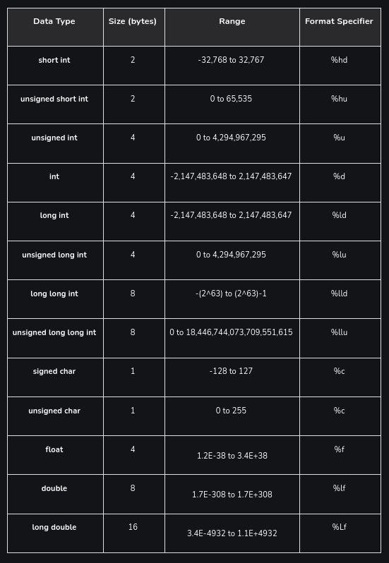

# C/C++ PROGRAMMING


# POINTERS IN C

## Introduction to pointers in C##

### What is reference?

**Memory**: an array of bytes within RAM

**Memory block**: a single unit (byte) within memory, used to hold some value

**Memroy address**: The address of where a memory block is located

### A list of memory size used by different data types




Example in C:
```cpp
#include <stdio.h>

int main() {
    char a = 'X'; 
    short b = 'Y'; // can use characters as it will covert to ASCII
    int c = 'Z';    

    printf("Size of char: %zu bytes\n", sizeof(a));   // Use %zu for size_t
    printf("Size of short: %zu bytes\n", sizeof(b));  // Use %zu for size_t
    printf("Size of int: %zu bytes\n", sizeof(c));    // Use %zu for size_t

    printf("Address of a: %p\n", (void*)&a);  // Use %p for address
    printf("Address of b: %p\n", (void*)&b);  // Cast to void* to match %p
    printf("Address of c: %p\n", (void*)&c);  // Cast to void* to match %p

    return 0;
}
```

output:
```
1 byte
2 byte
4 byte
000000000061FE1F // memory address for a in hexadecimal form
000000000061FE1D // memory address for b in hexadecimal form
000000000061FE1 // memory address for c in hexadecimal form
```

Reference is when a data is stored in memory it has a memory address. A variable points to this memory address. This is called its reference.

# REFERENCES

How to use pointers in C: https://www.freecodecamp.org/news/pointers-in-c-programming/

Data types in C: https://www.geeksforgeeks.org/data-types-in-c/

Primitive & non primitive in JS: https://blog.stackademic.com/understanding-the-difference-between-primitive-and-non-primitive-data-types-in-javascript-c5251c0293db

# Random Access Memory

The main memory in a computer is called Random Access Memory (often called RAM for short). When we run a program, the operating system loads the program into RAM. Any data that is hardcoded into the program itself (e.g. text such as “Hello, world!”) is loaded at this point.

The operating system also reserves some additional RAM for the program to use while it is running. Common uses for this memory are to store values entered by the user, to store data read in from a file or network, or to store values calculated while the program is running (e.g. the sum of two values) so they can be used again later.

You can think of RAM as a series of numbered boxes that can be used to store data while the program is running.

In some older programming languages (like Applesoft BASIC), you could directly access these boxes (e.g. you could write a statement to “go get the value stored in membox number 7532”).

# Objects and variables

In C++, direct memory access is discouraged. Instead, we access memory indirectly through an object. An object represents a region of storage (typically RAM or a CPU register) that can hold a value. Objects also have associated properties (that we’ll cover in future lessons).

The key point here is that rather than say “go get the value stored in mailbox number 7532”, we can say, “go get the value stored by this object” and let the compiler figure out where and how to retrieve the value. This means we can focus on using objects to store and retrieve values, and not have to worry about where in memory those objects are actually being placed.

Although objects in C++ can be unnamed (anonymous), more often we name our objects using an identifier. An object with a name is called a variable.

**NOTE: In general programming, the term object typically refers to an unnamed object in memory, a variable, or a function. In C++, the term object has a narrower definition that excludes functions.**

## Variable definition

In order to use a variable in our program, we need to tell the compiler that we want one. The most common way to do this is by use of a special kind of declaration statement called a definition.
A definition statement can be used to tell the compiler that we want to use a variable in our program.
```cpp
int x; // define a variable named x (of type int)
```
At **compile-time** (when the program is being compiled), when encountering this statement, the compiler makes a note to itself that we want a variable with the name `x`, and that the variable has the data type `int`.  From that point forward (with some limitations), whenever we use the identifier x in our code, the compiler will know that we are referring to this variable.

## Variable creation

At **runtime** (when the program is loaded into memory and run), each object is given an actual storage location (such as RAM, or a CPU register) that it can use to store values. The process of reserving storage for an object’s use is called **allocation**. Once allocation has occurred, the object has been created and can be used.

For the sake of example, let’s say that variable `x` is instantiated at memory location 140. Whenever the program uses variable `x`, it will access the value in memory location 140.

**NOTE: An object is “created” once actual storage has been reserved for the object’s use.**

## Data types

Objects are regions of storage that can store a data value. A **data type** (more commonly just called a **type**) determines what kind of value (e.g. a number, a letter, text, etc…) the object will store.

In C++, the type of an object must be known at compile-time, and that type can not be changed without recompiling the program. This means an integer variable can only hold integer values. If you want to store some other kind of value, you’ll need to use a different type.

**NOTE: The data type of an object must be known at compile-time (so the compiler knows how much memory that object requires).**
C++ also allows you to create your own custom types and it’s part of what makes C++ powerful.

## Summary

In C++, we use objects to access memory. A named object is called a variable. Each variable has an identifier, a type, and a value (and some other attributes that aren’t relevant here). A variable’s type is used to determine how the value in memory should be interpreted.

Variables are actually created at runtime, when memory is allocated for their use.

* What is a value?

A value is a letter (e.g. a), number (e.g. 5), text (e.g. Hello), or instance of some other useful concept that can be represented as data.

* What is an object?

An object is a region of storage (usually memory) that can store a value.

* What is a variable?

A variable is an object that has a name.


# Variable initialization

One downside of assignment is that assigning a value to a just-defined object requires two statements: one to define the variable, and another to assign the value.

These two steps can be combined. When an object is defined, you can optionally provide an initial value for the object. The process of specifying an initial value for an object is called initialization, and the syntax used to initialize an object is called an initializer. Informally, the initial value is often called an “initializer” as well.

For example, the following statement both defines a variable named width (of type int) and initializes it with the value 5:

```cpp
#include <iostream>

int main()
{
    int width { 5 };    // define variable width and initialize with initial value 5
    std::cout << width; // prints 5

    return 0;
}

In the above initialization of variable width, { 5 } is the initializer, and 5 is the initial value.
```


## Different forms of initialization
Unlike assignment (which is generally straightforward), initialization in C++ is surprisingly complex. So we’ll present a simplified view here to get started.

There are 5 common forms of initialization in C++:

```cpp
int a;         // default-initialization (no initializer)

// Traditional initialization forms:
int b = 5;     // copy-initialization (initial value after equals sign)
int c ( 6 );   // direct-initialization (initial value in parenthesis)

// Modern initialization forms (preferred):
int d { 7 };   // direct-list-initialization (initial value in braces)
int e {};      // value-initialization (empty braces)
```

Other forms of initialization include:

* Aggregate initialization
* Copy-list-initialization
* Reference initialization
* Static-initialization, constant-initialization, and dynamic-initialization
* Zero-initialization

### Default-initialization

When no initializer is provided (such as for variable a above), this is called default-initialization. In many cases, default-initialization performs no initialization, and leaves the variable with an indeterminate value (a value that is not predictable).

### Copy-initialization

When an initial value is provided after an equals sign, this is called copy-initialization. This form of initialization was inherited from the C language.

```c
int width = 5; // copy-initialization of value 5 into variable width
```

Much like copy-assignment, this copies the value on the right-hand side of the equals into the variable being created on the left-hand side. In the above snippet, variable width will be initialized with value 5.

Copy-initialization had fallen out of favor in modern C++ due to being less efficient than other forms of initialization for some complex types. However, C++17 remedied the bulk of these issues, and copy-initialization is now finding new advocates.

**NOTE: Copy-initialization is also used whenever values are implicitly copied, such as when passing arguments to a function by value, returning from a function by value, or catching exceptions by value.**

### Direct-initialization

When an initial value is provided inside parenthesis, this is called direct-initialization.

```c
int width ( 5 ); // direct initialization of value 5 into variable width
```

Direct-initialization was initially introduced to allow for more efficient initialization of complex objects (those with class types). Just like copy-initialization, direct-initialization had fallen out of favor in modern C++, largely due to being superseded by direct-list-initialization. However, direct-list-initialization has a few quirks of its own, and so direct-initialization is once again finding use in certain cases.

Direct-initialization is also used when values are explicitly cast to another type (e.g. via `static_cast`).

One of the reasons direct-initialization had fallen out of favor is because it makes it hard to differentiate variables from functions. For example:

```c
int x();  // forward declaration of function x
int x(0); // definition of variable x with initializer 0
T(5);     // function call if T is a function, direct-initialization of temporary object if T is a type
```

### Direct-list-initialization and copy-list-initialization

The modern way to initialize objects in C++ is to use a form of initialization that makes use of curly braces. This is called **list-initialization** (or **uniform initialization** or **brace initialization**).

List-initialization comes in two forms:

```cpp
int width { 5 };    // direct-list-initialization of initial value 5 into variable width (preferred)
int height = { 6 }; // copy-list-initialization of initial value 6 into variable height (rarely used)
```

When we see curly braces, we know we’re creating and initializing an object.

Additionally, list initialization provides a way to initialize objects with a list of values rather than a single value (which is why it is called “list initialization”).

### List initialization disallows narrowing conversions

The primary benefit of list-initialization is that “narrowing conversions” are disallowed. This means that if you try to list-initialize a variable using a value that the variable can not safely hold, the compiler is required to produce a diagnostic (compilation error or warning) to notify you. For example:


```cpp
int main()
{
    // An integer can only hold non-fractional values
    int w1 { 4.5 }; // compile error: list init does not allow narrowing conversion of 4.5 to 4

    int w2 = 4.5;   // compiles: copy-init initializes width with 4
    int w3 (4.5);    // compiles: direct-init initializes width with 4

    return 0;
}
```

**NOTE: List-initialization is generally preferred over the other initialization forms because it works in most cases (and is therefore most consistent), it disallows narrowing conversions (which we normally don’t want), and it supports initialization with a list of values (something we’ll cover in a future lesson).**

### Value-initialization and zero-initialization

When a variable is initialized using empty braces, value initialization takes place. In most cases, value initialization will initialize the variable to zero (or empty, if that’s more appropriate for a given type). In such cases where zeroing occurs, this is called zero-initialization.

```cpp
int width {}; // value-initialization / zero-initialization to value 0
```

### Q: When should I initialize with { 0 } vs {}?

Use direct-list-initialization when you’re actually using the initial value:

```cpp
int x { 0 };    // direct-list-initialization with initial value 0
std::cout << x; // we're using that 0 value here
```

Use value-initialization when the object’s value is temporary and will be replaced:

```cpp
int x {};      // value initialization
std::cin >> x; // we're immediately replacing that value so an explicit 0 would be meaningless
```

## Instantiation

The term instantiation is a fancy word that means a variable has been created (allocated) and initialized (this includes default initialization). An instantiated object is sometimes called an instance. Most often, this term is applied to class type objects, but it is occasionally applied to objects of other types as well.

multiple variables defined on the same line:

```cpp
int a = 5, b = 6;          // copy-initialization
int c ( 7 ), d ( 8 );      // direct-initialization
int e { 9 }, f { 10 };     // direct-list-initialization
int i {}, j {};            // value-initialization
```

## The `[[maybe_unused]]` attribute C++17

The `[[maybe_unused]]` attribute allows us to tell the compiler that we’re okay with a variable being unused. The compiler will not generate unused variable warnings for such variables.

The following program should generate no warnings/errors:

```cpp
#include <iostream>

int main()
{
    [[maybe_unused]] double pi { 3.14159 };  // Don't complain if pi is unused
    [[maybe_unused]] double gravity { 9.8 }; // Don't complain if gravity is unused
    [[maybe_unused]] double phi { 1.61803 }; // Don't complain if phi is unused

    std::cout << pi << '\n';
    std::cout << phi << '\n';

    // The compiler will no longer warn about gravity not being used

    return 0;
}
```
Additionally, the compiler will likely optimize these variables out of the program, so they have no performance impact.

The `[[maybe_unused]]` attribute should only be applied selectively to variables that have a specific and legitimate reason for being unused (e.g. because you need a list of named values, but which specific values are actually used in a given program may vary). Otherwise, unused variables should be removed from the program.

### Q. What are default-initialization and value-initialization? What is the behavior of each? Which should you prefer?


Default-initialization is when a variable initialization has no initializer (e.g. int x;). In most cases, the variable is left with an indeterminate value.
Value-initialization is when a variable initialization has an empty brace initializer (e.g. int x{};). In most cases this will perform zero-initialization.
You should prefer value-initialization, as it initializes the variable to a consistent value.


## `std::cout` is buffered

Consider a rollercoaster ride at your favorite amusement park. Passengers show up (at some variable rate) and get in line. Periodically, a train arrives and boards passengers (up to the maximum capacity of the train). When the train is full, or when enough time has passed, the train departs with a batch of passengers, and the ride commences. Any passengers unable to board the current train wait for the next one.

This analogy is similar to how output sent to std::cout is typically processed in C++. Statements in our program request that output be sent to the console. However, that output is typically not sent to the console immediately. Instead, the requested output “gets in line”, and is stored in a region of memory set aside to collect such requests (called a **buffer**). Periodically, the buffer is **flushed**, meaning all of the data collected in the buffer is transferred to its destination (in this case, the console).

This also means that if your program crashes, aborts, or is paused (e.g. for debugging purposes) before the buffer is flushed, any output still waiting in the buffer will not be displayed.

Using `std::endl` is often inefficient, as it actually does two jobs: it outputs a newline (moving the cursor to the next line of the console), and it flushes the buffer (which is slow). If we output multiple lines of text ending with std::endl, we will get multiple flushes, which is slow and probably unnecessary.

When outputting text to the console, we typically don’t need to explicitly flush the buffer ourselves. C++’s output system is designed to self-flush periodically, and it’s both simpler and more efficient to let it flush itself.

To output a newline without flushing the output buffer, we use `\n` (inside either single or double quotes), which is a special symbol that the compiler interprets as a newline character.

**NOTE**: In C++, we use single quotes to represent single characters (such as 'a' or '$'), and double-quotes to represent text (zero or more characters). Even though ‘\n’ is represented in source code as two symbols, it is treated by the compiler as a single **linefeed (LF)** character (with ASCII value 10), and thus is conventionally single quoted (unless embedded into existing double-quoted text).


## std::cin

`std::cin` is another predefined variable in the iostream library. Whereas `std::cout` prints data to the console (using the insertion operator `<<` to provide the data), `std::cin` (which stands for “character input”) reads input from keyboard. We typically use the extraction operator `>>` to put the input data in a variable (which can then be used in subsequent statements).

```cpp
#include <iostream>  // for std::cout and std::cin

int main()
{
    std::cout << "Enter a number: "; // ask user for a number

    int x{};       // define variable x to hold user input (and value-initialize it)
    std::cin >> x; // get number from keyboard and store it in variable x

    std::cout << "You entered " << x << '\n';
    return 0;
}
```

### std::cin is buffered

In a prior section, we noted that outputting data is actually a two stage process:

* The data from each output request is added (to the end) of an output buffer.
* Later, data from (the front of) the output buffer is flushed to the output device (the console).

Similarly, inputting data is also a two stage process:

* The individual characters you enter as input are added to the end of an input buffer (inside `std::cin`). The enter key (pressed to submit the data) is also stored as a `'\n'` character.
* The extraction operator ‘>>’ removes characters from the front of the input buffer and converts them into a value that is assigned (via copy-assignment) to the associated variable. This variable can then be used in subsequent statements.

Let's demonstrate this by an example:

```cpp
#include <iostream>  // for std::cout and std::cin

int main()
{
    std::cout << "Enter two numbers: ";

    int x{};
    std::cin >> x;

    int y{};
    std::cin >> y;

    std::cout << "You entered " << x << " and " << y << '\n';

    return 0;
}
```

This program inputs to two variables (this time as separate statements). We’ll run this program twice.

Run #1: When std::cin >> x; is encountered, the program will wait for input. Enter the value 4. The input 4\n goes into the input buffer, and the value 4 is extracted to variable x.

When std::cin >> y; is encountered, the program will again wait for input. Enter the value 5. The input 5\n goes into the input buffer, and the value 5 is extracted to variable y. Finally, the program will print You entered 4 and 5.

There should be nothing surprising about this run.

Run #2: When std::cin >> x is encountered, the program will wait for input. Enter 4 5. The input 4 5\n goes into the input buffer, but only the 4 is extracted to variable x (extraction stops at the space).

When std::cin >> y is encountered, the program will not wait for input. Instead, the 5 that is still in the input buffer is extracted to variable y. The program then prints You entered 4 and 5.

Note that in run 2, the program didn’t wait for the user to enter additional input when extracting to variable y because there was already prior input in the input buffer that could be used.

### The basic extraction process

Here’s a simplified view of how operator >> works for input:

    First, leading whitespace (spaces, tabs, and newlines at the front of the buffer) is discarded from the input buffer. This will discard any unextracted newline character remaining from a prior line of input.
    If the input buffer is now empty, operator >> will wait for the user to enter more data. Leading whitespace is again discarded.
    operator >> then extracts as many consecutive characters as it can, until it encounters either a newline character (representing the end of the line of input) or a character that is not valid for the variable being extracted to.

The result of the extraction is as follows:

    If any characters were extracted in step 3 above, extraction is a success. The extracted characters are converted into a value that is then copy-assigned to the variable.
    If no characters could be extracted in step 3 above, extraction has failed. The object being extracted to is copy-assigned the value 0 (as of C++11), and any future extractions will immediately fail (until std::cin is cleared).

Any non-extracted characters (including newlines) remain available for the next extraction attempt.
**Eg:**
If the user types 5a and enter, 5a\n will be added to the buffer. 5 will be extracted, converted to an integer, and assigned to variable x. a\n will be left in the input buffer for the next extraction.

If the user types ‘b’ and enter, b\n would be added to the buffer. Because b is not a valid integer, no characters can be extracted, so this is an extraction failure. Variable x would be set to 0, and future extractions will fail until the input stream is cleared.

# Uninitialized variables

Unlike some programming languages, C/C++ does not automatically initialize most variables to a given value (such as zero). When a variable that is not initialized is given a memory address to use to store data, the default value of that variable is whatever (garbage) value happens to already be in that memory address! A variable that has not been given a known value (through initialization or assignment) is called an uninitialized variable.

* Initialized = The object is given a known value at the point of definition.
* Assignment = The object is given a known value beyond the point of definition.
* Uninitialized = The object has not been given a known value yet.

# Undefined behavior

Using the value from an uninitialized variable is our first example of undefined behavior. **Undefined behavior** (often abbreviated UB) is the result of executing code whose behavior is not well-defined by the C++ language. In this case, the C++ language doesn’t have any rules determining what happens if you use the value of a variable that has not been given a known value. Consequently, if you actually do this, undefined behavior will result.

# Implementation-defined behavior and unspecified behavior

A specific compiler and the associated standard library it comes with are called an **implementation** (as these are what actually implements the C++ language). In some cases, the C++ language standard allows the implementation to determine how some aspect of the language will behave, so that the compiler can choose a behavior that is efficient for a given platform. Behavior that is defined by the implementation is called implementation-defined behavior. Implementation-defined behavior must be documented and consistent for a given implementation.

Example of implementation-defined behavior:

```cpp
#include <iostream>

int main()
{
	std::cout << sizeof(int) << '\n'; // print how many bytes of memory an int value takes

	return 0;
}
```
On most platforms, this will produce `4`, but on others it may produce `2`.

**Unspecified behavior** is almost identical to implementation-defined behavior in that the behavior is left up to the implementation to define, but the implementation is not required to document the behavior.

We generally want to avoid implementation-defined and unspecified behavior, as it means our program may not work as expected if compiled on a different compiler (or even on the same compiler if we change project settings that affect how the implementation behaves!)

# Keywords and naming identifiers

## Keywords

C++ reserves a set of 92 words (as of C++23) for its own use. These words are called keywords (or reserved words), and each of these keywords has a special meaning within the C++ language.

Here is a list of all the C++ keywords (through C++23):

* alignas
* alignof
* and
* and_eq
* asm
* auto
* bitand
* bitor
* bool
* break
* case
* catch
* char
* char8_t (since C++20)
* char16_t
* char32_t
* class
* compl
* concept (since C++20)
* const
* consteval (since C++20)
* constexpr
* constinit (since C++20)
* const_cast
* continue
* co_await (since C++20)
* co_return (since C++20)
* co_yield (since C++20)
* decltype
* default
* delete
* do
* double
* dynamic_cast
* else
* enum
* explicit
* export
* extern
* false
* float
* for
* friend
* goto
* if
* inline
* int
* long
* mutable
* namespace
* new
* noexcept
* not
* not_eq
* nullptr
* operator
* or
* or_eq
* private
* protected
* public
* register
* reinterpret_cast
* requires (since C++20)
* return
* short
* signed
* sizeof
* static
* static_assert
* static_cast
* struct
* switch
* template
* this
* thread_local
* throw
* true
* try
* typedef
* typeid
* typename
* union
* unsigned
* using
* virtual
* void
* volatile
* wchar_t
* while
* xor
* xor_eq

The name of a variable (or function, type, or other kind of item) is called an **identifier**.

C++ also defines special identifiers: *override, final, import, and module*. These have a specific meaning when used in certain contexts but are not reserved otherwise.

### Identifier naming best practices

First, it is a convention in C++ that variable names should begin with a lowercase letter. If the variable name is a single word or acronym, the whole thing should be written in lowercase letters.

Identifier names that start with a capital letter are typically used for user-defined types (such as structs, classes, and enumerations).

If the variable or function name is multi-word, there are two common conventions: words separated by underscores (sometimes called snake_case), or intercapped (sometimes called camelCase, since the capital letters stick up like the humps on a camel).

```cpp
int my_variable_name;   // conventional (separated by underscores/snake_case)
int my_function_name(); // conventional (separated by underscores/snake_case)

int myVariableName;     // conventional (intercapped/camelCase)
int myFunctionName();   // conventional (intercapped/camelCase)

int my variable name;   // invalid (whitespace not allowed)
int my function name(); // invalid (whitespace not allowed)

int MyVariableName;     // unconventional (should start with lower case letter)
int MyFunctionName();   // unconventional (should start with lower case letter)
```

# Literals

Consider the following two statements:

```cpp
std::cout << "Hello world!";
int x { 5 };
```

What are ‘”Hello world!”‘ and ‘5’? They are literals. A **literal** (also known as a **literal constant**) is a fixed value that has been inserted directly into the source code.

Literals and variables both have a value (and a type). Unlike a variable (whose value can be set and changed through initialization and assignment respectively), the value of a literal is fixed and cannot be changed. The literal 5 always has value 5. This is why literals are called constants.

A literal’s value is placed directly in the executable, and the executable itself can’t be changed after it is created. A variable’s value is placed in memory, and the value of memory can be changed while the executable is running.

# Operators

In mathematics, an **operation** is a process involving zero or more input values (called **operands**) that produces a new value (called an output value). The specific operation to be performed is denoted by a symbol called an **operator**.

In C++, the output value of an operation is often called a **return value**.

While most operators have symbols for names (e.g. `+`, or `==`), there are also a number of operators that are keywords (e.g. `new`, `delete`, and `throw`).

The number of operands that an operator takes as input is called the operator’s **arity**

## Types of Arity

Operators in C++ come in four different arities:

**Unary** operators act on one operand. An example of a unary operator is the `-` operator. For example, given `-5`, `operator-` takes literal operand `5` and flips its sign to produce new output value `-5`.

**Binary** operators act on two operands (often called left and right, as the left operand appears on the left side of the operator, and the right operand appears on the right side of the operator).
For example, given `3 + 4`, `operator+` takes the left operand `3` and the right operand `4` and applies mathematical addition to produce new output value `7`. The insertion (`<<`) and extraction (`>>`) operators are binary operators, taking `std::cout` or `std::cin` on the left side, and the value to output or variable to input to on the right side.

**Ternary** operators act on three operands. There is only one of these in C++ (the conditional operator)

**Nullary** operators act on zero operands. There is also only one of these in C++ (the throw operator)

Operators can be chained together such that the output of one operator can be used as the input for another operator.

## Return values and side effects

Most operators in C++ just use their operands to calculate a return value. There are a few operators that do not produce return values (such as **delete** and **throw**)

Some operators have additional behaviors. An operator (or function) that has some observable effect beyond producing a return value is said to have a **side effect**. For example, `x = 5` has the side effect of assigning value `5` to variable `x`. The changed value of `x` is observable (e.g. by printing the value of `x`) even after the operator has finished executing. `std::cout << 5` has the side effect of printing `5` to the console. We can observe the fact that `5` has been printed to the console even after `std::cout << 5` has finished executing.

**NOTE:** For the operators we call primarily for their side effects (e.g. **operator=** or **operator<<**), it’s not always obvious what return values they produce (if any) unlike for **operator+** or **operator ***.

So here, Both **operator=** and **operator<<** (when used to output values to the console) return their left operand. Thus, **x = 5** returns **x**, and **std::cout << 5** returns **std::cout**. This is done so that these operators can be chained.